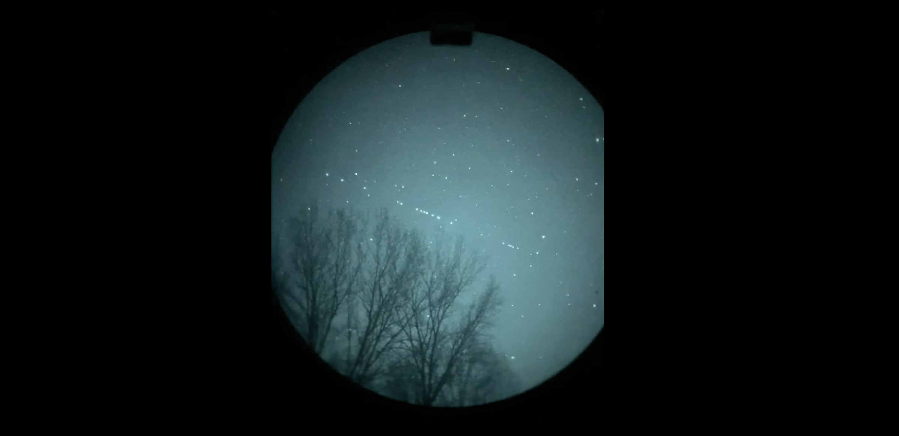
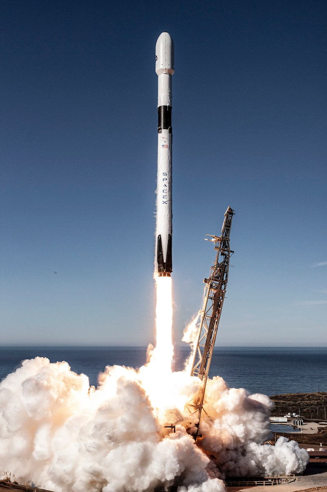
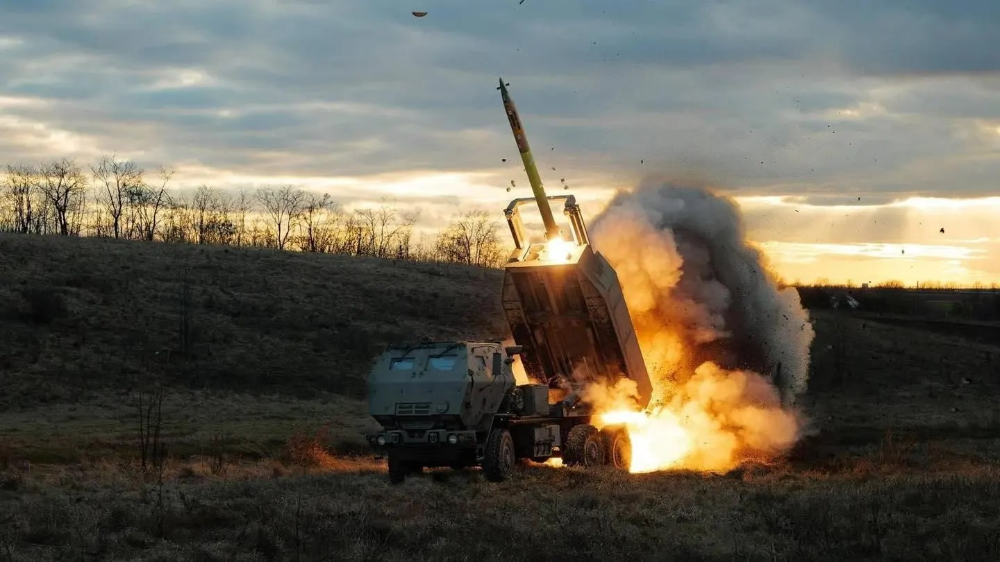
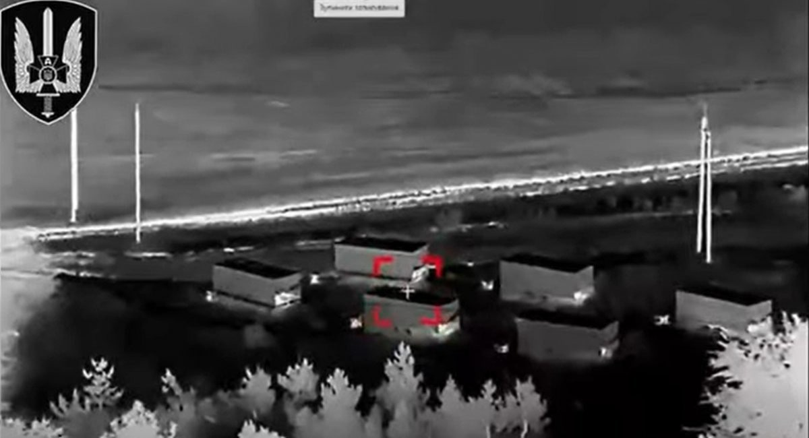
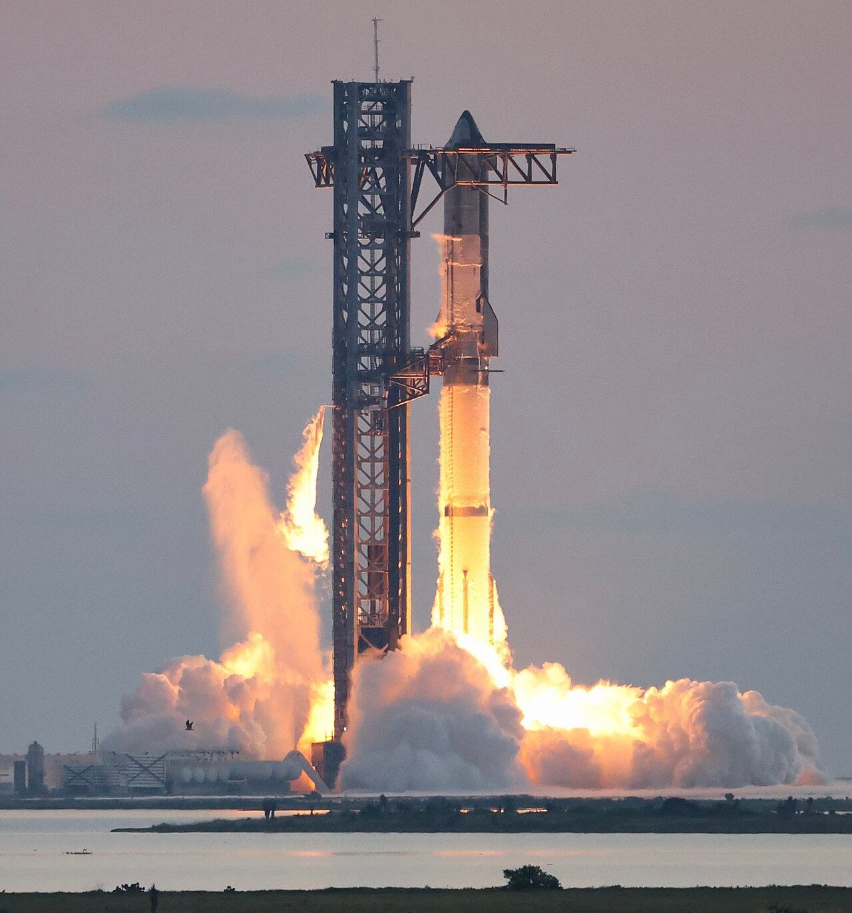

*Un tren de satélites Starlink cruza el cielo de noche.*

> La tarde del 26 de febrero de 2022, dos días después de que las tropas rusas cruzaran la frontera, el viceprimer ministro ucraniano Mykhailo Fedorov [le recordó a Elon Musk en un tuit](https://x.com/FedorovMykhailo/status/1497543633293266944?s=20) que, mientras él intentaba colonizar Marte, Rusia intentaba ocupar Ucrania, y le pidió terminales de Starlink para el país. Diez horas después, [Musk respondió](https://x.com/elonmusk/status/1497701484003213317?s=20) con una frase corta que cambiaría la guerra: «Starlink service is now active in Ukraine. More terminals en route». Ese intercambio de tuits, más que cualquier declaración oficial, marcó el momento en que una red de satélites privada pasó a formar parte del arsenal de un país en guerra.

## Qué es Starlink y qué lo hace diferente.

*Despegue de un Falcon 9 de SpaceX.*

[Starlink](https://starlink.com/es) es una red de internet por satélite creada por SpaceX, la empresa aeroespacial de Elon Musk, que empezó a lanzar sus primeros satélites en 2019. Hoy la constelación la forman más de [11.000 satélites en órbita baja](https://orbitalradar.com/how-many-starlink-satellites) (LEO), a unos 550 km de altura. Lejos quedan los satélites de comunicaciones tradicionales, que se mantienen en órbitas geoestacionarias a 36.000 km de altura. Esa distancia es lo que marca la diferencia: la señal de un satélite geoestacionario impone un retraso de ida y vuelta de 600 milisegundos o más, suficiente para notarse en una videollamada o al pilotar un dron a distancia. Starlink baja esa latencia a entre [25 y 60 milisegundos](https://apposite-tech.com/geo-vs-leo-satellite-testing/), cerca de cualquier conexión de fibra normal.

Lo que tiene el usuario es el terminal, una antena apodada _Dishy_ que se combina con un router wifi y que no es necesaria apuntarla a mano como los platos parabólicos de siempre, sino que el propio sistema localiza el satélite más cercano y va saltando de un satélite a otro sin cortar la conexión. En Ucrania, [buena parte de los cerca de 20.000 terminales enviados en el primer año de guerra se presentaron como donación de SpaceX, aunque en torno al 85 % ya estaban pagados total o parcialmente por gobiernos aliados —Estados Unidos y Polonia, entre otros—](https://www.cnn.com/2022/10/13/politics/elon-musk-spacex-starlink-ukraine).

Para desplegar un Starlink, SpaceX necesita subirlo con un cohete —normalmente un Falcon 9— cuya primera etapa se recupera y reutiliza en el siguiente lanzamiento. Lo hace en tandas de entre 20 y 29 satélites, que son liberados en órbita baja. El ritmo es constante: SpaceX lanza una nueva tanda cada dos o tres días. Cada satélite lleva su propio propulsor de plasma, que usa para subir a su órbita final, mantener la posición y, al final de su vida útil, desorbitarse y desintegrarse en la atmósfera.

Todo esto abarata el servicio: un satélite geoestacionario cuesta entre 150 y 400 millones de dólares y un Starlink unos 800.000, y reutilizar el cohete hace más barato cada lanzamiento. El precio de los datos por satélite [ha caído un 77 % desde 2019](https://payloadspace.com/the-cost-of-satcom-has-fallen-dramatically-thanks-to-starlink/).

[Las velocidades reales suelen ir de 45 a 280 Mbps de bajada, y varían según la zona y las horas de más uso](https://starlink.com/legal/documents/DOC-1470-99699-90), suficientes para videollamadas, transmisión de vídeo de drones en tiempo real o el tráfico de un puesto de mando, algo que ninguna red móvil puede garantizar en zona de combate. Y como hay miles de satélites repartidos por toda la órbita baja, cubre cualquier punto de Ucrania sin depender de una antena o un repetidor en tierra que se pueda localizar y destruir. Esa independencia del terreno es también lo que la hace más resistente al [jamming](/uas/glosario-y-terminologia) que otras redes.

Desde la V1.5 (2021), los satélites llevan enlaces láser: en vez de bajar cada dato a una estación terrestre y volver a subirlo al siguiente satélite, los propios satélites se pasan la información en el espacio mediante haces infrarrojos. La V3, cuyo primer lote llegó a órbita el 28 de septiembre de 2026, ya lleva el láser de serie en toda la flota, con seis enlaces de 400 Gbps por satélite. Y ese tramo no se puede interferir con jamming, porque no va por radio.

## Cómo se despliega en el terreno.

*Un soldado ucraniano desconecta un terminal Starlink en el frente de Luhansk.*

El terminal necesita entre 50 y 75 vatios para funcionar, [un consumo que SpaceX rebajó a propósito al empezar la invasión para que el _Dishy_ pudiera alimentarse desde el mechero de un coche](https://spaceexplored.com/2022/03/04/mobile-roaming-reducing-peak-power-for-starlink-in-ukraine/) en vez de necesitar un generador aparte. Repartir esos terminales por el frente ha exigido montar, casi desde cero, una logística paralela a la del propio Ejército. [Un solo taller de voluntarios en Ucrania ha reparado o adaptado más de 15.000 terminales desde que empezó la guerra](https://www.technologyreview.com/2025/08/21/1122035/ukraines-largest-starlink-repair-shop/). Estos voluntarios van mucho más rápido que los cauces oficiales.

Pero encender un _Dishy_ en primera línea tiene un precio: [la antena emite una señal de radio identificable que el SIGINT ruso puede rastrear](https://www.defenseone.com/threats/2023/03/using-starlink-paints-target-ukrainian-troops/384361/). Por eso muchas unidades solo lo encienden cuando lo necesitan de verdad, y en cuanto terminan lo apagan y cambian de posición.

## La columna vertebral de las comunicaciones en el frente.

*Un lanzacohetes HIMARS ucraniano dispara en campo abierto.*

Una de las primeras cosas que Ucrania conectó a Starlink fue la artillería. La aplicación GIS Arta, [desarrollada por un oficial de artillería para repartir objetivos entre las baterías disponibles como si fuera un Uber](https://www.newamerica.org/insights/how-ukraines-uber-for-artillery-is-leading-the-software-war-against-russia/), reúne en una misma red las radios militares, los móviles y Starlink, y consiguió bajar a 45 segundos el tiempo entre ver un objetivo y disparar.

Por la misma conexión va el vídeo de los drones FPV, del piloto al puesto de mando que decide el siguiente objetivo. Y cuando hay que sacar a un herido de una zona demasiado peligrosa para que entren los sanitarios, algunas unidades ucranianas [controlan vehículos terrestres no tripulados (UGV) a través de un terminal Starlink montado en el propio robot](https://www.space.com/space-exploration/satellites/spacex-starlink-internet-isnt-fast-enough-for-ukraines-combat-robots), aunque, con apenas 10 Mbps de ancho de banda disponible por terminal, la imagen que llega al operador es de mala calidad.

Pero por encima de la artillería, los drones y la evacuación, Starlink cumple una función más básica: sustituir a una red móvil ucraniana que, en buena parte del frente, sencillamente [ya no existe](https://circleid.com/posts/starlink-in-ukraine-what-three-years-of-wartime-connectivity-taught-us). Los bombardeos rusos han destruido antenas y repetidores que nadie puede reparar bajo fuego, así que la antena por satélite es, para muchas unidades y buena parte de la población civil, la única forma de tener conexión.

## El arma con dueño: Crimea, Kherson y Starshield.

*Elon Musk en un acto de America PAC en Lancaster (Pensilvania), el 26 de octubre de 2024.*

La noche del 16 al 17 de septiembre de 2022, drones navales ucranianos se acercaban a la flota rusa fondeada en la bahía de Sevastopol, en Crimea, cuando la conexión con Starlink se cortó a 70 km del objetivo. [La petición de activar el servicio hasta esa zona la denegó un solo hombre, Elon Musk](https://www.wearethemighty.com/feature/starlink-god-switch-ukraine-russia/), que alegó el riesgo de que el ataque desencadenara una escalada nuclear. Musk después llegó a negar que hubiera desactivado nada, diciendo que el servicio nunca había estado activo en esa zona —una versión que contradice el relato de quienes participaron en la operación—.

Por primera vez, un país en guerra dependía de lo que decidiera un empresario: [ningún mecanismo de alianza ni de mando militar podía forzar la activación; Kyiv no tuvo más recurso que intentar convencer a un particular](https://cepa.org/article/who-holds-the-switch/). Ucrania rediseñó desde cero las comunicaciones de sus drones navales, y de ahí nació el Magura. En Washington el episodio hizo saltar las alarmas sobre lo que significa que la capacidad de guerra de un aliado dependiese del criterio personal de una sola persona.

La respuesta de EE. UU. fue Starshield, [un programa secreto de unos 1.800 millones de dólares](https://www.wearethemighty.com/feature/starlink-god-switch-ukraine-russia/) para separar el Starlink comercial del Starlink militar. Lo que cambia es quién manda: en Starshield, el interruptor lo tiene la Fuerza Espacial, no Musk ni el consejo de administración de SpaceX. Aun así, la infraestructura —los satélites, el software, el mantenimiento— la sigue controlando la misma empresa.

No fue la única vez que ocurrió algo así. Según [una investigación de Reuters publicada en julio de 2025](https://www.reuters.com/investigations/musk-ordered-shutdown-starlink-satellite-service-ukraine-retook-territory-russia-2025-07-25/), Musk ordenó personalmente a un ingeniero sénior de SpaceX que cortara la cobertura de Starlink cerca de Beryslav, en el óblast de Kherson, en otoño de 2022, mientras las tropas ucranianas intentaban cercar a las fuerzas rusas en plena contraofensiva. Las unidades del frente se quedaron sin conexión de un día para otro: los drones dejaron de funcionar y se rompió la coordinación de la artillería, y una fuente militar ucraniana dijo a Reuters que el apagón contribuyó directamente a que el cerco fracasara. Ucrania liberó Kherson poco después, en noviembre, por otra vía. Musk ya lo había negado meses antes: «Starlink nunca apagará sus terminales», escribió en X en marzo de 2025.

## Guiar la guerra a distancia: drones y ataques en profundidad.

*Columnas de humo tras el ataque a una refinería de Moscú, el 20 de septiembre de 2026.*

Ucrania empezó a atacar dentro de Rusia en junio de 2022, contra la refinería de Novoshakhtinsk, a 8 km de la frontera. A comienzos de 2024 los ataques contra refinerías ya eran constantes: [según Reuters, en dos meses dejaron parada en torno al 14 % de la capacidad de refino rusa](https://drone-warfare.com/ukraine/deep-strike-origins/). En 2026 van al menos 194 ataques con éxito hasta julio, y el 20 de septiembre un MICH-2000 [alcanzó una refinería dentro de Moscú](https://charter97.org/en/news/2026/9/20/699109/) mientras los misiles rusos fallaban.

Para guiarlos, el propio MICH-2000 [deja elegir al operador entre enlace analógico, digital o Starlink](https://drone-warfare.com/research/mich-2000/) según la misión, y los drones navales Magura [usan terminales Starlink para el pilotaje en tiempo real y el vídeo en directo a cientos de kilómetros de la costa](https://www.businessinsider.com/ukraine-drone-war-starlink-us-tech-dependence-2026-8): el operador ve el objetivo hasta el último segundo y puede corregir el rumbo sobre la marcha, en vez de confiar solo en unas coordenadas programadas de antemano. 

El problema es que Starlink no funciona dentro de Rusia: SpaceX bloquea el servicio por geolocalización en un puñado de países, Rusia entre ellos, y Musk se ha negado varias veces a levantar ese veto para que Ucrania ataque objetivos rusos con drones guiados en tiempo real, por considerarlo una decisión de escalada que no le corresponde a él tomar. Por eso, buena parte de estos ataques en profundidad vuelan sin Starlink, guiándose solo por GPS y navegación inercial hasta el objetivo. Los drones solo recuperan el enlace en tiempo real cuando Ucrania lo consigue por otro lado: algunos analistas OSINT hablan de drones que hacen de repetidor y retransmiten la señal más allá del bloqueo, aunque nadie lo ha confirmado de forma independiente.

## Rusia contra Starlink.

*Imagen térmica de un dron del Centro de Operaciones Especiales «A» del SBU fijando como blanco un Volna Kupol Garant.*

En abril de 2022, cuando Rusia empezó a hacer jamming contra Starlink en Ucrania, [un alto cargo del Pentágono calificó de «asombrosa» la forma en que SpaceX lo neutralizó con una simple actualización de software enviada desde Hawthorne](https://breakingdefense.com/2022/04/spacex-beating-russian-jamming-attack-was-eyewatering-dod-official/). Desde entonces Rusia ha fabricado jammers pensados solo para Starlink. El más conocido es el Volna Kupol Garant: que Rusia desplegó inicialmente cerca de Kharkiv en 2024 y posteriormente más por todo el frente sur en 2026. Cada unidad cuesta [1,5 millones de dólares y cubre apenas 20 km²](https://keeptrack.space/deep-dive/volna-kupol-garant-starlink-jamming). Contra este no basta con software: Ucrania [lo localiza y lo destruye con drones a los pocos días de cada despliegue](https://militarnyi.com/en/news/starlink-countermeasure-system-volna-kupol-garant-destroyed-in-kerch/).

Y el interruptor vale para los dos bandos. Rusia lleva usando Starlink de forma no autorizada casi desde el principio de la guerra, [con terminales conseguidos por contrabando y compras a través de terceros países](https://www.twz.com/news-features/russian-forces-in-ukraine-scramble-to-overcome-musks-starlink-restrictions), algo que la inteligencia militar ucraniana confirmó ya en febrero de 2024. SpaceX ha ido respondiendo con «listas blancas» de terminales verificados, desactivando en remoto los que detecta como rusos, y con un límite de velocidad: si el terminal va a más de unos 90 km/h, se corta, que es justo a lo que vuelan los drones rusos que lo llevan. Otra vez, quien decide es SpaceX.

## ¿Y en el futuro, qué?

_Encendido de los motores de la Starship de SpaceX durante su lanzamiento en la prueba de vuelo IFT-5._

Ucrania ha sostenido las comunicaciones de un país en guerra con una red comercial, pensada para vender internet a particulares. Por ella pasan los apoyos de fuego de la artillería, el feed de los drones, el control de los robots que sacan a los heridos y la conexión de regiones que se han quedado sin red móvil. No tenía ni dinero ni tiempo para montar la suya, e improvisó con lo que había.

Eso fue posible por la curva de costes: cohetes reutilizables, satélites cada vez más baratos de fabricar y lanzar, datos desde el espacio un 77 % más baratos que en 2019. [Goldman Sachs calcula que el mercado de satélites se multiplicará por siete en la próxima década](https://www.goldmansachs.com/insights/articles/the-global-satellite-market-is-forecast-to-become-seven-times-bigger), hay más de 70.000 satélites en órbita baja planeados o anunciados para lanzarse entre 2025 y 2031, y el coste de subir un kilo a órbita podría bajar a solo 100 o 200 dólares. A eso se suma el _direct-to-cell_: Starlink, T-Mobile, AT&T y otras operadoras ya conectan teléfonos normales directamente a satélites, sin terminal ni antena, así que la frontera entre «cobertura móvil» y «cobertura por satélite» está empezando a desaparecer.
