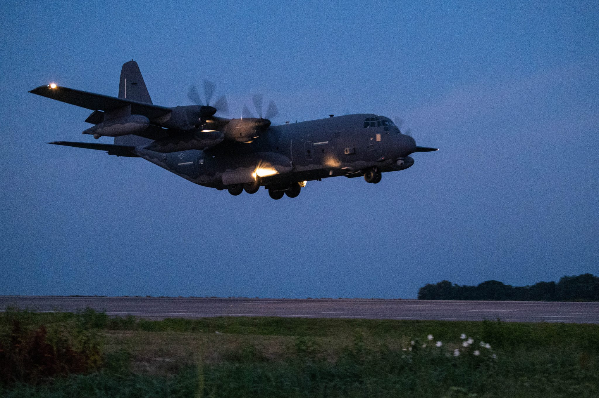
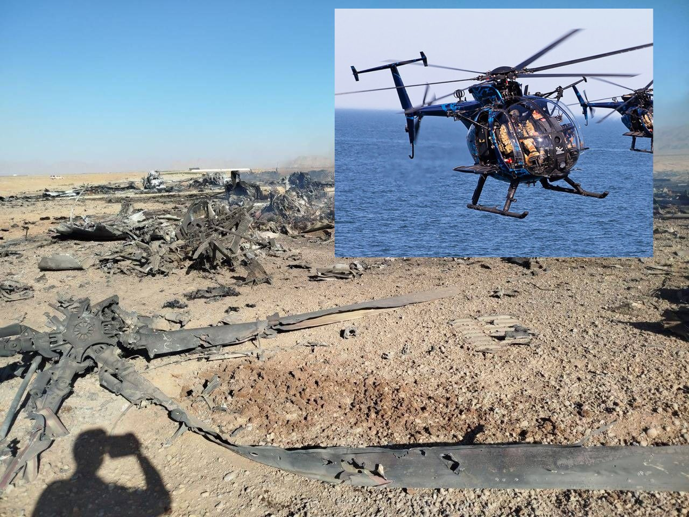
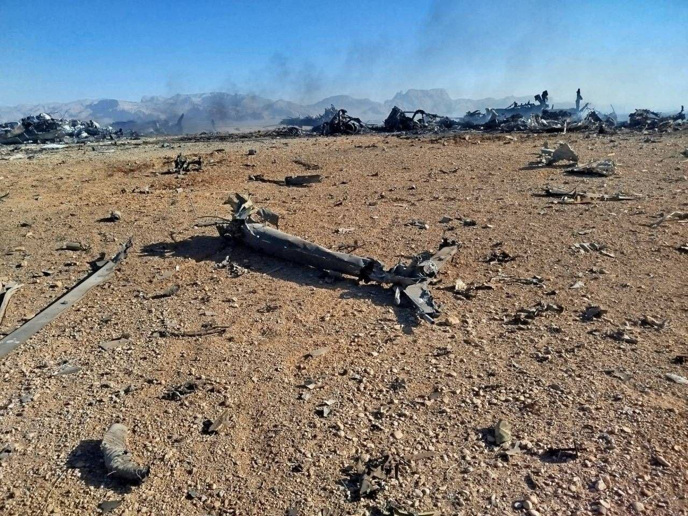
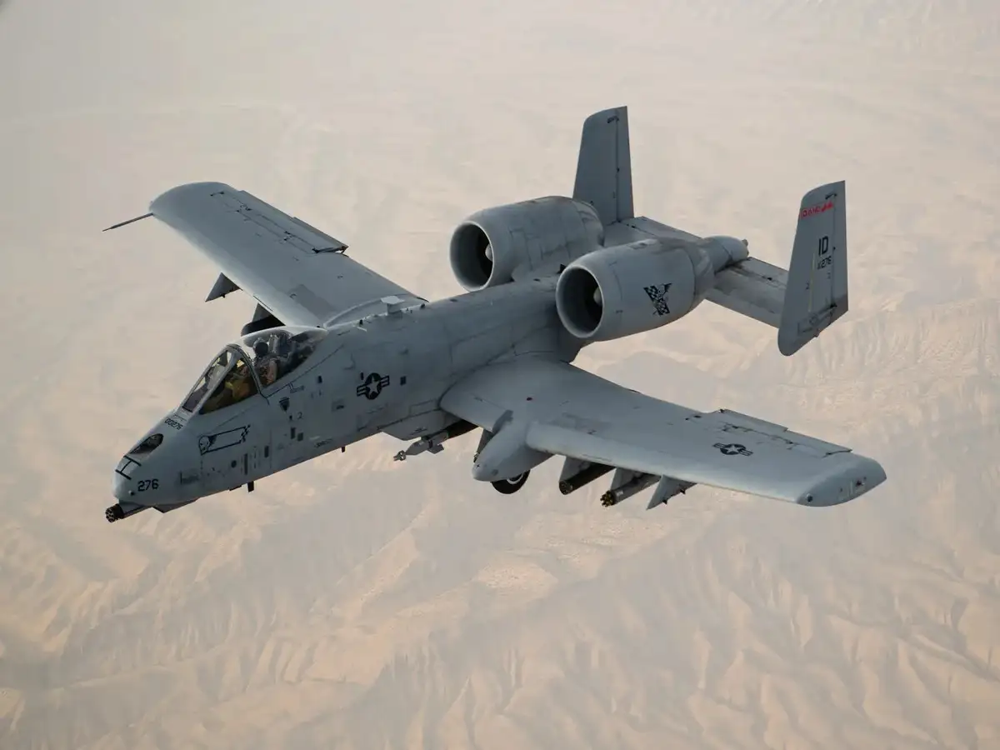

> Durante la madrugada del 3 de abril de 2026, un F-15E Strike Eagle - *callsign Dude 44 -* realizaba misiones de combate en el suroeste de Irán cuando fue alcanzado por un MANPADS guiado por infrarrojos. La tripulación, compuesta por el piloto _«Dude 44 Alpha»_ y el oficial de sistemas de armas (WSO) _«Dude 44 Bravo»_ se eyectó en territorio iraní, iniciando lo que sería una de las operaciones de rescate y extracción de operaciones especiales más complejas en la historia militar moderna, requiriendo una respuesta conjunta sin precedentes para operar de forma prolongada en espacio aéreo disputado.

## Antecedentes y Operación Epic Fury

El 28 de febrero de 2026, Estados Unidos e Israel lanzaron la **Operación Epic Fury**, una campaña de ataques aéreos masivos contra objetivos militares e industriales en todo Irán. Tras varias semanas de intensos bombardeos que neutralizaron gran parte de las defensas antiaéreas enemigas, la superioridad aérea aliada parecía absoluta, llegando a afirmarse desde Washington que el régimen iraní era incapaz de responder ante las incursiones en su espacio aéreo.

El F-15E _Dude 44_, perteneciente al **494th Fighter Squadron** (con base habitual en RAF Lakenheath), había sido desplegado temporalmente en la Base Aérea Muwaffaq Salti en Jordania como parte del refuerzo militar masivo en Oriente Medio. Sus misiones consistían en vuelos de interdicción profunda e incursiones nocturnas en la provincia de Kohgiluyeh y Boyer-Ahmad.

## Primeras horas y el rescate del piloto

El avión se estrelló tras ser alcanzado por un misil portátil (MANPADS) —posteriormente identificado por fuentes iraníes como un Misagh-3, aunque la BBC señaló que esta identificación no pudo verificarse de forma independiente—. Ambos tripulantes se eyectaron por separado sobre la provincia de Isfahan.

En cuanto el F-15E emitió la señal de eyección, el protocolo de combat search and rescue (CSAR) se activó de forma prácticamente automática: dentro de la primera hora tras el derribo ya había activos en el aire moviéndose hacia la zona. Sobre el mediodía del 3 de abril, un HC-130 realizaba maniobras de reabastecimiento en vuelo a baja cota para mantener en el aire a los helicópteros de rescate, mientras varios A-10 Thunderbolt II patrullaban la zona proporcionando apoyo aéreo cercano (CAS) y cobertura frente a una posible respuesta iraní. 

<blockquote class="tweet" data-tweet-id="2040077939052523845">
  <a class="tweet-author" href="https://x.com/Osinttechnical/status/2040077939052523845" target="_blank" rel="noopener">
    
    OSINTtechnical
    @Osinttechnical
  </a>
  
USAF HC-130 refueling a pair of HH-60G Pavehawks over Iran while searching for the downed F-15E aircrew today.

  <a class="tweet-media tweet-media-video" href="https://x.com/Osinttechnical/status/2040077939052523845" target="_blank" rel="noopener">▶ Ver vídeo en X</a>
  <a class="tweet-date" href="https://x.com/Osinttechnical/status/2040077939052523845" target="_blank" rel="noopener">3 de abril de 2026</a>
</blockquote>

<blockquote class="tweet" data-tweet-id="2040145805802106941">
  <a class="tweet-author" href="https://x.com/Osinttechnical/status/2040145805802106941" target="_blank" rel="noopener">
    
    OSINTtechnical
    @Osinttechnical
  </a>
  
Footage of Iranian police firing small arms at a pair of USAF HH-60Ws searching for the downed F-15E crew earlier today.

  <a class="tweet-media tweet-media-video" href="https://x.com/Osinttechnical/status/2040145805802106941" target="_blank" rel="noopener">▶ Ver vídeo en X</a>
  <a class="tweet-date" href="https://x.com/Osinttechnical/status/2040145805802106941" target="_blank" rel="noopener">3 de abril de 2026</a>
</blockquote>

El piloto fue rescatado por fuerzas estadounidenses apenas **siete horas** después del derribo, aunque con heridas de consideración. El WSO, con rango de coronel, quedó "en paradero desconocido": los drones de vigilancia estadounidenses no lograron localizarlo en las primeras horas, dando inicio a una carrera contrarreloj entre las fuerzas de EE. UU. y las iraníes por encontrarlo primero.

Según el Wall Street Journal, Trump pasó buena parte del día en el Ala Oeste, presuntamente presa del pánico y "gritando a sus asesores durante horas", hasta el punto de que los mandos militares le mantuvieron fuera de la Sala de Situación durante gran parte de la operación, informándole solo por teléfono en los momentos clave. Públicamente, la Casa Blanca minimizó el incidente, pero la posible captura del oficial suponía un riesgo de vergüenza política mayúsculo para la administración.

<blockquote class="tweet" data-tweet-id="2040060994781601841">
  <a class="tweet-author" href="https://x.com/Osinttechnical/status/2040060994781601841" target="_blank" rel="noopener">
    
    OSINTtechnical
    @Osinttechnical
  </a>
  
Iranian media has posted the remains of a separated ACES II ejection seat from the downed F-15E.  
 
Indicates at least one of the aircraft’s crew successfully punched out and is on the ground in southwest Iran. Combat search and rescue operations are ongoing.

  
  <a class="tweet-date" href="https://x.com/Osinttechnical/status/2040060994781601841" target="_blank" rel="noopener">3 de abril de 2026</a>
</blockquote>

## La maniobra SERE del oficial de sistemas de armas en los Montes Zagros

Tras la eyección, el WSO sufrió una ligera conmoción y perdió el conocimiento. Al despertar, ascendió una cresta de unos 2.100 metros (7.000 pies) en las estribaciones de los **Montes Zagros** y se ocultó en una grieta rocosa, restringiendo deliberadamente el uso de su baliza de emergencia para evitar que fuera detectada por Irán.

Durante su búsqueda, las fuerzas estadounidenses no solo competían contra el IRGC, sino también contra tribus nómadas **[bajtiaríes](https://www.angelvillazon.com/articulos-culturales/tribus-nomadas-iranies-i-los-bajtiari/)**, tradicionalmente armadas con rifles de caza y con un conocimiento profundo del terreno del Zagros. Irán llegó a ofrecer una recompensa de unos 60.000 dólares por información que condujera a su captura.

## El papel de la CIA y 'Ghost Murmur'

Mientras las fuerzas convencionales y de operaciones especiales rastreaban al WSO sobre el terreno, la CIA desplegó una campaña de desinformación dentro de Irán haciendo circular la idea de que el WSO ya había sido rescatado, con el objetivo de relajar la búsqueda del IRGC. En paralelo, cuando el oficial finalmente emitió una breve señal de radio ("God is good"), fue la Agencia quien compartió la localización de la baliza con el Pentágono, que a su vez tuvo que verificar que no se tratara de una trampa iraní antes de comprometer activos en su rescate. Según [prensa surcoreana](https://www.chosun.com/english/world-en/2026/04/07/4RJEAJL6OJGEPLL6X2YQCQ2VTA/), el esquema de engaño llegó a desplegarse simultáneamente en hasta siete localizaciones distintas para confundir a la inteligencia iraní sobre el punto real de extracción.

La CIA recurrió además al procedimiento doctrinal conocido como *unconventional assisted recovery*, contactando con civiles locales dispuestos a colaborar con las fuerzas estadounidenses sobre el terreno para ayudar a localizar y proteger al aviador. Según reveló originalmente el [New York Post](https://www.newsweek.com/ghost-murmur-secretive-cia-tool-iran-airman-rescue-11797688) —recogido también por [Euronews](https://www.euronews.com/2026/04/08/cia-tracks-his-heart-signal-in-iran-rescued-us-soldier-treated-in-germany)—, la Agencia habría empleado además una tecnología experimental apodada **"Ghost Murmur"**, desarrollada por Skunk Works (Lockheed Martin), que combinaría magnetometría cuántica con filtrado por IA para detectar la señal electromagnética del latido cardíaco humano a distancia y así estimar su ubicación exacta.

'Ghost Murmur' hay que cogerlo con pinzas: [Scientific American](https://www.scientificamerican.com/article/what-is-the-quantum-ghost-murmur-purportedly-used-in-iran-scientists/) recogió opiniones de físicos y especialistas en sensores que consideran que una capacidad de detección remota del latido cardíaco excedería los límites físicos y tecnológicos conocidos actualmente, por lo que no hay evidencia pública independiente que la respalde. 

## La base de operaciones avanzada (FOB)

Con el WSO ya localizado en su grieta rocosa de los Zagros, la fase final de la operación pasaba por sacarlo físicamente de Irán, y para ello Estados Unidos necesitaba un punto de aterrizaje intermedio. La elección recayó en una pista agrícola abandonada, poco más que una franja de tierra de unos 60 x 1.190 metros, situada 23 kilómetros al norte de Shahreza, en el sur de Isfahan. Nunca fue pensada para operaciones militares: no era una pista pavimentada, sino, en palabras del propio Trump semanas después, "un pequeño trozo de tierra muy húmeda y arena", una granja, no un aeródromo.

Allí aterrizaron dos MC-130J Commando II, cada uno valorado en más de 100 millones de dólares, cargados con parte del centenar de operadores de fuerzas especiales que iban a asegurar la zona y ejecutar el rescate final. El problema llegó casi de inmediato: el terreno, blando y encharcado por la humedad, se tragó literalmente el tren de aterrizaje de ambos aparatos. Los dos C-130 quedaron atascados a la vez en la misma pista, con los motores fríos y las ruedas hundidas en el barro, incapaces de generar la tracción necesaria para despegar de nuevo.

*MC-130J Commando II del 492nd Special Operations Wing durante el ejercicio Emerald Warrior 24*
*(USAF / Senior Airman Ty Pilgrim)*

Con Delta Force asegurando el perímetro y el reloj corriendo —las fuerzas iraníes se acercaban a la zona—, cerca de cien operadores estadounidenses se quedaron durante aproximadamente dos horas sin ninguna opción inmediata de extracción, varados en territorio hostil junto a dos aeronaves inutilizadas. La decisión, autorizada por CENTCOM, fue tan rápida como drástica: en lugar de intentar salvar los aparatos, se colocaron cargas y se destruyeron deliberadamente en el sitio, junto con cuatro helicópteros MH-6/AH-6 Little Bird del 160th SOAR, para evitar que cualquiera de los dos cayera en manos iraníes —o, como advirtió más tarde la Casa Blanca, en manos de aliados de Teherán como Rusia o China—.

*Restos destruidos de la FOB, @Osinttechnical, 5 abril 2026.*

*Restos destruidos de la FOB, @Osinttechnical, 5 abril 2026.*

Solo entonces entró en juego una tercera oleada: aeronaves de reemplazo —Dash 8 y C295W de Operaciones Especiales—  volaron hasta la pista, recogieron a la totalidad del personal varado junto con el WSO ya rescatado, y despegaron de vuelta a territorio seguro. Fue este tramo final, más que el tiroteo o la persecución por los Zagros, el que estuvo más cerca de convertir la operación en un desastre: casi un centenar de hombres en tierra enemiga, sin aviones operativos, dependiendo de que un tercer avión llegara a tiempo antes de que las fuerzas iraníes cerraran el cerco.

<blockquote class="tweet" data-tweet-id="2040895085944991766">
  <a class="tweet-author" href="https://x.com/Osinttechnical/status/2040895085944991766" target="_blank" rel="noopener">
    
    OSINTtechnical
    @Osinttechnical
  </a>
  
Footage of a USAF C-295W from the 427th Special Operations Squadron flying low over the western Iranian desert early this morning.

  <a class="tweet-media tweet-media-video" href="https://x.com/Osinttechnical/status/2040895085944991766" target="_blank" rel="noopener">▶ Ver vídeo en X</a>
  <a class="tweet-date" href="https://x.com/Osinttechnical/status/2040895085944991766" target="_blank" rel="noopener">5 de abril de 2026</a>
</blockquote>

Durante la fase final del rescate del WSO, el 5 de abril, Estados Unidos confirmó la pérdida de un A-10 Thunderbolt II, alcanzado mientras prestaba apoyo aéreo cercano sobre la zona de extracción. El piloto logró eyectarse a salvo ya fuera del espacio aéreo iraní. Fue, junto con el propio F-15E, una de las dos pérdidas de aeronaves tripuladas que Irán pudo reclamar como derribos reales durante toda la operación —el resto de bajas materiales (los dos MC-130J y los cuatro Little Bird) fueron autodestrucciones deliberadas de EE. UU., no derribos.

*A-10 Thunderbolt II del 190th Fighter Squadron sobre Afganistán durante la Operación Enduring Freedom.*
## Enjambre de drones ''medusa''?

En junio de 2026, más de dos meses después del rescate, [CNN](https://edition.cnn.com/2026/06/23/politics/iran-drones-f-15-pilot-intelligence) publicó una exclusiva basada en cuatro fuentes que abrió un nuevo frente de debate dentro de la comunidad de inteligencia estadounidense: durante su debriefing posterior al rescate, el piloto del F-15E relató haber visto, justo antes de eyectarse, varios drones iraníes interconectados moviéndose como si fueran un único organismo, con drones más pequeños colgando debajo de los grandes a modo de "patas" — una imagen que él mismo comparó con una medusa. Otra fuente citada por CNN describió la escena directamente como un "campo minado de drones" suspendido en el aire.

El relato no fue recibido de forma unánime. Según [The Aviationist](https://theaviationist.com/2026/06/23/iranian-drone-swarm-jellyfish-formation/), los propios funcionarios de inteligencia que participaron en el debriefing discreparon sobre la fiabilidad del testimonio: el piloto sufrió una conmoción durante la eyección y el rescate, y —dato que añade más ruido al caso— habría sido también [uno de los pilotos implicados en un incidente de fuego amigo sobre Kuwait un mes antes](https://theaviationist.com/2026/06/03/f-15e-pilot-shot-down-two-times/), durante la propia Operación Epic Fury. Ese historial llevó a varios analistas a preguntarle directamente si estaba seguro de lo que decía haber visto.

En términos técnicos, lo descrito por el piloto se corresponde con lo que se conoce como _**one-to-many meshed networking**_: un esquema en el que un único operador controla varios drones que comparten datos entre sí y se desplazan como una unidad coordinada. Rusia y China cuentan con capacidades de este tipo, pero no había constancia previa de que Irán las hubiera desarrollado o desplegado en combate. Precisamente por eso The Aviationist subraya que, de confirmarse, supondría un salto significativo y no anticipado en las capacidades iraníes — pero insiste en que la afirmación sigue sin corroborarse con ninguna evidencia más allá del propio testimonio del piloto, y que ese enjambre no ha sido vinculado de forma concluyente al derribo real del F-15E, que oficialmente se atribuye a un MANPADS.

El hilo quedó abierto meses después: en agosto de 2026, el medio alemán [Focus](https://www.focus.de/politik/ausland/haben-sensoren-an-iranischen-drohnen-zum-abschuss-der-f-15e-beigetragen-iran-soll-us-kampfjet-geortet-haben_da33ba9f-c559-46ad-9f1f-94bc8e00378a.html) recogió la valoración de un experto militar no identificado según la cual Irán probablemente localizó al caza mediante varios drones antes de derribarlo con un misil portátil de origen presuntamente chino —una hipótesis que conectaría, aunque sin confirmación oficial, la observación del piloto con el propio mecanismo del derribo. A día de hoy, ninguna de las dos piezas —el enjambre "medusa" y su posible papel en la detección del F-15E— ha sido confirmada ni descartada de forma oficial por el Pentágono.

## Balance de pérdidas

### Pérdidas materiales — Estados Unidos 🇺🇸

| Aeronave                | Cantidad | Circunstancia                                                                                         |
| ----------------------- | -------- | ----------------------------------------------------------------------------------------------------- |
| MC-130J Commando II     | 2        | Atascadas en la pista de la FOB y autodestruidas deliberadamente para evitar su captura               |
| MH-6 / AH-6 Little Bird | 4        | Del 160th SOAR, autodestruidos junto a los MC-130J en la FOB                                          |
| A-10 Thunderbolt II     | 1        | Derribado por fuerzas iraníes durante la fase final del rescate (5 de abril). Piloto eyectado a salvo |
| UH-60 Black Hawk        | 2        | Alcanzados por fuego de armas ligeras, dañados pero permanecieron operativos                          |

**Coste económico estimado:** ~300 millones de dólares en aeronaves destruidas (cada MC-130J valorado en más de 100 millones por sí solo).

### Pérdidas reclamadas por Irán 🇮🇷 (no confirmadas por EE. UU.)

| Aeronave | Circunstancia |
|---|---|
| MQ-9 Reaper | Irán afirma haberlo derribado sobre Isfahan durante la operación |
| Hermes-900 (israelí) | Irán afirma haberlo derribado en la misma zona |

Ninguna de estas dos últimas ha sido reconocida por Washington ni por Tel Aviv; se basan únicamente en declaraciones del Khatam al-Anbiya Central Headquarters y medios estatales iraníes.

#### Fuentes

- Wikipedia — 2026 United States F-15E rescue operation in Iran ([fuente](https://en.wikipedia.org/wiki/2026_United_States_F-15E_rescue_operation_in_Iran))
- The Guardian — A timeline of the two US military jets shot down by Iran forces ([fuente](https://www.theguardian.com/world/2026/apr/05/timeline-us-military-jets-shot-down))
- Reuters — How a perilous US rescue mission in Iran nearly went off course ([fuente](https://www.reuters.com/business/aerospace-defense/how-perilous-us-rescue-mission-iran-nearly-went-off-course-2026-04-05/))
- CBS News — Inside the daring mission to rescue a U.S. airman downed in Iran ([fuente](https://www.cbsnews.com/projects/2026/us-military-rescue-iran/))
- The New York Times — A Harrowing Race Against Time to Find a Downed U.S. Airman in Iran ([fuente](https://www.nytimes.com/2026/04/05/us/iran-airman-fighter-jet-rescue-mission.html))
- Time — How a U.S. Airman Shot Down in Iran Was Rescued From a Mountain Crevice ([fuente](https://time.com/article/2026/04/05/-safe-and-sound-how-a-u-s-airman-shot-down-in-iran-was-rescued-from-a-mountain-crevice/))
- BBC — How rescue of US airman in remote part of Iran unfolded ([fuente](https://www.bbc.com/news/articles/cx2vpz1kwreo))
- Wall Street Journal — Behind Trump's Public Bravado on the War, He Grapples With His Own Fears ([fuente](https://www.wsj.com/politics/national-security/trump-public-bravado-private-fear-59814dca))

#### CIA / Ghost Murmur

- The Chosun Daily — U.S. Rescues Officer Using Seven-Location Deception in Iran ([fuente](https://www.chosun.com/english/world-en/2026/04/07/4RJEAJL6OJGEPLL6X2YQCQ2VTA/))
- Newsweek — Ghost Murmur: Secretive CIA Tool Linked to Iran Airman Rescue ([fuente](https://www.newsweek.com/ghost-murmur-secretive-cia-tool-iran-airman-rescue-11797688))
- Euronews — CIA tracks his heart signal in Iran, rescued US soldier treated in Germany ([fuente](https://www.euronews.com/2026/04/08/cia-tracks-his-heart-signal-in-iran-rescued-us-soldier-treated-in-germany))
- Scientific American — Is the 'Ghost Murmur' quantum device possible? ([fuente](https://www.scientificamerican.com/article/what-is-the-quantum-ghost-murmur-purportedly-used-in-iran-scientists/))

#### FOB / MC-130J

- FlightGlobal — Iran rescue mission featured 155 aircraft, refuelling over enemy territory and one lost A-10 ([fuente](https://www.flightglobal.com/archive/2026/04/iran-rescue-mission-featured-155-aircraft-refuelling-over-enemy-territory-and-one-lost-a-10/))
- FlightGlobal — Two US MC-130s destroyed on the ground inside Iran as part of F-15E rescue mission ([fuente](https://www.flightglobal.com/archive/2026/04/two-us-mc-130s-destroyed-on-the-ground-inside-iran-as-part-of-f-15e-rescue-mission/))
- MigFlug — Stuck in Sand: US Rescue Helicopter Destroyed Inside Iran ([fuente](https://migflug.com/jetflights/stuck-in-sand-blown-to-pieces-inside-iran/))

#### Enjambre de drones "medusa"

- CNN — Downed US pilot reported seeing Iranian drones swarm in 'jellyfish' formation ([fuente](https://edition.cnn.com/2026/06/23/politics/iran-drones-f-15-pilot-intelligence))
- The Aviationist — Downed U.S. F-15E Pilot Reportedly Observed Unusual Iranian Drone Swarm Moving In 'Jellyfish' Formation ([fuente](https://theaviationist.com/2026/06/23/iranian-drone-swarm-jellyfish-formation/))
- The Aviationist — F-15E Pilot Downed Over Iran Had Also Survived Kuwaiti Friendly Fire Shootdown at Start of War ([fuente](https://theaviationist.com/2026/06/03/f-15e-pilot-shot-down-two-times/))
- Focus — Weaknesses in U.S. air defenses: Iran allegedly located F-15E fighter jet with drones ([fuente](https://www.focus.de/politik/ausland/haben-sensoren-an-iranischen-drohnen-zum-abschuss-der-f-15e-beigetragen-iran-soll-us-kampfjet-geortet-haben_da33ba9f-c559-46ad-9f1f-94bc8e00378a.html))
