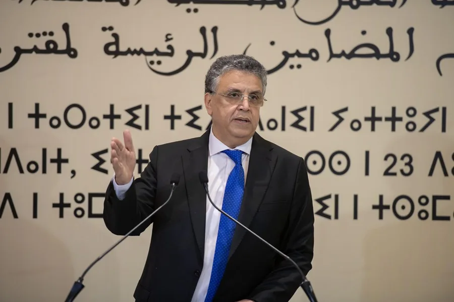
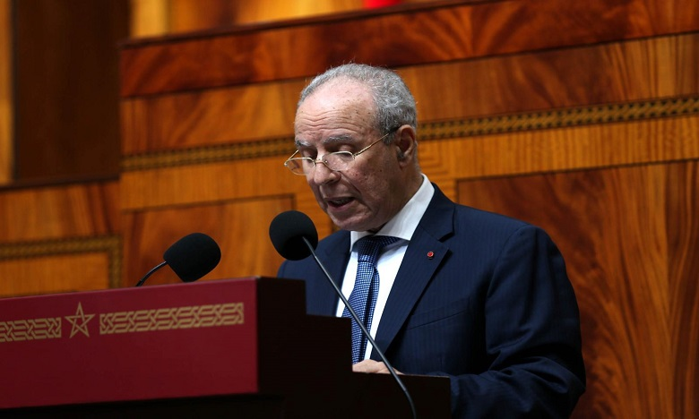
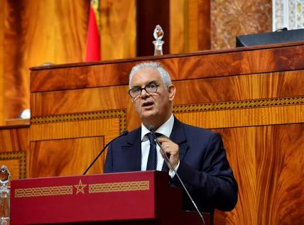

> Durante los días 30 y 31 de julio, [entre 75.000 y 85.000](https://theobjective.com/wp-content/uploads/2026/09/informe_ceuta_sept__compressed.pdf) personas entraron a la ciudad de Ceuta ante la pasividad de las autoridades marroquíes. Durante todo el mes de agosto, el trabajo del gobierno español ha sido incansable a la hora de defender a Marruecos como socio fiable y libre de toda culpa.

> Lejos de ser un vecino amisto, múltiples autoridades políticas y religiosas han reclamado Ceuta, Melilla, y otros territorios españoles, como parte de su tierra. Vamos con una recopilación de todos ellos.

## Abdellatif Ouahbi

**Ministro de Justicia**. El 12 de agosto, en una entrevista con [Asharq News](https://asharq.com/videos/192785/%D9%88%D8%B2%D9%8A%D8%B1-%D8%A7%D9%84%D8%B9%D8%AF%D9%84-%D8%A7%D9%84%D9%85%D8%BA%D8%B1%D8%A8%D9%8A-%D8%A3%D9%88%D8%B1%D9%88%D8%A8%D8%A7-%D8%AA%D8%AA%D8%B9%D8%A7%D9%85%D9%84-%D8%A8%D8%A7%D9%86%D8%AA%D9%82%D8%A7%D8%A6%D9%8A%D8%A9-%D9%85%D8%B9-%D8%A7%D9%84%D9%87%D8%AC%D8%B1%D8%A9/) / Bloomberg, dijo: 

>"Seguimos reivindicando nuestros territorios. Es un asunto que está sobre la mesa. Cada vez que nos reunimos con los españoles planteamos la cuestión." 

El 21-22 de agosto, en la televisión pública 2M, fue más lejos: 

>"Ceuta y Melilla seguirán siendo objeto de diálogo entre nosotros y España, y mantendremos nuestro derecho histórico y nuestro derecho geográfico"

Reclamando una "solución definitiva" que suponga el '*retorno de Ceuta y Melilla al seno de la patria*', y propuso crear una comisión bilateral de diálogo. También vinculó el asunto a que España entregue a los menores marroquíes no acompañados que cruzaron a Ceuta en la crisis migratoria de finales de julio. Estas declaraciones del 21 de agosto provocaron que España convocara a la embajadora marroquí, Karima Benyaich.

## Ahmed Toufiq

**Ministro de Habices y Asuntos Islámicos**. Intervino el 25-26 de agosto en la ceremonia religiosa del Mawlid (nacimiento del profeta) en el Palacio Real de Rabat, presidida por el propio Mohamed VI y el príncipe heredero Moulay Hasán. 

Ante el rey, se refirió a Ceuta y Melilla como "ciudades ocupadas" y evocó la "liberación" de esos territorios, invocando a eruditos religiosos históricos ligados a Ceuta (Ayyad, Al Zafi, Al Jazuli) como "símbolo de movilización" para su recuperación. Es la intervención con mayor carga simbólico-religiosa, hecha literalmente delante del monarca.

## Nizar Baraka

**Ministro de Obras Públicas y Agua** y secretario general del partido Istiqlal, hizo la declaración más reciente, el propio 3 de septiembre, en un mitin electoral (Marruecos está entrando en campaña para sus elecciones legislativas de este mes): 

>"No retrocederemos ni un palmo de nuestro territorio nacional", en referencia directa a la crisis de Ceuta.
