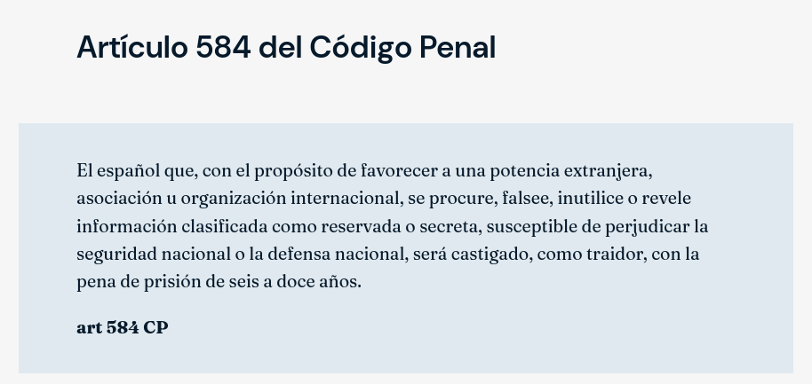

## 06 de agosto

<blockquote class="tweet" data-tweet-id="2085265648393814330">
  <a class="tweet-author" href="https://x.com/pabloharour/status/2085265648393814330" target="_blank" rel="noopener">
    
    Pablo Haro Urquízar
    @pabloharour
  </a>
  
Meloni presiona a la UE para que censure formalmente la regularización masiva de más de un millón de inmigrantes que Sánchez aprobó sin previo aviso, generando el efecto llamada que desató la crisis de Ceuta

  <a class="tweet-date" href="https://x.com/pabloharour/status/2085265648393814330" target="_blank" rel="noopener">6 de agosto de 2026</a>
</blockquote>

<blockquote class="tweet" data-tweet-id="2085398778769486330">
  <a class="tweet-author" href="https://x.com/RelanoPena/status/2085398778769486330" target="_blank" rel="noopener">
    
    Francisco Relaño Peña
    @RelanoPena
  </a>
  
<a href="https://x.com/jmalbares" target="_blank" rel="noopener">@jmalbares</a> <a href="https://x.com/MAECgob" target="_blank" rel="noopener">@MAECgob</a> <a href="https://x.com/EmbEspanaRabat" target="_blank" rel="noopener">@EmbEspanaRabat</a> Si fuera como usted está afirmando, ¿por qué piensa el gobierno desplazar a más de un millar de &quot;supuestos menores&quot; a la península?

  <a class="tweet-date" href="https://x.com/RelanoPena/status/2085398778769486330" target="_blank" rel="noopener">6 de agosto de 2026</a>
</blockquote>

<blockquote class="tweet" data-tweet-id="2085345144908181841">
  <a class="tweet-author" href="https://x.com/MemoriasPez/status/2085345144908181841" target="_blank" rel="noopener">
    
    Memorias de Pez
    @MemoriasPez
  </a>
  
¿Podemos hablar ya de que Felipe VI no ha visitado Ceuta ni Melilla desde que es rey? 
 
¿Podemos hablar ya de que ha tenido que ir el Presidente de Ceuta a Mallorca para verle? 
 
¿Podemos hablar de que Marruecos ha dicho que Felipe VI felicitó a Mohammed VI en plena crisis?

  
  <a class="tweet-date" href="https://x.com/MemoriasPez/status/2085345144908181841" target="_blank" rel="noopener">6 de agosto de 2026</a>
</blockquote>

## 07 de agosto

<blockquote class="tweet" data-tweet-id="2085647741330338071">
  <a class="tweet-author" href="https://x.com/okdiario/status/2085647741330338071" target="_blank" rel="noopener">
    
    okdiario.com
    @okdiario
  </a>
  
El Gobierno da 37 millones a los menas de Ceuta mientras 63.000 afectados por los incendios siguen esperando las ayudas. 
 
✍️ Informa Alba Martín (<a href="https://x.com/alba_mrtn" target="_blank" rel="noopener">@alba_mrtn</a>)

  <a class="tweet-date" href="https://x.com/okdiario/status/2085647741330338071" target="_blank" rel="noopener">7 de agosto de 2026</a>
</blockquote>

<blockquote class="tweet" data-tweet-id="2085624390494933006">
  <a class="tweet-author" href="https://x.com/felixbolanosg/status/2085624390494933006" target="_blank" rel="noopener">
    
    Félix Bolaños
    @felixbolanosg
  </a>
  
Los ministros del Interior, Exteriores, Defensa y yo compareceremos en el Congreso a petición propia en agosto para informar sobre la gestión de los hechos ocurridos en Ceuta el 30 de julio.  
 
Frente a los bulos, el odio y la xenofobia, hechos y transparencia.

  <a class="tweet-date" href="https://x.com/felixbolanosg/status/2085624390494933006" target="_blank" rel="noopener">7 de agosto de 2026</a>
</blockquote>

<blockquote class="tweet" data-tweet-id="2085659611428704326">
  <a class="tweet-author" href="https://x.com/Political_Room/status/2085659611428704326" target="_blank" rel="noopener">
    
    The Political Room
    @Political_Room
  </a>
  
🇪🇸🇲🇦 IMPORTANTE Aparece un misterioso y extenso informe de 120 páginas que podría haber sido filtrado por el CNI.  
 
La forma en que está montado el sitio web y la cantidad ingente de información que contiene apuntarían en esa dirección. 
 
El informe además deja caer una idea […]

  <a class="tweet-date" href="https://x.com/Political_Room/status/2085659611428704326" target="_blank" rel="noopener">7 de agosto de 2026</a>
</blockquote>

<blockquote class="tweet" data-tweet-id="2085780269097787606">
  <a class="tweet-author" href="https://x.com/TheObjective_es/status/2085780269097787606" target="_blank" rel="noopener">
    
    THE OBJECTIVE
    @TheObjective_es
  </a>
  
🔴 EXCLUSIVA | La inteligencia militar informó al Gobierno tres días antes del asalto a Ceuta

  <a class="tweet-date" href="https://x.com/TheObjective_es/status/2085780269097787606" target="_blank" rel="noopener">7 de agosto de 2026</a>
</blockquote>

**NOTICIAS DEL DÍA**

- Meloni rechaza el ultimátum de Sánchez y mantendrá la suspensión de Schengen con España: «Italia no acepta imposiciones» ([fuente](https://www.elespanol.com/espana/politica/20260807/ultima-hora-politica-directo-sanchez-preside-lanzarote-reunion-telematica-ceuta-marlaska-robles-saiz-rego/1003744346443_10.html?utm_cmp_rs=breaking))
- España establece controles a los viajeros procedentes de Italia tras la negativa de Meloni a retirar los suyos a los españoles ([fuente](https://www.elmundo.es/espana/2026/08/07/6a75bbd6e4d4d8ff228b459a.html))
- Moncloa destina 475.000 euros a la inclusión de discapacitados en Marruecos en el Mundial ([fuente](https://theobjective.com/espana/2026-08-08/gobierno-empleo-turismo-marruecos-mundial/))

## 08 de agosto

<blockquote class="tweet" data-tweet-id="2086048582994428230">
  <a class="tweet-author" href="https://x.com/interiorgob/status/2086048582994428230" target="_blank" rel="noopener">
    
    Ministerio del Interior
    @interiorgob
  </a>
  
<a href="https://x.com/hashtag/Últimahora" target="_blank" rel="noopener">#Últimahora</a> | Grande-Marlaska comunica a la <a href="https://x.com/hashtag/UE" target="_blank" rel="noopener">#UE</a> el restablecimiento de los controles fronterizos en las conexiones aéreas y marítimas con <a href="https://x.com/hashtag/Italia" target="_blank" rel="noopener">#Italia</a>.  
 
<a href="https://x.com/hashtag/España" target="_blank" rel="noopener">#España</a> sigue con atención la evolución de la situación migratoria  
y, en particular,  la que afecta a la República Italiana.

  
  <a class="tweet-date" href="https://x.com/interiorgob/status/2086048582994428230" target="_blank" rel="noopener">8 de agosto de 2026</a>
</blockquote>

<blockquote class="tweet" data-tweet-id="2086115031863709844">
  <a class="tweet-author" href="https://x.com/elmundoes/status/2086115031863709844" target="_blank" rel="noopener">
    
    EL MUNDO
    @elmundoes
  </a>
  
Expulsado de España a Marruecos por entrar en una vivienda en Ceuta y meterse en la cama de una mujer

  <a class="tweet-date" href="https://x.com/elmundoes/status/2086115031863709844" target="_blank" rel="noopener">8 de agosto de 2026</a>
</blockquote>

<blockquote class="tweet" data-tweet-id="2086149895824589087">
  <a class="tweet-author" href="https://x.com/Santi_ABASCAL/status/2086149895824589087" target="_blank" rel="noopener">
    
    Santiago Abascal 🇪🇸
    @Santi_ABASCAL
  </a>
  
La traición de Pedro Sánchez a los españoles debe llevarse a los tribunales.   
 
Por ello proponemos activar el procedimiento previsto en el artículo 102 de la Constitución, que atribuye a la Sala de lo Penal del Tribunal Supremo la competencia para exigir la responsabilidad […]

  <a class="tweet-date" href="https://x.com/Santi_ABASCAL/status/2086149895824589087" target="_blank" rel="noopener">8 de agosto de 2026</a>
</blockquote>

<blockquote class="tweet" data-tweet-id="2086168429724123463">
  <a class="tweet-author" href="https://x.com/rubnpulido/status/2086168429724123463" target="_blank" rel="noopener">
    
    Rubén Pulido
    @rubnpulido
  </a>
  
Según la Ordenanza Municipal de uso y aprovechamiento de playas de la Ciudad Autónoma de Ceuta: queda prohibida, durante todo el año y a cualquier hora, la instalación de tiendas de campaña y las acampadas de cualquier duración en todas las playas del litoral ceutí. Las sanciones […]

  <a class="tweet-media tweet-media-video" href="https://x.com/rubnpulido/status/2086168429724123463" target="_blank" rel="noopener">▶ Ver vídeo en X</a>
  <a class="tweet-date" href="https://x.com/rubnpulido/status/2086168429724123463" target="_blank" rel="noopener">8 de agosto de 2026</a>
</blockquote>

<blockquote class="tweet" data-tweet-id="2086056869030711495">
  <a class="tweet-author" href="https://x.com/eldebate_com/status/2086056869030711495" target="_blank" rel="noopener">
    
    El Debate
    @eldebate_com
  </a>
  
🔴 Vivas acusa al Gobierno de mentir 
 
«No se puede decir que hay 2.500 en Ceuta cuando hay entre 8.000 y 11.000»

  <a class="tweet-date" href="https://x.com/eldebate_com/status/2086056869030711495" target="_blank" rel="noopener">8 de agosto de 2026</a>
</blockquote>

## 09 de agosto

<blockquote class="tweet" data-tweet-id="2086360665459994731">
  <a class="tweet-author" href="https://x.com/herqles_es/status/2086360665459994731" target="_blank" rel="noopener">
    
    ʜᴇʀQʟᴇs
    @herqles_es
  </a>
  
🇮🇹🇪🇸🇲🇦 | Los servicios de inteligencia italianos temen que el asalto a Ceuta previsto para el 15 de agosto pueda adelantarse: 
 
Según medios locales, los servicios de inteligencia italianos consideran que la fecha difundida en redes sociales para un supuesto nuevo asalto a la […]

  
  <a class="tweet-date" href="https://x.com/herqles_es/status/2086360665459994731" target="_blank" rel="noopener">9 de agosto de 2026</a>
</blockquote>

<blockquote class="tweet" data-tweet-id="2086527044431565080">
  <a class="tweet-author" href="https://x.com/WillyTolerdoo/status/2086527044431565080" target="_blank" rel="noopener">
    
    Willy Tolerdo
    @WillyTolerdoo
  </a>
  
Manifestación masiva contra la lamentable gestión de Pedro Sánchez en Ceuta

  <a class="tweet-media tweet-media-video" href="https://x.com/WillyTolerdoo/status/2086527044431565080" target="_blank" rel="noopener">▶ Ver vídeo en X</a>
  <a class="tweet-date" href="https://x.com/WillyTolerdoo/status/2086527044431565080" target="_blank" rel="noopener">9 de agosto de 2026</a>
</blockquote>

<blockquote class="tweet" data-tweet-id="2086472570614759632">
  <a class="tweet-author" href="https://x.com/elespanolcom/status/2086472570614759632" target="_blank" rel="noopener">
    
    EL ESPAÑOL
    @elespanolcom
  </a>
  
📚 En plena escalada de la crisis migratoria y con la atención mediática centrada en la gestión de las fronteras, Pedro Sánchez ha vuelto a activar sus redes sociales para recomendar &quot;tres libros para el verano&quot;

  <a class="tweet-media tweet-media-video" href="https://x.com/elespanolcom/status/2086472570614759632" target="_blank" rel="noopener">▶ Ver vídeo en X</a>
  <a class="tweet-date" href="https://x.com/elespanolcom/status/2086472570614759632" target="_blank" rel="noopener">9 de agosto de 2026</a>
</blockquote>

---

Las redes sociales de Marruecos multiplican los mensajes convocando un asalto a Ceuta el 15 de agosto ([fuente](https://www.elespanol.com/espana/20260809/redes-sociales-llaman-nueva-entrada-ceuta-proximo-agosto-ceuties-dicen-basta/1003744348107_0.html))

## 10 de agosto

<blockquote class="tweet" data-tweet-id="2086726536183333067">
  <a class="tweet-author" href="https://x.com/Josevizner/status/2086726536183333067" target="_blank" rel="noopener">
    
    Jose Vizner
    @Josevizner
  </a>
  
The Telegraph pone de vuelta y media a Sánchez.  
 
Que acaba el artículo basado en el inicio en Ceuta con la reflexión de que Sánchez es un París internacional, cada vez más aislado en el escenario mundial. 
 
Ya le van conociendo fuera.

  
  <a class="tweet-date" href="https://x.com/Josevizner/status/2086726536183333067" target="_blank" rel="noopener">10 de agosto de 2026</a>
</blockquote>

<blockquote class="tweet" data-tweet-id="2086764510438683025">
  <a class="tweet-author" href="https://x.com/WillyTolerdoo/status/2086764510438683025" target="_blank" rel="noopener">
    
    Willy Tolerdo
    @WillyTolerdoo
  </a>
  
La maravillosa gestión de Pedro Sánchez en Ceuta

  <a class="tweet-media tweet-media-video" href="https://x.com/WillyTolerdoo/status/2086764510438683025" target="_blank" rel="noopener">▶ Ver vídeo en X</a>
  <a class="tweet-date" href="https://x.com/WillyTolerdoo/status/2086764510438683025" target="_blank" rel="noopener">10 de agosto de 2026</a>
</blockquote>

<blockquote class="tweet" data-tweet-id="2086739875781382413">
  <a class="tweet-author" href="https://x.com/Political_Room/status/2086739875781382413" target="_blank" rel="noopener">
    
    The Political Room
    @Political_Room
  </a>
  
🇪🇺🇲🇦 Según el comisario europeo de Migración, Magnus Brunner, la UE no puede permitir que el control de sus fronteras exteriores dependa exclusivamente de la buena voluntad de países terceros en calidad de zona de tránsito, en referencia a Marruecos. 
 
Brunner señala así […]

  <a class="tweet-date" href="https://x.com/Political_Room/status/2086739875781382413" target="_blank" rel="noopener">10 de agosto de 2026</a>
</blockquote>

<blockquote class="tweet" data-tweet-id="2086787574790558127">
  <a class="tweet-author" href="https://x.com/EFEnoticias/status/2086787574790558127" target="_blank" rel="noopener">
    
    EFE Noticias
    @EFEnoticias
  </a>
  
<a href="https://x.com/hashtag/ÚLTIMAHORA" target="_blank" rel="noopener">#ÚLTIMAHORA</a> | El Gobierno eleva a 80.000 las personas que entraron en Ceuta los días 30 y 31 de julio.

  <a class="tweet-media tweet-media-video" href="https://x.com/EFEnoticias/status/2086787574790558127" target="_blank" rel="noopener">▶ Ver vídeo en X</a>
  <a class="tweet-date" href="https://x.com/EFEnoticias/status/2086787574790558127" target="_blank" rel="noopener">10 de agosto de 2026</a>
</blockquote>

**NOTICIAS DEL DÍA**

- El primer ministro marroquí Al Othmani vuelve a la carga con su retórica imperialista refiriendo Ceuta y Melilla como ciudades ocupadas. ([fuente](https://x.com/Political_Room/status/2086740658870480902?s=20))
- Marruecos exige repatriar a todos sus menores no acompañados que están en España. ([fuente](https://x.com/TheObjective_es/status/2086804154480001071?ref_src=twsrc%5Etfw%7Ctwcamp%5Etweetembed%7Ctwterm%5E2086804154480001071%7Ctwgr%5E%7Ctwcon%5Es1_c10&ref_url=))

## 11 de agosto

<blockquote class="tweet" data-tweet-id="2087231421853143173">
  <a class="tweet-author" href="https://x.com/Anonymous_TA/status/2087231421853143173" target="_blank" rel="noopener">
    
    Anonymous Tabarnia 🃏
    @Anonymous_TA
  </a>
  
Miles de marroquíes se AGRUPAN en la frontera con Ceuta 
 
Espero lo PEOR

  <a class="tweet-media tweet-media-video" href="https://x.com/Anonymous_TA/status/2087231421853143173" target="_blank" rel="noopener">▶ Ver vídeo en X</a>
  <a class="tweet-date" href="https://x.com/Anonymous_TA/status/2087231421853143173" target="_blank" rel="noopener">11 de agosto de 2026</a>
</blockquote>

<blockquote class="tweet" data-tweet-id="2087085913763352871">
  <a class="tweet-author" href="https://x.com/voz_populi/status/2087085913763352871" target="_blank" rel="noopener">
    
    Vozpópuli
    @voz_populi
  </a>
  
🟢 EXCLUSIVA Vozpópuli 
 
El ministro del Interior, Fernando Grande-Marlaska, condecoró a ocho altos cargos de la inteligencia marroquí apenas unas semanas antes del asalto masivo a Ceuta. En concreto, concedió la Cruz de la Orden del Mérito de la Guardia Civil con distintivo […]

  
  <a class="tweet-date" href="https://x.com/voz_populi/status/2087085913763352871" target="_blank" rel="noopener">11 de agosto de 2026</a>
</blockquote>

<blockquote class="tweet" data-tweet-id="2087281265590354191">
  <a class="tweet-author" href="https://x.com/TalebSahara/status/2087281265590354191" target="_blank" rel="noopener">
    
    Taleb Alisalem
    @TalebSahara
  </a>
  
🔴 MUY IMPORTANTE | El actual ministro de justicia marroquí acaba de declarar en una televisión árabe que quieren negociar con España el estatus de Ceuta y Melilla a quien considera ciudades marroquíes 
 
Esta sería la primera declaración oficial del gobierno marroquí sobre el tema

  <a class="tweet-media tweet-media-video" href="https://x.com/TalebSahara/status/2087281265590354191" target="_blank" rel="noopener">▶ Ver vídeo en X</a>
  <a class="tweet-date" href="https://x.com/TalebSahara/status/2087281265590354191" target="_blank" rel="noopener">11 de agosto de 2026</a>
</blockquote>

**NOTICIAS DEL DÍA**

- EEUU y Marruecos estrenan un centro de ensayo de armamento frente a Canarias lanzando un misil de largo alcance ([fuente](https://x.com/elespanolcom/status/2087041662232998265?ref_src=twsrc%5Etfw%7Ctwcamp%5Etweetembed%7Ctwterm%5E2087041662232998265%7Ctwgr%5E%7Ctwcon%5Es1_c10&ref_url=))
- Robles comparecerá en el Senado por la invasión de Ceuta tras la presión del PP: Marlaska y Albares callan. ([fuente](https://x.com/okdiario/status/2087149858314469474?ref_src=twsrc%5Etfw%7Ctwcamp%5Etweetembed%7Ctwterm%5E2087149858314469474%7Ctwgr%5E%7Ctwcon%5Es1_c10&ref_url=))
## 12 de agosto

<blockquote class="tweet" data-tweet-id="2087419581635715551">
  <a class="tweet-author" href="https://x.com/okdiario/status/2087419581635715551" target="_blank" rel="noopener">
    
    okdiario.com
    @okdiario
  </a>
  
🔴 LA PORTADA DEL 12 AGOSTO  
 
OKDIARIO capta a los padres de Sánchez en La Mareta con camarero, escolta y coche oficial mientras 10.000 inmigrantes ilegales asedian Ceuta.

  <a class="tweet-date" href="https://x.com/okdiario/status/2087419581635715551" target="_blank" rel="noopener">12 de agosto de 2026</a>
</blockquote>

<blockquote class="tweet" data-tweet-id="2087149852048166920">
  <a class="tweet-author" href="https://x.com/okdiario/status/2087149852048166920" target="_blank" rel="noopener">
    
    okdiario.com
    @okdiario
  </a>
  
💥 El periodista y escritor Chani estalla contra Sánchez por viajar a ver el eclipse tras la crisis migratoria en Ceuta. 
 
&quot;Es el presidente de una nación que ha visto invadidas y violadas sus fronteras, que tiene una ciudad en emergencia absoluta, y se viene a hacer el capullo […]

  <a class="tweet-media tweet-media-video" href="https://x.com/okdiario/status/2087149852048166920" target="_blank" rel="noopener">▶ Ver vídeo en X</a>
  <a class="tweet-date" href="https://x.com/okdiario/status/2087149852048166920" target="_blank" rel="noopener">11 de agosto de 2026</a>
</blockquote>

<blockquote class="tweet" data-tweet-id="2087225031243735465">
  <a class="tweet-author" href="https://x.com/europapress/status/2087225031243735465" target="_blank" rel="noopener">
    
    Europa Press
    @europapress
  </a>
  
Mónica García anuncia que visitará Ceuta para abordar la crisis migratoria y descarta una &quot;catástrofe sanitaria&quot;: &quot;Ni ha existido ni existe actualmente falta de atención alguna en el Área Sanitaria de Ceuta&quot;

  <a class="tweet-date" href="https://x.com/europapress/status/2087225031243735465" target="_blank" rel="noopener">11 de agosto de 2026</a>
</blockquote>

<blockquote class="tweet" data-tweet-id="2087471550500856285">
  <a class="tweet-author" href="https://x.com/wallstwolverine/status/2087471550500856285" target="_blank" rel="noopener">
    
    Wall Street Wolverine
    @wallstwolverine
  </a>
  
Se registra un incendio en parques de Ceuta provocado por inmigrantes.

  <a class="tweet-media tweet-media-video" href="https://x.com/wallstwolverine/status/2087471550500856285" target="_blank" rel="noopener">▶ Ver vídeo en X</a>
  <a class="tweet-date" href="https://x.com/wallstwolverine/status/2087471550500856285" target="_blank" rel="noopener">12 de agosto de 2026</a>
</blockquote>

<blockquote class="tweet" data-tweet-id="2087482235536523761">
  <a class="tweet-author" href="https://x.com/larazon_es/status/2087482235536523761" target="_blank" rel="noopener">
    
    La Razón
    @larazon_es
  </a>
  
🇲🇦 El Gobierno marroqui dice que recuperará Ceuta y Melilla con paciencia y diálogo

  <a class="tweet-date" href="https://x.com/larazon_es/status/2087482235536523761" target="_blank" rel="noopener">12 de agosto de 2026</a>
</blockquote>

<blockquote class="tweet" data-tweet-id="2087545476971106522">
  <a class="tweet-author" href="https://x.com/wallstwolverine/status/2087545476971106522" target="_blank" rel="noopener">
    
    Wall Street Wolverine
    @wallstwolverine
  </a>
  
Margarita Robles, minstra de Defensa, tras su reunión con el presidente de Ceuta: “Lo que pasó el día 30 no puede volver a ocurrir. Tiene que quedar muy claro que Ceuta y Melilla no son españolas, son españolísimas. No se las toca”

  <a class="tweet-media tweet-media-video" href="https://x.com/wallstwolverine/status/2087545476971106522" target="_blank" rel="noopener">▶ Ver vídeo en X</a>
  <a class="tweet-date" href="https://x.com/wallstwolverine/status/2087545476971106522" target="_blank" rel="noopener">12 de agosto de 2026</a>
</blockquote>

<blockquote class="tweet" data-tweet-id="2087510117528789399">
  <a class="tweet-author" href="https://x.com/okdiario/status/2087510117528789399" target="_blank" rel="noopener">
    
    okdiario.com
    @okdiario
  </a>
  
‼️ &quot;¡Tengo miedo, he tenido que coger un cuchillo!&quot;. 
 
Una vecina de Ceuta ha estallado este miércoles ante la presencia de la ministra de Defensa, Margarita Robles, por el abandono del Gobierno que preside Pedro Sánchez a Ceuta. 
 
Vía: AlRojoVivo 
 
📲 Todos los detalles: […]

  <a class="tweet-media tweet-media-video" href="https://x.com/okdiario/status/2087510117528789399" target="_blank" rel="noopener">▶ Ver vídeo en X</a>
  <a class="tweet-date" href="https://x.com/okdiario/status/2087510117528789399" target="_blank" rel="noopener">12 de agosto de 2026</a>
</blockquote>

<blockquote class="tweet" data-tweet-id="2087047569075470547">
  <a class="tweet-author" href="https://x.com/larazon_es/status/2087047569075470547" target="_blank" rel="noopener">
    
    La Razón
    @larazon_es
  </a>
  
🇪🇸🇲🇦 España-Marruecos: la confianza frente a la desestabilización

  <a class="tweet-date" href="https://x.com/larazon_es/status/2087047569075470547" target="_blank" rel="noopener">11 de agosto de 2026</a>
</blockquote>

<blockquote class="tweet" data-tweet-id="2087654435145367955">
  <a class="tweet-author" href="https://x.com/guidoprincesa/status/2087654435145367955" target="_blank" rel="noopener">
    
    Samuel
    @guidoprincesa
  </a>
  
Casi un centenar de seres humanos muertos, un número indeterminado de niñas agredidas sexualmente (al parecer, también niños). Miles de familias encerradas durante días en sus casas muertas de miedo. Saqueos, palizas. 
Y parace que no ha pasado nada. Ni un cese o dimisión. Nada.

  <a class="tweet-date" href="https://x.com/guidoprincesa/status/2087654435145367955" target="_blank" rel="noopener">12 de agosto de 2026</a>
</blockquote>

**NOTICIAS DEL DÍA**

- Marruecos insiste a España a que devuelva a los menores de forma rápida: «tienen que asumir sus responsabilidades» ([fuente](https://www.vozpopuli.com/espana/marruecos-insiste-a-espana-a-que-devuelva-a-los-menores-de-forma-rapida-tienen-que-asumir-sus-responsabilidades.html#Echobox=1786544109))
- Marruecos estudia suspender el acuerdo de extradición con España, según apunta su ministro de Justicia en una entrevista con EFE. ([fuente](https://x.com/EFEnoticias/status/2087558369921941820?ref_src=twsrc%5Etfw%7Ctwcamp%5Etweetembed%7Ctwterm%5E2087558369921941820%7Ctwgr%5E%7Ctwcon%5Es1_c10&ref_url=))
