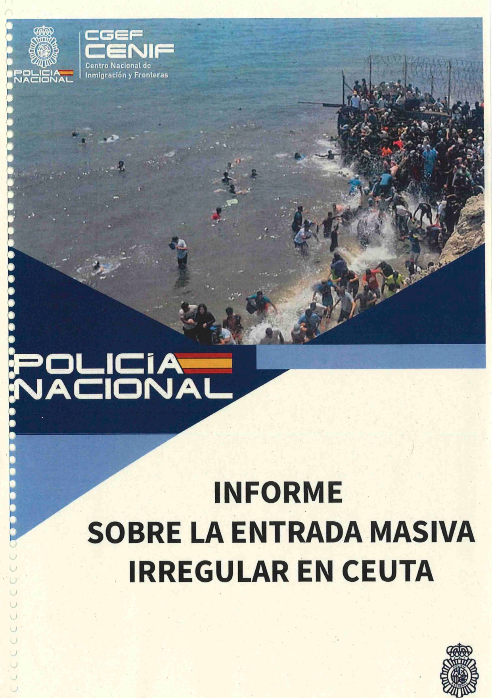
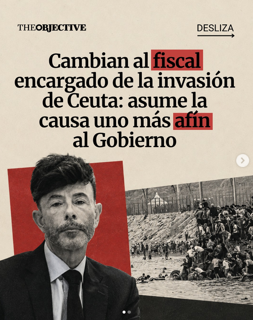

## 03 de septiembre - El famoso informe del CENIF

[enlace](https://youtu.be/Y-mci3pBpTw)

<blockquote class="tweet" data-tweet-id="2095421208351175066">
  <a class="tweet-author" href="https://x.com/educarazo/status/2095421208351175066" target="_blank" rel="noopener">
    
    Eduardo Carazo
    @educarazo
  </a>
  
Alguien NO aplaude el anuncio de Sánchez de “publicar todos los informes”

  <a class="tweet-media tweet-media-video" href="https://x.com/educarazo/status/2095421208351175066" target="_blank" rel="noopener">▶ Ver vídeo en X</a>
  <a class="tweet-date" href="https://x.com/educarazo/status/2095421208351175066" target="_blank" rel="noopener">3 de septiembre de 2026</a>
</blockquote>

<blockquote class="tweet" data-tweet-id="2095433830509195352">
  <a class="tweet-author" href="https://x.com/voz_populi/status/2095433830509195352" target="_blank" rel="noopener">
    
    Vozpópuli
    @voz_populi
  </a>
  
🟢 Abascal retrata a Pedro Sánchez tras la invasión a Ceuta: 
 
&quot;Marruecos no necesita embajador en España, usted es su embajador aquí&quot;

  <a class="tweet-media tweet-media-video" href="https://x.com/voz_populi/status/2095433830509195352" target="_blank" rel="noopener">▶ Ver vídeo en X</a>
  <a class="tweet-date" href="https://x.com/voz_populi/status/2095433830509195352" target="_blank" rel="noopener">3 de septiembre de 2026</a>
</blockquote>

<blockquote class="tweet" data-tweet-id="2095384726567600368">
  <a class="tweet-author" href="https://x.com/entrammbasaguas/status/2095384726567600368" target="_blank" rel="noopener">
    
    Alejandro Entrambasaguas
    @entrammbasaguas
  </a>
  
<a href="https://x.com/hashtag/INVESTIGACIÓN" target="_blank" rel="noopener">#INVESTIGACIÓN</a> Exteriores ha dado a Marruecos 45,1 millones para «cooperación fronteriza» que se está usando de manera militar. Entre ellos hay vehículos para tropas y visores nocturnos. Estas transferencias se han hecho a través de una fundación pública.

  <a class="tweet-date" href="https://x.com/entrammbasaguas/status/2095384726567600368" target="_blank" rel="noopener">3 de septiembre de 2026</a>
</blockquote>

<blockquote class="tweet" data-tweet-id="2095448546493264227">
  <a class="tweet-author" href="https://x.com/elespanolcom/status/2095448546493264227" target="_blank" rel="noopener">
    
    EL ESPAÑOL
    @elespanolcom
  </a>
  
🔴‼️ Sánchez anuncia que elevará a 7.000 las plazas para migrantes en Ceuta 3 días después de decir que sólo hay 5.000 en la ciudad

  <a class="tweet-date" href="https://x.com/elespanolcom/status/2095448546493264227" target="_blank" rel="noopener">3 de septiembre de 2026</a>
</blockquote>

<blockquote class="tweet" data-tweet-id="2095486297217339486">
  <a class="tweet-author" href="https://x.com/elespanolcom/status/2095486297217339486" target="_blank" rel="noopener">
    
    EL ESPAÑOL
    @elespanolcom
  </a>
  
🔴 <a href="https://x.com/hashtag/URGENTE" target="_blank" rel="noopener">#URGENTE</a> | Bloqueados los 32 millones de ayuda urgente de la UE a Ceuta por la falta de respuestas de España a preguntas de Bruselas 
 
✍️ Por <a href="https://x.com/jsanhermelando" target="_blank" rel="noopener">@jsanhermelando</a>

  <a class="tweet-date" href="https://x.com/elespanolcom/status/2095486297217339486" target="_blank" rel="noopener">3 de septiembre de 2026</a>
</blockquote>

<blockquote class="tweet" data-tweet-id="2095549342618735082">
  <a class="tweet-author" href="https://x.com/elespanolcom/status/2095549342618735082" target="_blank" rel="noopener">
    
    EL ESPAÑOL
    @elespanolcom
  </a>
  
🔴 <a href="https://x.com/hashtag/URGENTE" target="_blank" rel="noopener">#URGENTE</a> | Un marroquí detenido en Ceuta al intentar apuñalar a un militar y amenazar a un operario del puerto para subirse a un barco 
 
✍️ <a href="https://x.com/jismael00" target="_blank" rel="noopener">@jismael00</a>

  <a class="tweet-date" href="https://x.com/elespanolcom/status/2095549342618735082" target="_blank" rel="noopener">3 de septiembre de 2026</a>
</blockquote>

<blockquote class="tweet" data-tweet-id="2095548326087147752">
  <a class="tweet-author" href="https://x.com/rubnpulido/status/2095548326087147752" target="_blank" rel="noopener">
    
    Rubén Pulido
    @rubnpulido
  </a>
  
Por cierto, que la cámara del capó del coche dejase de funcionar podría no ser casual. El dispositivo —que opera por wifi— pudo haber sido inhibido deliberadamente por los drones marroquíes que operaban sobre el terreno. Había uno grabándonos sin el menor pudor. ¿Cómo tolera […]

  <a class="tweet-media tweet-media-video" href="https://x.com/rubnpulido/status/2095548326087147752" target="_blank" rel="noopener">▶ Ver vídeo en X</a>
  <a class="tweet-date" href="https://x.com/rubnpulido/status/2095548326087147752" target="_blank" rel="noopener">3 de septiembre de 2026</a>
</blockquote>

<blockquote class="tweet" data-tweet-id="2095595001577148622">
  <a class="tweet-author" href="https://x.com/wallstwolverine/status/2095595001577148622" target="_blank" rel="noopener">
    
    Wall Street Wolverine
    @wallstwolverine
  </a>
  
Así han cazado una cría de delfín los inmigrantes en Ceuta:

  <a class="tweet-media tweet-media-video" href="https://x.com/wallstwolverine/status/2095595001577148622" target="_blank" rel="noopener">▶ Ver vídeo en X</a>
  <a class="tweet-date" href="https://x.com/wallstwolverine/status/2095595001577148622" target="_blank" rel="noopener">3 de septiembre de 2026</a>
</blockquote>

**NOTICIAS DEL DÍA**

- Las ONG que protegen a los invasores de Ceuta se alojan en un edificio público cedido por el ministerio de Elma Saiz ([fuente](https://okdiario.com/espana/ong-que-protegen-invasores-ceuta-alojan-edificio-publico-cedido-ministerio-elma-saiz-20211151#Echobox=1788415699-2))
- Los ministros Torres y Saiz huyen por una puerta trasera del acto institucional en Ceuta al grito de «¡Traidores dimisión!». ([fuente](https://okdiario.com/espana/ministros-torres-saiz-huyen-puerta-trasera-del-acto-institucional-ceuta-grito-traidores-dimision-20217293))
- Jupol acusa al director de la Policía de «tener relación directa con  servicios secretos marroquíes» ([fuente](https://www.eldebate.com/espana/20260902/jupol-acusa-director-policia-tener-relacion-directa-servicios-secretos-marroquies_454734.html))
- Ceuta: mentira tras mentira ([fuente](https://www.abc.es/opinion/editorial-ceuta-mentira-tras-mentira-20260902193302-nt.html))
## 04 de septiembre

<blockquote class="tweet" data-tweet-id="2095756469035475244">
  <a class="tweet-author" href="https://x.com/voz_populi/status/2095756469035475244" target="_blank" rel="noopener">
    
    Vozpópuli
    @voz_populi
  </a>
  
💥 Vicente Vallés retrata una vez más a Pedro Sánchez y al Gobierno tras sus explicaciones en el Congreso sobre la invasión de Ceuta: 
 
“Moncloa ya ha hecho lecturas falaces de otros informes que no confirmaban las tesis del Gobierno”

  <a class="tweet-media tweet-media-video" href="https://x.com/voz_populi/status/2095756469035475244" target="_blank" rel="noopener">▶ Ver vídeo en X</a>
  <a class="tweet-date" href="https://x.com/voz_populi/status/2095756469035475244" target="_blank" rel="noopener">4 de septiembre de 2026</a>
</blockquote>

<blockquote class="tweet" data-tweet-id="2095757372509593651">
  <a class="tweet-author" href="https://x.com/okdiario/status/2095757372509593651" target="_blank" rel="noopener">
    
    okdiario.com
    @okdiario
  </a>
  
La portada del 4 de septiembre. 
 
El Gobierno reduce de 12 a 8 los policías que vigilan el puesto fronterizo de Ceuta tras la invasión.  
 
✍🏻 Por Ángel Moya (<a href="https://x.com/AngelMoyatv" target="_blank" rel="noopener">@AngelMoyatv</a>).

  <a class="tweet-date" href="https://x.com/okdiario/status/2095757372509593651" target="_blank" rel="noopener">4 de septiembre de 2026</a>
</blockquote>

<blockquote class="tweet" data-tweet-id="2095765979309490451">
  <a class="tweet-author" href="https://x.com/TalebSahara/status/2095765979309490451" target="_blank" rel="noopener">
    
    Taleb Alisalem
    @TalebSahara
  </a>
  
En Marruecos ya están moviendo en redes sociales una gran marcha popular para el domingo 20 de septiembre. 
 
“Hacemos un llamado a la movilización popular para pedir la liberación de Ceuta, Melilla y las islas ocupadas por España” publica este Peridista marroquí.

  
  <a class="tweet-date" href="https://x.com/TalebSahara/status/2095765979309490451" target="_blank" rel="noopener">4 de septiembre de 2026</a>
</blockquote>

<blockquote class="tweet" data-tweet-id="2095790577358942368">
  <a class="tweet-author" href="https://x.com/Espball/status/2095790577358942368" target="_blank" rel="noopener">
    
    Spainball
    @Espball
  </a>
  
Patriot.

  <a class="tweet-media tweet-media-video" href="https://x.com/Espball/status/2095790577358942368" target="_blank" rel="noopener">▶ Ver vídeo en X</a>
  <a class="tweet-date" href="https://x.com/Espball/status/2095790577358942368" target="_blank" rel="noopener">4 de septiembre de 2026</a>
</blockquote>

<blockquote class="tweet" data-tweet-id="2095787345819652122">
  <a class="tweet-author" href="https://x.com/elespanolcom/status/2095787345819652122" target="_blank" rel="noopener">
    
    EL ESPAÑOL
    @elespanolcom
  </a>
  
🔴 <a href="https://x.com/hashtag/URGENTE" target="_blank" rel="noopener">#URGENTE</a> | Robles firma el ascenso de Balas a coronel: seguirá en la UCO al frente de las causas contra el PSOE hasta finalizarlas  
 
✍️ Por <a href="https://x.com/BraisCedeira" target="_blank" rel="noopener">@BraisCedeira</a>

  <a class="tweet-date" href="https://x.com/elespanolcom/status/2095787345819652122" target="_blank" rel="noopener">4 de septiembre de 2026</a>
</blockquote>

<blockquote class="tweet" data-tweet-id="2095823686871753137">
  <a class="tweet-author" href="https://x.com/visegrad24/status/2095823686871753137" target="_blank" rel="noopener">
    
    Visegrád 24
    @visegrad24
  </a>
  
The illegal migrants are now using tunnels to enter Ceuta. 
 
New migrants are still coming in 
 
🇪🇸

  <a class="tweet-media tweet-media-video" href="https://x.com/visegrad24/status/2095823686871753137" target="_blank" rel="noopener">▶ Ver vídeo en X</a>
  <a class="tweet-date" href="https://x.com/visegrad24/status/2095823686871753137" target="_blank" rel="noopener">4 de septiembre de 2026</a>
</blockquote>

<blockquote class="tweet" data-tweet-id="2095760873415405646">
  <a class="tweet-author" href="https://x.com/CSinsoles/status/2095760873415405646" target="_blank" rel="noopener">
    
    Camarada Sinsoles ♱ 🦁 🇪🇦🟥⬛🟥❌
    @CSinsoles
  </a>
  
Hay que quitarse el maricomplejinismo.

  <a class="tweet-media tweet-media-video" href="https://x.com/CSinsoles/status/2095760873415405646" target="_blank" rel="noopener">▶ Ver vídeo en X</a>
  <a class="tweet-date" href="https://x.com/CSinsoles/status/2095760873415405646" target="_blank" rel="noopener">4 de septiembre de 2026</a>
</blockquote>

<blockquote class="tweet" data-tweet-id="2095814137309741316">
  <a class="tweet-author" href="https://x.com/gaceta_es/status/2095814137309741316" target="_blank" rel="noopener">
    
    LA GACETA
    @gaceta_es
  </a>
  
🔴 ÚLTIMA HORA | Guerra psicológica contra el Ejército en Ceuta: canales marroquíes difunden fotos de militares españoles y los «fichan»

  <a class="tweet-date" href="https://x.com/gaceta_es/status/2095814137309741316" target="_blank" rel="noopener">4 de septiembre de 2026</a>
</blockquote>

<blockquote class="tweet" data-tweet-id="2095805236493341000">
  <a class="tweet-author" href="https://x.com/Josevizner/status/2095805236493341000" target="_blank" rel="noopener">
    
    Jose Vizner
    @Josevizner
  </a>
  
ÚLTIMA HORA: El think tank más cercano a Trump se pone del lado de España en Ceuta. 
 
Kevin Roberts, presidente de la Heritage Foundation y cara visible del Project 2025, lo llama por su nombre: &quot;una invasión por parte de Marruecos, que está usando a personas como peones para sus […]

  <a class="tweet-media tweet-media-video" href="https://x.com/Josevizner/status/2095805236493341000" target="_blank" rel="noopener">▶ Ver vídeo en X</a>
  <a class="tweet-date" href="https://x.com/Josevizner/status/2095805236493341000" target="_blank" rel="noopener">4 de septiembre de 2026</a>
</blockquote>

<blockquote class="tweet" data-tweet-id="2095896935945097505">
  <a class="tweet-author" href="https://x.com/will_pulido/status/2095896935945097505" target="_blank" rel="noopener">
    
    Guillermo Pulido
    @will_pulido
  </a>
  
🇪🇸🇲🇦 Marruecos comienza una campaña informativa de cara al 20 de septiembre. 
 
Recordar que el 20 de septiembre hay convocada una gran marcha popular para exigir la “liberación” de Ceuta, Melilla y “las islas bajo soberanía española” 👇

  <a class="tweet-date" href="https://x.com/will_pulido/status/2095896935945097505" target="_blank" rel="noopener">4 de septiembre de 2026</a>
</blockquote>

<blockquote class="tweet" data-tweet-id="2095874757174386909">
  <a class="tweet-author" href="https://x.com/monitordisinfo/status/2095874757174386909" target="_blank" rel="noopener">
    
    Monitor Disinfo
    @monitordisinfo
  </a>
  
🚨 <a href="https://x.com/hashtag/CEUTA" target="_blank" rel="noopener">#CEUTA</a>, OBJETIVO 20-S 
La ofensiva informativa ya ha comenzado. 
No llega con miles de bots. Llega con medios, dirigentes, influencers y cuentas nacionalistas capaces de convertir cada reacción española en «colonialismo», «racismo» y debilidad. 
Abrimos hilo. 🧵

  <a class="tweet-date" href="https://x.com/monitordisinfo/status/2095874757174386909" target="_blank" rel="noopener">4 de septiembre de 2026</a>
</blockquote>

**NOTICIAS DEL DÍA**

- Defensa captó comunicaciones de agentes marroquíes que alertaban del asalto a Ceuta ([fuente](https://theobjective.com/espana/2026-09-04/defensa-agentes-marroquies-invasion-ceuta/))
- Robles firma el ascenso de Balas a coronel: seguirá en la UCO al frente de las causas contra el PSOE hasta finalizarlas ([fuente](https://www.elespanol.com/espana/20260904/robles-firma-ascenso-balas-coronel-seguira-uco-frente-causas-psoe-finalizarlas/1003744372381_0.html?utm_cmp_rs=breaking))
- La Guardia Civil entrega a la juez su informe sobre los avisos previos a la crisis de Ceuta ([fuente](https://theobjective.com/espana/tribunales/2026-09-04/guardia-civil-jueza-informe-avisos-crisis-ceuta/))

## 05 de septiembre

<blockquote class="tweet" data-tweet-id="2096033145187373236">
  <a class="tweet-author" href="https://x.com/Political_Room/status/2096033145187373236" target="_blank" rel="noopener">
    
    The Political Room
    @Political_Room
  </a>
  
🇲🇦🇪🇭 ATAQUE SOBRE MARRUECOS 
 
El Frente Polisario lanza una andanada de ataques sobre &quot;El Muro&quot; -la gigantesca línea defensiva de Marruecos en el Sáhara Occidental. 
 
Como es habitual han recurrido al uso de lanzacohetes de artillería Grad de diseño soviético adaptados sobre […]

  <a class="tweet-media tweet-media-video" href="https://x.com/Political_Room/status/2096033145187373236" target="_blank" rel="noopener">▶ Ver vídeo en X</a>
  <a class="tweet-date" href="https://x.com/Political_Room/status/2096033145187373236" target="_blank" rel="noopener">5 de septiembre de 2026</a>
</blockquote>

<blockquote class="tweet" data-tweet-id="2096121186602152236">
  <a class="tweet-author" href="https://x.com/okdiario/status/2096121186602152236" target="_blank" rel="noopener">
    
    okdiario.com
    @okdiario
  </a>
  
🗞️ La portada del 5 de septiembre. 
 
La ONG alojada en un edificio público cedido por el Gobierno también gestiona las carpas para 900 inmigrantes ilegales junto a una guardería en Ceuta. 
 
🔗 Noticia completa

  <a class="tweet-media tweet-media-video" href="https://x.com/okdiario/status/2096121186602152236" target="_blank" rel="noopener">▶ Ver vídeo en X</a>
  <a class="tweet-date" href="https://x.com/okdiario/status/2096121186602152236" target="_blank" rel="noopener">5 de septiembre de 2026</a>
</blockquote>

<blockquote class="tweet" data-tweet-id="2096128696927039773">
  <a class="tweet-author" href="https://x.com/elespanolcom/status/2096128696927039773" target="_blank" rel="noopener">
    
    EL ESPAÑOL
    @elespanolcom
  </a>
  
🔙🇲🇦 Un acuerdo vigente con Rabat firmado por González en 1992 permitía expulsar &quot;en 10 días&quot; a todos los asaltantes de Ceuta  
 
✍️ Por <a href="https://x.com/ADPrietoEE" target="_blank" rel="noopener">@ADPrietoEE</a>

  <a class="tweet-date" href="https://x.com/elespanolcom/status/2096128696927039773" target="_blank" rel="noopener">5 de septiembre de 2026</a>
</blockquote>

<blockquote class="tweet" data-tweet-id="2096157673402056880">
  <a class="tweet-author" href="https://x.com/eldebate_com/status/2096157673402056880" target="_blank" rel="noopener">
    
    El Debate
    @eldebate_com
  </a>
  
🔴 Frontex manda al Canal de la Mancha la patrullera que Marlaska pidió para Ceuta 
 
El barco de la Guardia Civil 'Duque de Ahumada' es de gestión compartida entre España y la Unión Europea, seis meses cada uno 
 
✍️ <a href="https://x.com/pabloojer" target="_blank" rel="noopener">@pabloojer</a>

  <a class="tweet-date" href="https://x.com/eldebate_com/status/2096157673402056880" target="_blank" rel="noopener">5 de septiembre de 2026</a>
</blockquote>

<blockquote class="tweet" data-tweet-id="2096212212188672193">
  <a class="tweet-author" href="https://x.com/europapress/status/2096212212188672193" target="_blank" rel="noopener">
    
    Europa Press
    @europapress
  </a>
  
<a href="https://x.com/hashtag/ÚLTIMAHORA" target="_blank" rel="noopener">#ÚLTIMAHORA</a> | El Gobierno toma el control del puerto de Ceuta para instalar, de forma provisional hasta el 31 de diciembre, carpas y otros espacios destinados a la &quot;atención humanitaria&quot; y gestión de la crisis migratoria

  <a class="tweet-media tweet-media-video" href="https://x.com/europapress/status/2096212212188672193" target="_blank" rel="noopener">▶ Ver vídeo en X</a>
  <a class="tweet-date" href="https://x.com/europapress/status/2096212212188672193" target="_blank" rel="noopener">5 de septiembre de 2026</a>
</blockquote>

<blockquote class="tweet" data-tweet-id="2096208495620047358">
  <a class="tweet-author" href="https://x.com/EnriqueSantiago/status/2096208495620047358" target="_blank" rel="noopener">
    
    Enrique Santiago
    @EnriqueSantiago
  </a>
  
El gobierno de Ceuta continúa entorpeciendo las soluciones al grave problema de la ciudad. 
 
Ni admite traslados a la península (la prioridad), ni facilita terrenos donde acoger a los inmigrantes en Ceuta y sacarlos de las calles. 
 
Todas las personas merecen un trato digno.

  
  
  <a class="tweet-date" href="https://x.com/EnriqueSantiago/status/2096208495620047358" target="_blank" rel="noopener">5 de septiembre de 2026</a>
</blockquote>

<blockquote class="tweet" data-tweet-id="2096277759446155387">
  <a class="tweet-author" href="https://x.com/Capitana_espana/status/2096277759446155387" target="_blank" rel="noopener">
    
    Muy.Mona/🇪🇸💚
    @Capitana_espana
  </a>
  
El mensaje que está lanzando el gobierno de España construyendo alojamiento en vez de deportar a quienes han entrado ilegalmente es muy, pero que MUY peligroso. 
 
El mensaje es: aquí hay sitio. Venid. 
 
Y vendrán más. MILLONES. 🚨

  <a class="tweet-media tweet-media-video" href="https://x.com/Capitana_espana/status/2096277759446155387" target="_blank" rel="noopener">▶ Ver vídeo en X</a>
  <a class="tweet-date" href="https://x.com/Capitana_espana/status/2096277759446155387" target="_blank" rel="noopener">5 de septiembre de 2026</a>
</blockquote>

<blockquote class="tweet" data-tweet-id="2096219675830939884">
  <a class="tweet-author" href="https://x.com/Gonzor_1212/status/2096219675830939884" target="_blank" rel="noopener">
    
    Gonzor
    @Gonzor_1212
  </a>
  
Margarita Robles, a mí me da que está cavando su tumba, políticamente hablando, por qué? Por decir la verdad. 
🇪🇸⚔️☠️

  <a class="tweet-media tweet-media-video" href="https://x.com/Gonzor_1212/status/2096219675830939884" target="_blank" rel="noopener">▶ Ver vídeo en X</a>
  <a class="tweet-date" href="https://x.com/Gonzor_1212/status/2096219675830939884" target="_blank" rel="noopener">5 de septiembre de 2026</a>
</blockquote>

<blockquote class="tweet" data-tweet-id="2096354558712631363">
  <a class="tweet-author" href="https://x.com/JaviPerezCampos/status/2096354558712631363" target="_blank" rel="noopener">
    
    Javier Pérez Campos
    @JaviPerezCampos
  </a>
  
Playa del Trampolín,  
Ceuta, 2026.

  
  <a class="tweet-date" href="https://x.com/JaviPerezCampos/status/2096354558712631363" target="_blank" rel="noopener">5 de septiembre de 2026</a>
</blockquote>

## 06 de septiembre

<blockquote class="tweet" data-tweet-id="2096511170467287401">
  <a class="tweet-author" href="https://x.com/ceuta_ahora/status/2096511170467287401" target="_blank" rel="noopener">
    
    CeutaAhora
    @ceuta_ahora
  </a>
  
<a href="https://x.com/hashtag/EmergenciaCeuta" target="_blank" rel="noopener">#EmergenciaCeuta</a> La presión en el Puerto de Ceuta es cada vez mayor. El video fue grabado ayer tarde desde el Ferry. Abrir un campamento de 1.000  inmigrantes cerca de la Estación Marítima, mas pareciera la intención del Gobierno Sánchez de colapsar Ceuta por sus cuatro esquinas.

  <a class="tweet-media tweet-media-video" href="https://x.com/ceuta_ahora/status/2096511170467287401" target="_blank" rel="noopener">▶ Ver vídeo en X</a>
  <a class="tweet-date" href="https://x.com/ceuta_ahora/status/2096511170467287401" target="_blank" rel="noopener">6 de septiembre de 2026</a>
</blockquote>

<blockquote class="tweet" data-tweet-id="2096522801490399345">
  <a class="tweet-author" href="https://x.com/rubnpulido/status/2096522801490399345" target="_blank" rel="noopener">
    
    Rubén Pulido
    @rubnpulido
  </a>
  
🔴 <a href="https://x.com/hashtag/ÚLTIMAHORA" target="_blank" rel="noopener">#ÚLTIMAHORA</a> || Motos acuáticas, lanchas rápidas y el espigón de Benzú: así se planifica en Marruecos un nuevo asalto fronterizo a Ceuta el 23 de septiembre. 
 
🗳️ Coincidiendo con las elecciones legislativas marroquíes.

  <a class="tweet-date" href="https://x.com/rubnpulido/status/2096522801490399345" target="_blank" rel="noopener">6 de septiembre de 2026</a>
</blockquote>

<blockquote class="tweet" data-tweet-id="2096536770238161203">
  <a class="tweet-author" href="https://x.com/_Laura_Garcia_P/status/2096536770238161203" target="_blank" rel="noopener">
    
    Laura García💙🇪🇸
    @_Laura_Garcia_P
  </a>
  
⚠️Vimos el momento exacto del 
lanzamiento de una silla a la cabeza de un militar y los momentos posteriores en Loma Colmenar, <a href="https://x.com/hashtag/Ceuta" target="_blank" rel="noopener">#Ceuta</a> 
 
‼️Más de 50 agresiones registradas a los diferentes cuerpos policiales y militares. 
 
⁉️Cuál es el límite⁉️

  <a class="tweet-media tweet-media-video" href="https://x.com/_Laura_Garcia_P/status/2096536770238161203" target="_blank" rel="noopener">▶ Ver vídeo en X</a>
  <a class="tweet-date" href="https://x.com/_Laura_Garcia_P/status/2096536770238161203" target="_blank" rel="noopener">6 de septiembre de 2026</a>
</blockquote>

<blockquote class="tweet" data-tweet-id="2096528490258477546">
  <a class="tweet-author" href="https://x.com/avtorresp/status/2096528490258477546" target="_blank" rel="noopener">
    
    Ángel Víctor Torres Pérez
    @avtorresp
  </a>
  
Los espacios donde se está trabajando en Ceuta se aprobaron por unanimidad y en consenso con la Ciudad Autónoma.  
 
Quiero dejar claro que estas carpas son temporales. No son permanentes. 
 
Y que, para que las personas migrantes puedan ser retornadas pronto, es necesario tener […]

  <a class="tweet-media tweet-media-video" href="https://x.com/avtorresp/status/2096528490258477546" target="_blank" rel="noopener">▶ Ver vídeo en X</a>
  <a class="tweet-date" href="https://x.com/avtorresp/status/2096528490258477546" target="_blank" rel="noopener">6 de septiembre de 2026</a>
</blockquote>

<blockquote class="tweet" data-tweet-id="2096554261047869731">
  <a class="tweet-author" href="https://x.com/herqles_es/status/2096554261047869731" target="_blank" rel="noopener">
    
    ʜᴇʀQʟᴇs
    @herqles_es
  </a>
  
🇪🇸🇲🇦 | El propagandista sanchista conocido como 'Perro andaluz', genera indignación entre los ceutíes al reírse de su miedo a la invasión: 
 
«No puede ser una invasión si los invasores quieren una manta y un caldito».

  <a class="tweet-media tweet-media-video" href="https://x.com/herqles_es/status/2096554261047869731" target="_blank" rel="noopener">▶ Ver vídeo en X</a>
  <a class="tweet-date" href="https://x.com/herqles_es/status/2096554261047869731" target="_blank" rel="noopener">6 de septiembre de 2026</a>
</blockquote>

**NOTICIAS DEL DÍA**
- Devueltos 21 migrantes a Marruecos tras apedrear a una patrulla de militares en Ceuta ([fuente]([https://www.eldebate.com/espana/20260906/detienen-21-inmigrantes-apedrear-militares-guardias-civiles-ceuta_455821.html](https://www.europapress.es/sociedad/noticia-devueltos-21-migrantes-marruecos-apedrear-patrulla-militares-ceuta-20260906160117.html)))
## 07 de septiembre

<blockquote class="tweet" data-tweet-id="2096635508919034245">
  <a class="tweet-author" href="https://x.com/elespanolcom/status/2096635508919034245" target="_blank" rel="noopener">
    
    EL ESPAÑOL
    @elespanolcom
  </a>
  
🔴 <a href="https://x.com/hashtag/URGENTE" target="_blank" rel="noopener">#URGENTE</a> | El diputado que representa a toda Ceuta pide que el Congreso declare el Estado de Sitio y que el Gobierno nombre una &quot;autoridad militar&quot; temporal

  <a class="tweet-date" href="https://x.com/elespanolcom/status/2096635508919034245" target="_blank" rel="noopener">6 de septiembre de 2026</a>
</blockquote>

<blockquote class="tweet" data-tweet-id="2096888485097426997">
  <a class="tweet-author" href="https://x.com/abc_es/status/2096888485097426997" target="_blank" rel="noopener">
    
    ABC.es
    @abc_es
  </a>
  
🔴 Noche de violencia en Ceuta: decenas de inmigrantes apedrean a guardias civiles y bomberos al apagar un incendio 
 
✍️Informa <a href="https://x.com/Borjamendez" target="_blank" rel="noopener">@Borjamendez</a>

  <a class="tweet-date" href="https://x.com/abc_es/status/2096888485097426997" target="_blank" rel="noopener">7 de septiembre de 2026</a>
</blockquote>

<blockquote class="tweet" data-tweet-id="2096744001399669150">
  <a class="tweet-author" href="https://x.com/okdiario/status/2096744001399669150" target="_blank" rel="noopener">
    
    okdiario.com
    @okdiario
  </a>
  
<a href="https://x.com/hashtag/LoMásLeído" target="_blank" rel="noopener">#LoMásLeído</a> | Sánchez retrasa la visita del Rey a Ceuta hasta después de las elecciones generales de Marruecos el 23-S.

  <a class="tweet-date" href="https://x.com/okdiario/status/2096744001399669150" target="_blank" rel="noopener">7 de septiembre de 2026</a>
</blockquote>

<blockquote class="tweet" data-tweet-id="2096829916490694754">
  <a class="tweet-author" href="https://x.com/elespanolcom/status/2096829916490694754" target="_blank" rel="noopener">
    
    EL ESPAÑOL
    @elespanolcom
  </a>
  
🔴 <a href="https://x.com/hashtag/EXCLUSIVA" target="_blank" rel="noopener">#EXCLUSIVA</a> | El general Peláez ordenó excluir toda referencia a Marruecos del informe de la Guardia Civil a la juez por orden del DAO  
 
✍️ Por <a href="https://x.com/BraisCedeira" target="_blank" rel="noopener">@BraisCedeira</a>

  <a class="tweet-date" href="https://x.com/elespanolcom/status/2096829916490694754" target="_blank" rel="noopener">7 de septiembre de 2026</a>
</blockquote>

<blockquote class="tweet" data-tweet-id="2096886194311475229">
  <a class="tweet-author" href="https://x.com/pabloharour/status/2096886194311475229" target="_blank" rel="noopener">
    
    Pablo Haro Urquízar
    @pabloharour
  </a>
  
Un inmigrante llegado a Ceuta: «Para que te acepten el asilo tienes que fingir que eres LGTBI o un perseguido religioso»

  <a class="tweet-media tweet-media-video" href="https://x.com/pabloharour/status/2096886194311475229" target="_blank" rel="noopener">▶ Ver vídeo en X</a>
  <a class="tweet-date" href="https://x.com/pabloharour/status/2096886194311475229" target="_blank" rel="noopener">7 de septiembre de 2026</a>
</blockquote>

<blockquote class="tweet" data-tweet-id="2096897764160401579">
  <a class="tweet-author" href="https://x.com/EnBocaDe_Todos/status/2096897764160401579" target="_blank" rel="noopener">
    
    En boca de todos
    @EnBocaDe_Todos
  </a>
  
<a href="https://x.com/hashtag/ÚLTIMAHORA" target="_blank" rel="noopener">#ÚLTIMAHORA</a> | Algunos inmigrantes increpan a Juan Ruiz, 'influencer' ceutí, mientras habla con nosotros. 
 
🔴 <a href="https://x.com/hashtag/EnBocaDeTodos" target="_blank" rel="noopener">#EnBocaDeTodos</a> en <a href="https://x.com/cuatro" target="_blank" rel="noopener">@cuatro</a> con <a href="https://x.com/Nacho_Abad" target="_blank" rel="noopener">@Nacho_Abad</a> 
➡

  <a class="tweet-media tweet-media-video" href="https://x.com/EnBocaDe_Todos/status/2096897764160401579" target="_blank" rel="noopener">▶ Ver vídeo en X</a>
  <a class="tweet-date" href="https://x.com/EnBocaDe_Todos/status/2096897764160401579" target="_blank" rel="noopener">7 de septiembre de 2026</a>
</blockquote>

<blockquote class="tweet" data-tweet-id="2096860221687656471">
  <a class="tweet-author" href="https://x.com/europapress/status/2096860221687656471" target="_blank" rel="noopener">
    
    Europa Press
    @europapress
  </a>
  
🔴 El ministro Torres ve &quot;imposible&quot; cifrar los migrantes que quedan en Ceuta y dice que son 4.000 los retornados desde el 10 de agosto

  <a class="tweet-date" href="https://x.com/europapress/status/2096860221687656471" target="_blank" rel="noopener">7 de septiembre de 2026</a>
</blockquote>

<blockquote class="tweet" data-tweet-id="2096911309845504437">
  <a class="tweet-author" href="https://x.com/europapress/status/2096911309845504437" target="_blank" rel="noopener">
    
    Europa Press
    @europapress
  </a>
  
<a href="https://x.com/hashtag/EnDirecto" target="_blank" rel="noopener">#EnDirecto</a> | Sánchez asegura que el Gobierno responderá con contundencia a la crisis migratoria de Ceuta: &quot;Quienes tengan derecho a asilo lo tendrán en España, como exige la ética y el derecho, y quienes no, serán devueltos&quot;

  <a class="tweet-media tweet-media-video" href="https://x.com/europapress/status/2096911309845504437" target="_blank" rel="noopener">▶ Ver vídeo en X</a>
  <a class="tweet-date" href="https://x.com/europapress/status/2096911309845504437" target="_blank" rel="noopener">7 de septiembre de 2026</a>
</blockquote>

<blockquote class="tweet" data-tweet-id="2096914159887593949">
  <a class="tweet-author" href="https://x.com/okdiario/status/2096914159887593949" target="_blank" rel="noopener">
    
    okdiario.com
    @okdiario
  </a>
  
‼️ Sánchez evita hacer autocrítica y asegura que los reproches por la gestión en Ceuta son cosa de la &quot;internacional ultraderechista&quot; por su buena gestión: &quot;Por algo será&quot;.  
 
🔗

  <a class="tweet-media tweet-media-video" href="https://x.com/okdiario/status/2096914159887593949" target="_blank" rel="noopener">▶ Ver vídeo en X</a>
  <a class="tweet-date" href="https://x.com/okdiario/status/2096914159887593949" target="_blank" rel="noopener">7 de septiembre de 2026</a>
</blockquote>

<blockquote class="tweet" data-tweet-id="2096929220811219175">
  <a class="tweet-author" href="https://x.com/ElFarodeCeuta/status/2096929220811219175" target="_blank" rel="noopener">
    
    El Faro de Ceuta
    @ElFarodeCeuta
  </a>
  
◼️La playa del Trampolín cada vez nos deja una estampa más impactante: la de todo un nuevo asentamiento chabolista, lleno de pequeños puestos de comida, ropa o zapatos 
 
📍Tienes toda la información en El Faro de Ceuta a través de nuestro enlace en bio 
 
<a href="https://x.com/hashtag/Ceuta" target="_blank" rel="noopener">#Ceuta</a> <a href="https://x.com/hashtag/Trampolín" target="_blank" rel="noopener">#Trampolín</a>

  <a class="tweet-media tweet-media-video" href="https://x.com/ElFarodeCeuta/status/2096929220811219175" target="_blank" rel="noopener">▶ Ver vídeo en X</a>
  <a class="tweet-date" href="https://x.com/ElFarodeCeuta/status/2096929220811219175" target="_blank" rel="noopener">7 de septiembre de 2026</a>
</blockquote>

<blockquote class="tweet" data-tweet-id="2096920517194264693">
  <a class="tweet-author" href="https://x.com/davidsantosvlog/status/2096920517194264693" target="_blank" rel="noopener">
    
    David Santos
    @davidsantosvlog
  </a>
  
Menudo repaso de esta ceutí al gobierno de inútiles que tenemos en España.

  <a class="tweet-media tweet-media-video" href="https://x.com/davidsantosvlog/status/2096920517194264693" target="_blank" rel="noopener">▶ Ver vídeo en X</a>
  <a class="tweet-date" href="https://x.com/davidsantosvlog/status/2096920517194264693" target="_blank" rel="noopener">7 de septiembre de 2026</a>
</blockquote>

<blockquote class="tweet" data-tweet-id="2096991878717567196">
  <a class="tweet-author" href="https://x.com/herqles_es/status/2096991878717567196" target="_blank" rel="noopener">
    
    ʜᴇʀQʟᴇs
    @herqles_es
  </a>
  
🇪🇸🇲🇦 | El testimonio de las operarias de limpieza en Ceuta refleja la insalubridad del campamento irregular:  
 
Denuncian que el olor es insoportable y que las papeleras están llenas de botellas de alcohol y botes de pegamento que consumen los inmigrantes.

  <a class="tweet-media tweet-media-video" href="https://x.com/herqles_es/status/2096991878717567196" target="_blank" rel="noopener">▶ Ver vídeo en X</a>
  <a class="tweet-date" href="https://x.com/herqles_es/status/2096991878717567196" target="_blank" rel="noopener">7 de septiembre de 2026</a>
</blockquote>

<blockquote class="tweet" data-tweet-id="2097027597083328639">
  <a class="tweet-author" href="https://x.com/europapress/status/2097027597083328639" target="_blank" rel="noopener">
    
    Europa Press
    @europapress
  </a>
  
Marlaska dice que ningún informe constata autoría en la crisis de Ceuta: &quot;Manifiesto mi confianza en Marruecos&quot;

  <a class="tweet-media tweet-media-video" href="https://x.com/europapress/status/2097027597083328639" target="_blank" rel="noopener">▶ Ver vídeo en X</a>
  <a class="tweet-date" href="https://x.com/europapress/status/2097027597083328639" target="_blank" rel="noopener">7 de septiembre de 2026</a>
</blockquote>

<blockquote class="tweet" data-tweet-id="2097054318981488724">
  <a class="tweet-author" href="https://x.com/okdiario/status/2097054318981488724" target="_blank" rel="noopener">
    
    okdiario.com
    @okdiario
  </a>
  
💥 Los militares desalojan las ‘toperas’ donde se escondían inmigrantes ilegales tras ver el programa de Iker Jiménez y los devuelven a Marruecos. 
 
🔗

  <a class="tweet-media tweet-media-video" href="https://x.com/okdiario/status/2097054318981488724" target="_blank" rel="noopener">▶ Ver vídeo en X</a>
  <a class="tweet-date" href="https://x.com/okdiario/status/2097054318981488724" target="_blank" rel="noopener">7 de septiembre de 2026</a>
</blockquote>

**NOTICIAS DEL DÍA**
- La Audiencia Nacional acuerda investigar la invasión de Ceuta y alerta de una «indudable gestión favorecedora desde Marruecos» ([fuente](https://www.abc.es/espana/audiencia-nacional-acuerda-investigar-invasion-ceuta-alerta-20260907144350-nt.html)) ([nota informativa](https://www.poderjudicial.es/cgpj/es/Poder-Judicial/Noticias-Judiciales/La-Audiencia-Nacional-acuerda-investigar-la-entrada-masiva-irregular-en-Ceuta-al-ser-un-ataque-grave-contra-la-integridad-territorial-de-Espana-y-afectar-a-la-paz-o-independencia-del-Estado))
- El Gobierno incluye a Ceuta y Melilla en un mapa como zonas en disputa con Marruecos ([fuente](https://theobjective.com/espana/politica/2026-09-07/gobierno-ceuta-melilla-mapa-marruecos/))

## 08 de septiembre

<blockquote class="tweet" data-tweet-id="2097066288946323868">
  <a class="tweet-author" href="https://x.com/abc_es/status/2097066288946323868" target="_blank" rel="noopener">
    
    ABC.es
    @abc_es
  </a>
  
La portada y la Dos de ABC. Pronto, en 
<a href="https://x.com/Kioskoymas" target="_blank" rel="noopener">@Kioskoymas</a>

  
  
  <a class="tweet-date" href="https://x.com/abc_es/status/2097066288946323868" target="_blank" rel="noopener">7 de septiembre de 2026</a>
</blockquote>

## 09 de septiembre
