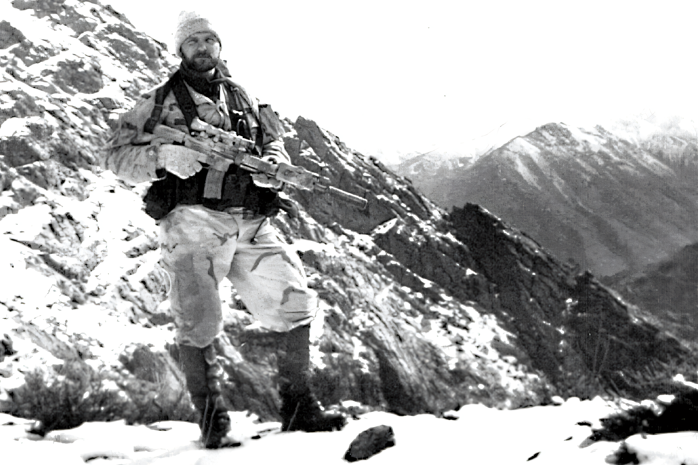
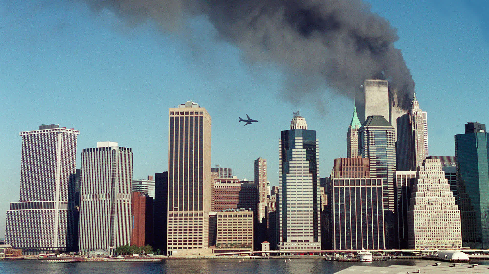
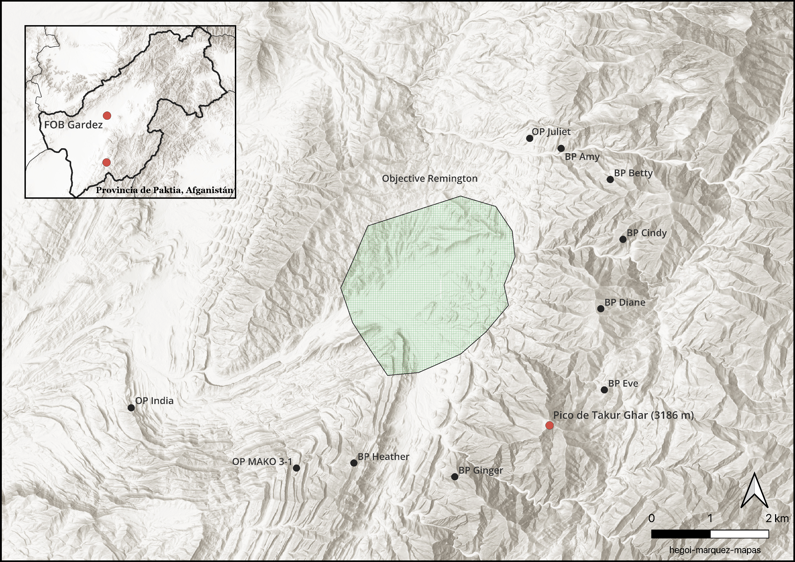
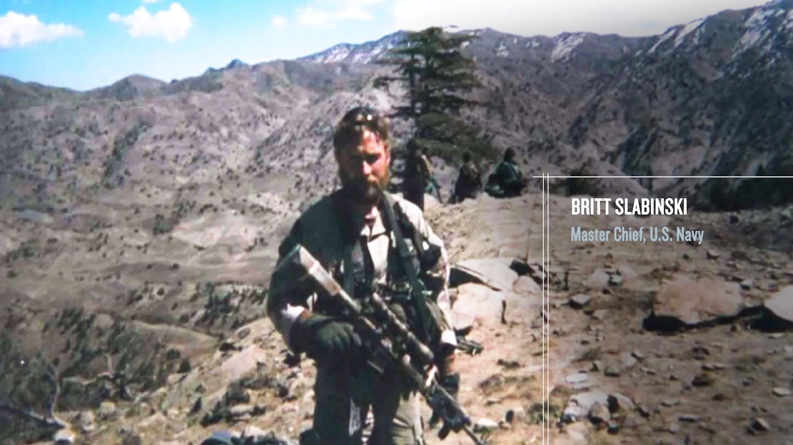
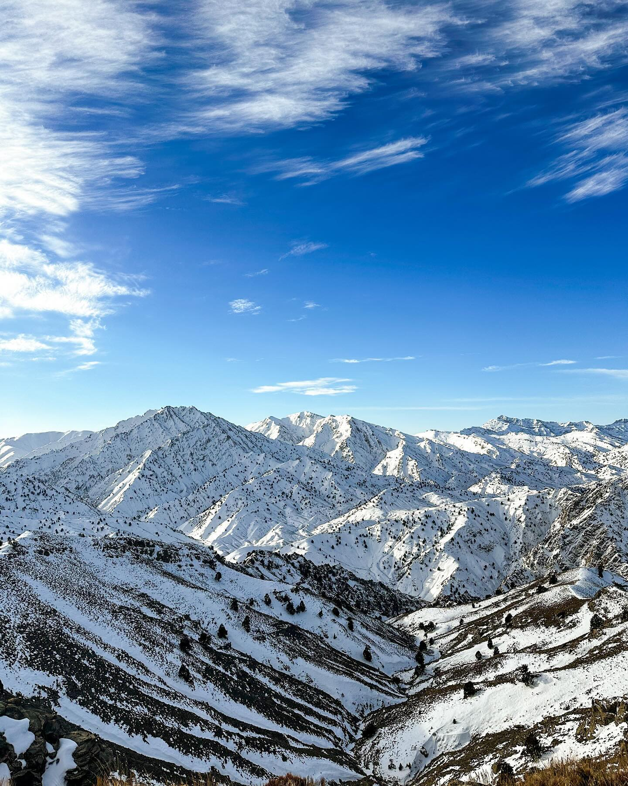
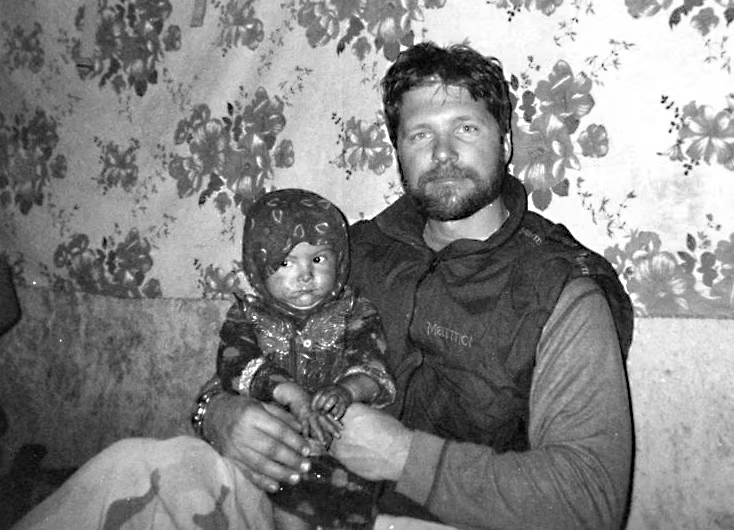
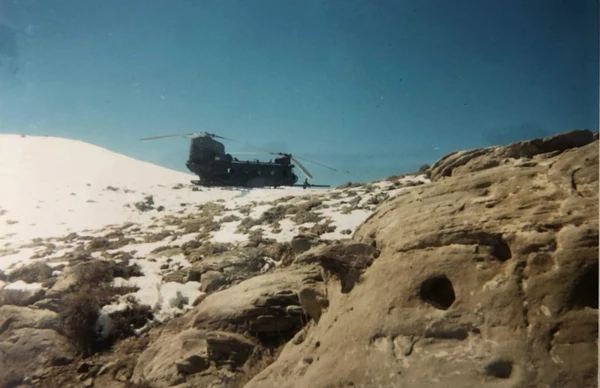

 _Tech Sgt. John A. Chapman, 24th Special Tactics Squadron, Afganistán, un mes antes de Takur Ghar._

> En la madrugada del 4 de marzo de 2002, en la nevada cima de Takur Ghar a 3100 metros de altura, mientras intentaban recuperar a un compañero caído en dicha cima, un Combat Controller de la Fuerza Aérea estadounidense libró una batalla en solitario contra decenas de combatientes atrincherados de Al Qaeda. Dado por muerto y dejado atrás por su equipo en aquel pico, John Chapman continuó combatiendo solo al amanecer, dando su vida para proteger a la fuerza de reacción rápida que venía en su ayuda.

## Technical Sergeant John A. Chapman

John Allan Chapman nació el 14 de julio de 1965 y se crió en Windsor Locks, Connecticut. Destacó desde joven como atleta y se convirtió en el mejor saltador de trampolín del estado, siendo el primer campeón estatal de salto en la historia de su instituto. Se graduó en 1983 y entró a la Universidad de Connecticut a estudiar ingeniería, pero la universidad no encajó con él: suspendió tantas asignaturas que perdió la oportunidad de competir y, en sus propias palabras, "estudiar no era lo suyo; hacer, sí lo era". Volvió a casa, trabajó una temporada como mecánico, y en agosto de 1985 se alistó en la Fuerza Aérea, prometiéndole a su madre que elegiría algo "seguro".

Durante la instrucción básica en Lackland AFB quedó fascinado por una charla de reclutamiento de los Combat Controllers, pero cumplió su promesa y completó su formación como especialista en sistemas de información, destinado a Lowry AFB, Colorado, en 1986. Cumplidos sus tres años de obligación contractual, se preparó por su cuenta para el examen físico de acceso a Combat Controller, sabiendo que el 90 % de los aspirantes fracasaba. En 1989 aprobó y entró a la pipeline de Combat Controller, volviendo a Lackland para comenzar "indoc" —el primero de diez cursos que tendría que superar para convertirse en un operador. 

## Combat Controllers

Los Combat Controllers ([CCT](https://en.wikipedia.org/wiki/United_States_Air_Force_Combat_Control_Team)) son operadores de la Fuerza Aérea encuadrados en los Special Tactics Squadrons. Combinan múltiples funciones: controladores de tráfico aéreo certificados por la [FAA](https://en.wikipedia.org/wiki/Federal_Aviation_Administration) capaces de operar en zona de combate, capacidad para dirigir ataques aéreos de precisión (JTAC), establecer zonas de asalto y aeródromos improvisados, y operar en pequeñas unidades de combate directo. No están asignados de forma fija a ningún equipo; sino que se integran a estos equipos según necesidad operativa, lo que hace que, en la práctica, acumulen más horas de combate que muchos operadores de dichas unidades a lo largo de su carrera.

Convertirse en CCT exige una pipeline de cerca de dos años y más de diez cursos distintos. Arrancaba con el curso de selección "**indoc**", hoy Special Warfare Assessment and Selection (SWAS), siete semanas centradas exclusivamente en pruebas de resistencia acuática diseñadas para eliminar al máximo número de candidatos. Tras esto: [**Combat Diver Qualification Course**](https://www.army.mil/article/52949/combat_diver_qualification_course_challenges_special_forces) (Key West), **AF Water Survival School** (Homestead, Florida), [**US Army Airborne School**](https://en.wikipedia.org/wiki/United_States_Army_Airborne_School) (Fort Benning), [**US Air Force Survival School / SERE**](https://en.wikipedia.org/wiki/Survival,_Evasion,_Resistance_and_Escape) (Fairchild), **Air Traffic Control School** (Keesler), y [**Combat Control School**](https://en.wikipedia.org/wiki/United_States_Air_Force_Combat_Control_Team) (Pope, Fort Bragg).

Chapman pasó por dicha pipeline de 1989 a 1990, junto a su compañero Joe Maynor. De los 120 aspirantes de la clase OL-H 89-005 que comenzaron el indoc, solo siete se graduaron —cinco PJs y dos CCT: Chapman y Maynor.

## Guerra de Afganistán: Operación Libertad Duradera (OEF)

 _11 de septiembre de 2001, Nueva York_

Tres semanas después del 11 de septiembre, un CCT y un oficial del STS ya operaban en el aeródromo de Karshi-Khanabad ("K2") en Uzbekistán, la base desde la que EE. UU. lanzaría sus primeras operaciones en Afganistán —"_First There_", los primeros en llegar— antes incluso de que la guerra llegase a suelo afgano. En la primera semana de octubre, el 5th SFG insertó sus dos primeros equipos (ODA 595 y ODA 555) para enlazar con la Alianza del Norte, la coalición de facciones afganas en la que EE. UU. tendría que apoyarse para derrocar al régimen. Cada equipo, de diez a doce Boinas Verdes, tenía una misión clara: hacer contacto, entender el terreno, y sobre todo, dirigir el poder aéreo americano contra el Talibán y Al Qaeda desde tierra.

Con el apoyo aéreo canalizado a través de estos pequeños equipos de Fuerzas Especiales y sus Combat Controllers, la Alianza del Norte pasó de una situación estancada a tomar Kabul en cuestión de semanas. Para diciembre, la atención se desplazó a una región montañosa en la frontera con Pakistán de la que casi nadie en el ejército había oído hablar: [Tora Bora](https://es.wikipedia.org/wiki/Tora_Bora), donde la inteligencia situaba a Osama bin Laden. Fue el primer gran objetivo simbólico de la guerra, y aunque la operación no logró capturarlo, marcó el patrón que definiría los meses siguientes: equipos pequeños, tecnológicamente abrumadores en poder aéreo, operando en alta montaña contra un enemigo que dominaba el terreno.

## Operación Anaconda

Anaconda nació de una idea clásica del manual militar: _hammer and anvil_ (martillo y yunque) y de las lecciones aprendidas de la batalla de Tora Bora. El martillo lo formarían unos 400 hombres de la milicia afgana del general Zia, junto con Boinas Verdes americanos, empujando desde FOB Gardez hacia el centro del valle de Shah-i-Kot (Objective Remington) —infestado de combatientes de Al Qaeda que escaparon de la batalla de Tora Bora— para forzar al enemigo a huir. El yunque contra el que se estrellarían serían las tropas convencionales de las divisiones 10th Mountain y 101st Airborne, bajo el mando del general Franklin Hagenbeck, posicionadas en las montañas al este hacia la frontera con Pakistán —la ruta de escape que, según la inteligencia americana, tomarían los combatientes en fuga. Fue la operación más grande de la guerra hasta ese momento.

Al margen de ese plan convencional operaba otra pieza, más discreta pero decisiva: la Task Force AFO (Advance Force Operations), un conjunto de equipos de Delta, SEAL y Combat Controllers al mando del comandante Pete Blaber, cuya misión era infiltrarse en puestos de observación ocultos alrededor del valle para detectar al enemigo y dirigir ataques aéreos sobre él. Esa última tarea recaía enteramente en los Combat Controllers integrados en cada equipo —entre ellos, _Mako 30_.

La inteligencia oficial estimaba unos 200 combatientes enemigos dispersos por el valle de Shah-i-Kot; en el centro de mando en FOB Gardez, diversas fuentes sospechaban que la cifra real podía duplicar esa estimación. Ninguna de las dos se acercaba ni remotamente a la realidad: los equipos que se preparaban para infiltrarse no tenían forma de saber que se enfrentaban a entre 1.000 y 1.500 combatientes solo en el valle, con otros 700 más escalonados en los valles hacia Khost. Anaconda se construyó, de principio a fin, sobre un mapa del enemigo desactualizado.

## _Mako 30_ y «_Razor 03_»

 _Chief Britt Slabinski, Afganistán (2002)_

_Mako 30_ era un pequeño equipo compuesto por Slabinski (jefe de equipo), Chapman (CCT) y 5 SEALs más a bordo del MH-47E «_Razor 03_», pilotado por "Mack". Estos debían insertarse en la base de Takur Ghar y subir caminando hasta el puesto de observación en la cumbre, a 3100 metros de altura. Una sucesión de eventos cambió los planes: primero un ataque aéreo obligó al AC-130 de cobertura a abandonar la zona, luego un asalto del 101st Airborne forzó otra demora, y finalmente el segundo motor del helicóptero se quedó inutilizado. Slabinski pidió por radio un aplazamiento de 24 horas —no quería subir la montaña de día, a plena vista del enemigo— pero las órdenes fueron claras: había que entrar esa misma noche. Sin margen para caminar, Slabinski valoró los riesgos y decidió aterrizar directamente en la cima.

En la cima de la montaña y con la rampa trasera bajada, los SEALs se preparaban para salir cuando un RPG reventó el fuselaje, dejando sin potencia el sistema eléctrico y las miniguns del helicóptero inutilizadas. Munición pesada de una DShK impactó contra la aeronave, pero el piloto consiguió mantenerla en el aire. Neil "Fifi" Roberts, quien se encontraba en la rampa y sin asegurar, sale despedido por la rampa trasera y desaparece en la oscura nieve. Bajo intenso fuego enemigo, y perdiendo altitud a más de 3000m, el accidente del helicóptero era inminente. Mack consiguió deslizar el aparato casi 600 metros hasta el valle, donde finalmente el helicóptero se estrelló en una ladera sin llegar a volcar, a siete kilómetros de la montaña donde habían dejado a su compañero Neil Roberts.

## Neil Roberts y Takur Ghar

 _Takur Ghar, 2024_

Roberts cayó a la nieve, en una gélida madrugada, pero su combate en solitario duró apenas unos minutos. Herido de gravedad, con la ametralladora atascada, nunca llegó a desenfundar su pistola. Uno de los combatientes chechenos lo remató de un disparo a quemarropa. Otro equipo en un puesto de observación cercano fue testigo del suceso: vieron a «_Razor 03_» hacer el giro final hacia la cima —_y ahí es cuando todo se fue a la mierda_—, el fogonazo, las explosiones, el sonido de la DShK, y después el silencio.

En la cima, los chechenos y combatientes de Al Qaeda registraron el cuerpo de Roberts, repartiéndose sus pertenencias —incluida su baliza infrarroja, la cual activaron por error— antes de dispersarse. Un AC-130H Spectre que orbitaba la zona reportó la baliza encendida y _"4 a 6 tipos alrededor de Fifi"_ —concluyendo, literalmente, que estaba vivo. Slabinski repitió ese informe a su equipo palabra por palabra en el brief previo al despegue. Dos horas y media después, a las 04:57, «_Razor 04_» con Slabinski, Chapman y 4 SEALs volvió a la cima y aterrizó en ella, decididos a rescatar a un compañero que, sin que ellos lo supieran, llevaba ya un rato muerto.

## Solo al amanecer

Nada más tocar tierra, Chapman se lanzó cuesta arriba en solitario, directo hacia el Bunker 1. En dos minutos abatió a los dos chechenos que lo ocupaban y tomó la posición. Slabinski lo alcanzó y ambos abrieron fuego contra el Bunker 2, situado a unos 6 metros, hasta que Chapman recibió un disparo y colapsó en el suelo. Slabinski, viendo su láser inmóvil bajo el árbol, lo dio por muerto. Bajo intenso fuego enemigo, con dos hombres más heridos y sin munición, ordenó la retirada. Nadie comprobó el cuerpo de Chapman al pasar.

Eran poco más de las 05:20 cuando Chapman recobró el conocimiento. A su lado, en la trinchera, dos cuerpos sin vida de los combatientes que lo habían atacado al cargar cuesta arriba; un tercero, el que le había disparado, también muerto. A su izquierda, la roca donde había visto por última vez a Slabinski. ¿Dónde estaban? ¿Muertos? ¿Lo habían dado por muerto? Por encima, en el Bunker 2, seguía sonando la PKM —pero no le disparaban a él. Con los dedos entumecidos por el frío y la conmoción, luchó por activar la radio en su pecho.

Cambió de la frecuencia de ataques aéreos a una común de emergencia y probó suerte: _"Any station, any station, this is Mako Three Zero Charlie."_ A tres kilómetros de allí, en otro puesto de observación, Jay Hill —compañero suyo— reconoció la voz al instante y respondió una y otra vez: _"Mako Three Zero Charlie, this is Yankee Uniform Three, go ahead."_ Nada. Chapman nunca llegó a escuchar ninguna de sus respuestas. Llamó varias veces más, sin saber si alguien al otro lado le oía, hasta que finalmente lo dejó. Estaba completamente solo, sangrando, y nadie sabía que seguía con vida.

Durante la siguiente media hora, al amanecer, el enemigo lanzó una oleada de ataques. Un RPG estalló contra el borde de su búnker, cubriéndolo de tierra y dejándole los oídos zumbando. Un combatiente de Al Qaeda lo cargó desde el flanco; lo abatió a bocajarro. A las 06:00 en punto, un uzbeko que vestía el pantalón robado del cadáver de Neil Roberts se le echó encima disparando; Chapman lo derribó a 3 metros de distancia. Seis minutos después, otro hombre llegó sigiloso hasta el mismo punto donde antes había estado Slabinski, y ambos se encararon en un combate cuerpo a cuerpo: Chapman, ya con metralla en brazos y torso y sangrando por el abdomen, salió vencedor, aunque el forense encontraría después heridas contusas en cabeza, cuello y rostro por la pelea.

Fue entonces cuando oyó las palas de los rotores de un MH-47 remontando la ladera. Sabía exactamente lo que significaba —y también sabía que ese helicóptero, cargado de Rangers, correría la misma suerte que los dos anteriores si nadie neutralizaba la posición de la DShK. A las 06:11, con el sol asomando por la ladera este, Chapman se levantó del parapeto ensangrentado y abrió fuego contra la DShK que amenazaba al helicóptero, vaciando cargador tras cargador mientras «_Razor 01_» hacía su aproximación final. Le impactaron varias veces en las piernas —una le destrozó el fémur—, pero siguió disparando, ahora tumbado, cubriendo a hombres a los que nunca llegaría a conocer. Los dos últimos disparos de un AK-47 le alcanzaron el torso y le seccionaron la aorta. Murió con el cargador vacío y la vista puesta en la nieve manchada de sangre, mientras a su alrededor la batalla por Takur Ghar apenas comenzaba.

## «_Razor 01_» y «_Razor 02_» — la historia de aquellos Rangers

«_Razor 01_» llevaba dieciocho hombres (Chalk 1): 15 Rangers, 2 PJs y un CCT. El piloto, Greg Calvert, hizo un primer pase para evaluar la zona antes de comprometerse, y en la aproximación final, a apenas 30 metros de altura, la cabina estalló —agujeros por todo el parabrisas, su casco rozado varias veces por el impacto de las balas. Un RPG destrozó el motor derecho. Calvert logró un aterrizaje casi sin velocidad horizontal, firme pero brusco, y supo al instante que no volverían a despegar.

Dentro, la matanza fue inmediata. Phil Svitak, el artillero de la puerta derecha, cayó muerto sobre su minigun tras absorber una ráfaga que probablemente salvó la vida de Gabe Brown, sentado justo detrás de él. El especialista Marc Anderson murió de un disparo que atravesó el fino fuselaje. Al bajar por la rampa, el sargento Brad Crose y el cabo Matt Commons cayeron a pocos pasos de la salida, alcanzados por fuego de ametralladora. Calvert, herido en una mano por un proyectil trazador aún ardiendo dentro de su guante, fue arrastrado fuera junto a los demás heridos mientras el helicóptero seguía recibiendo impactos.

Gabe Brown (CCT), sin tiempo para procesar lo que veía, se hizo con el control de la situación: montó su antena SATCOM entre el fuego cruzado y empezó a dirigir aviones F-15E en pasadas con sus cañones de 20mm para las que ni siquiera estaban diseñados —maniobras de combate aire-aire adaptadas sobre la marcha para golpear objetivos terrestres a apenas cincuenta metros de sus propios hombres.

«_Razor 02_», con diez Rangers a bordo (Chalk 2), aterrizó sobre las 08:30, 600 metros más abajo de donde estaban sus compañeros —muy lejos de los "250-300 metros" que les habían indicado. Ninguno de ellos, pese a su entrenamiento, estaba preparado para lo que les esperaba: escalar una pendiente de 45 a 70 grados, cubierta de nieve hasta las rodillas, cargando cada uno unos 36 kilos de equipo en un aire tan enrarecido que apenas se podía respirar. Muchos, vestidos para una espera fría y estática que nunca llegó, empezaron a sudar bajo capas térmicas pensadas para quedarse quietos, no para trepar; otros llevaban botas de desierto, en vez de botas de montaña, que se empaparon como esponjas. En los tramos más duros, algunos avanzaban a gatas; otros lanzaban el arma hacia adelante en la nieve para trepar con las manos libres y recuperarla después. Rin Canon, jefe de pelotón de Chalk 2, pidió autorización para aligerar la carga: dejó que tiraran las placas cerámicas de sus chalecos, estrellándolas contra las rocas para que el enemigo no pudiera aprovecharlas. Tardaron horas en cubrir apenas 600 metros de desnivel, deteniéndose solo cuando caían morteros cerca, mientras arriba sus compañeros de Chalk 1 seguían resistiendo.

La batalla se extendió durante todo el día. Con la ayuda de otros dos Combat Controllers en puestos cercanos, Gabe fue dirigiendo bombas sobre la cima búnker a búnker, en ocasiones a distancias que ningún manual consideraría seguras. Pero el rescate no llegaba: el mando en Bagram, dudando de la situación real sobre el terreno, retrasó una y otra vez el envío de un helicóptero de evacuación médica. La llamada "hora dorada" para tratar a un herido grave pasó de largo. Jason Cunningham, el PJ, murió desangrado esa tarde —el séptimo y último caído de Takur Ghar. Los helicópteros de extracción no llegaron hasta bien entrada la noche, cargando a los heridos, a los supervivientes, y a los cuerpos de Chapman y Roberts, colocados uno junto a otro para el último vuelo de vuelta a Gardez. Nadie se quedó a consolidar la montaña.

## Reapertura del caso y Medal of Honor

En mayo de 2015, la secretaria de la Fuerza Aérea, Deborah Lee James, leyó un artículo del _Air Force Times_ que cuestionaba por qué ciertos actos de heroísmo no habían recibido la Medalla de Honor, y ordenó revisar todas las Silver Stars y Air Force Crosses concedidas desde el 11-S. El único caso que cumplió los criterios de reapertura fue el de Chapman: existían indicios de que había seguido con vida después de que su equipo lo diera por muerto. La investigación resultante —la más exhaustiva en la historia de la condecoración— combinó el análisis del vídeo del Predator, validado por la National Geospatial-Intelligence Agency, con los informes de Anaconda, la investigación de JSOC, una revisión de la autopsia original y nuevas entrevistas a los supervivientes de AFO. La conclusión fue que Chapman se había levantado tras el primer asalto y había combatido en solitario más de una hora. En junio de 2016, James firmó la recomendación de actualización y la remitió al Departamento de Defensa.

El proceso se prolongó dos años más por la resistencia de mandos de SEAL Team Six —principalmente el almirante Tim Szymanski— a reconocer que su equipo había dejado a un hombre con vida en la montaña, lo que expertos en la Medalla de Honor describen como el primer intento de una rama militar de bloquear la solicitud de otra. En julio de 2017 el subsecretario de Defensa Bob Work confirmó la aprobación, señalando un análisis del FBI que fijaba el combate final en una hora tras la retirada del equipo. Trump comunicó la decisión a la viuda de Chapman el 26 de marzo de 2018, y la ceremonia se celebró en la Casa Blanca el 22 de agosto: Chapman se convirtió en el primer aviador en recibir la Medalla de Honor desde Vietnam. Contando también la concedida a Slabinski ese mismo año, Takur Ghar es, proporcionalmente, la batalla con más condecoraciones al valor de la historia militar estadounidense.

## La primera Medalla de Honor grabada en video

<iframe src="https://www.youtube-nocookie.com/embed/3oKMjTqdTYo" title="Vídeo de YouTube" loading="lazy" allowfullscreen allow="accelerometer; autoplay; clipboard-write; encrypted-media; gyroscope; picture-in-picture; web-share"></iframe>

