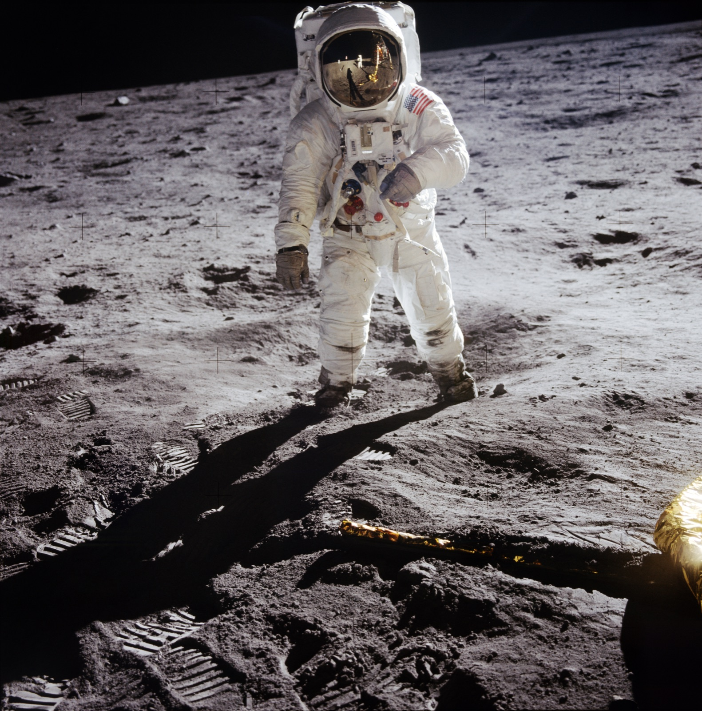
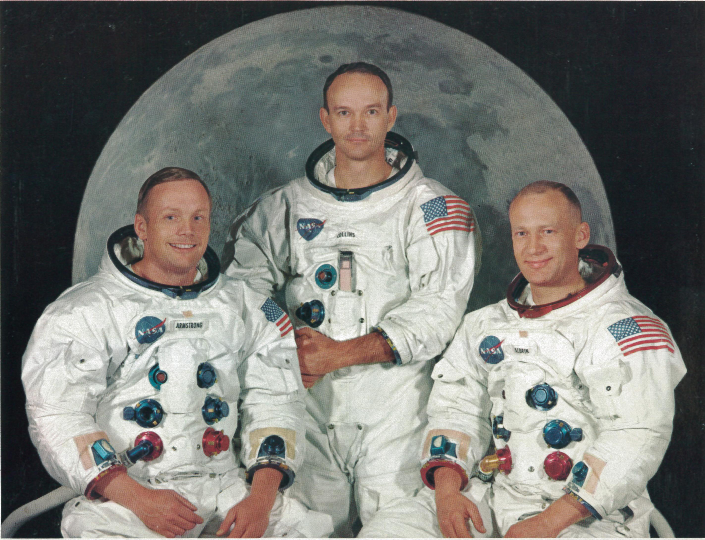

## Primera misión tripulada en posarse en la Luna, el 20 de julio de 1969, en el Mar de la Tranquilidad.

*Buzz Aldrin en la superficie del Mar de la Tranquilidad, fotografiado por Neil Armstrong (NASA, 20 de julio de 1969).*

El módulo lunar *Eagle*, con Neil Armstrong y Buzz Aldrin a bordo, alunizó el 20 de julio de 1969 en el **Mar de la Tranquilidad** mientras Michael Collins esperaba en órbita a bordo del módulo de mando *Columbia*. Armstrong fue el primer ser humano en pisar la Luna, y Aldrin lo siguió veinte minutos después; permanecieron en la superficie unas dos horas y media, recogieron 21,5 kg de muestras y dejaron una placa conmemorativa y la bandera de EE. UU. Fue el quinto vuelo tripulado del programa Apolo y el que cumplió el objetivo fijado por Kennedy en 1961 de llevar a un hombre a la Luna antes de que acabara la década.

Durante los últimos minutos del descenso, el ordenador de a bordo del *Eagle* saltó varias veces con las alarmas 1202 y 1201 por sobrecarga de tareas, y Armstrong y Aldrin tuvieron que fiarse de que en Houston el controlador de guiado Steve Bales, de solo 26 años, diera el visto bueno para seguir sin abortar. Acertó: años después recibiría la Medalla Presidencial de la Libertad por una decisión que tomó en cuestión de segundos.

*Retrato oficial de la tripulación: Neil Armstrong, Michael Collins y Buzz Aldrin (NASA, 1969).*
