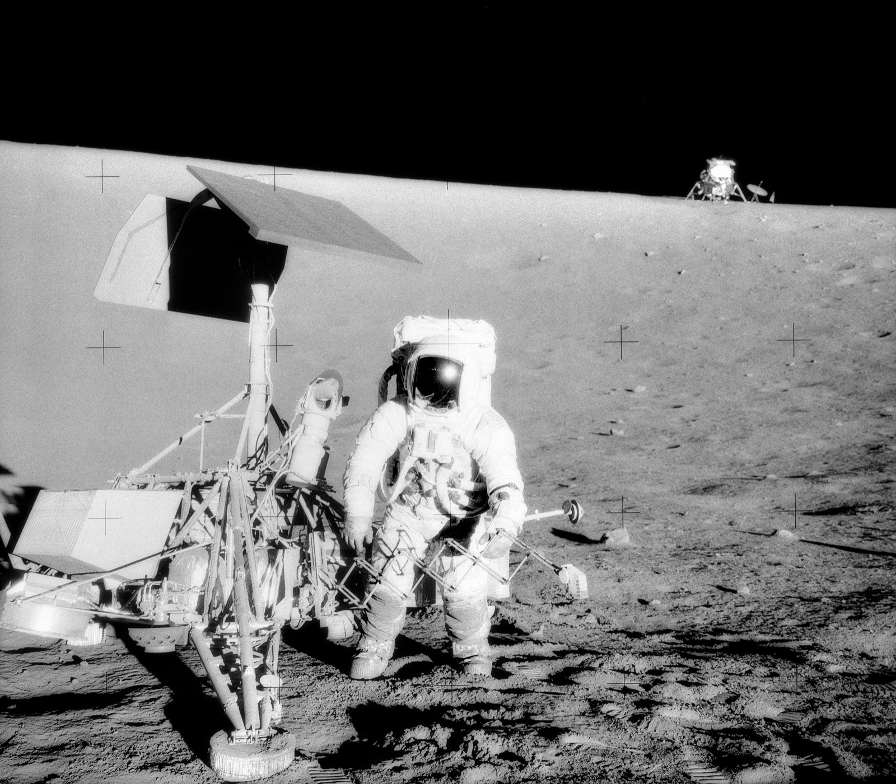

## Segunda misión tripulada, en noviembre de 1969, alunizó junto a la sonda no tripulada Surveyor 3.

*Charles "Pete" Conrad examina la sonda Surveyor 3, con el módulo lunar Intrepid al fondo (NASA, 20 de noviembre de 1969).*

Apolo 12 alunizó el 19 de noviembre de 1969 en el Océano de las Tormentas, a apenas 180 metros de la sonda **Surveyor 3**, que llevaba en la Luna desde 1967. Pete Conrad y Alan Bean pasaron casi 32 horas en la superficie, repartidas en dos paseos lunares, mientras Richard Gordon orbitaba en el módulo de mando *Yankee Clipper*. Se llevaron piezas de la Surveyor para estudiar en la Tierra el efecto de tres años de exposición lunar sobre materiales terrestres: fue una demostración de la precisión de alunizaje que harían falta en misiones posteriores.
