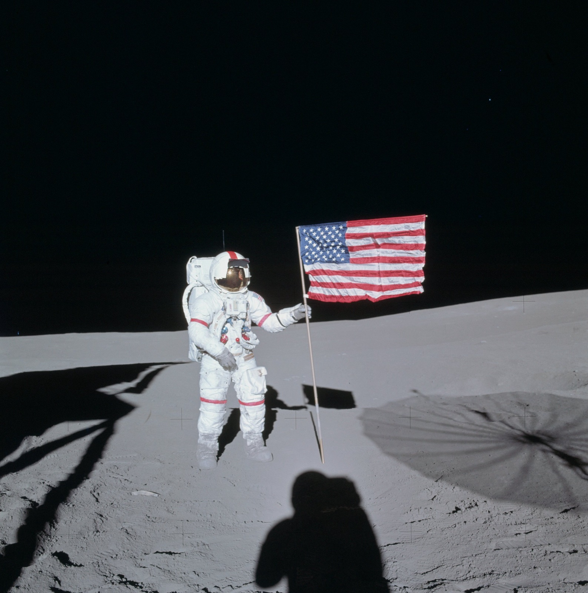

## Tercera misión tripulada, en febrero de 1971, primera en aterrizar en la zona de Fra Mauro.

*Alan Shepard junto al módulo lunar Antares en Fra Mauro (NASA, 5 de febrero de 1971).*

Apolo 14 alunizó el 5 de febrero de 1971 en la región de Fra Mauro, el objetivo original del fallido Apolo 13. Alan Shepard —primer estadounidense en el espacio, en 1961— y Edgar Mitchell pasaron más de 33 horas en la superficie mientras Stuart Roosa orbitaba en el módulo de mando *Kitty Hawk*. Fra Mauro es en realidad material eyectado de la cuenca de Imbrium, no tierras altas propiamente dichas —ese hito quedaría para el Apolo 16, un año después—, pero a Shepard se le recuerda sobre todo por otra cosa: golpear dos pelotas de golf con un palo improvisado antes de regresar a bordo, la imagen más desenfadada del programa Apolo.

Durante el viaje de vuelta, mientras Shepard y Roosa dormían, Mitchell dedicó varios ratos privados a un experimento que no figuraba en ningún plan de vuelo de la NASA: concentrarse en una serie de símbolos al azar para intentar transmitirlos por telepatía a un grupo de personas en Tierra que trataban de adivinarlos. Solo se supo tras el amerizaje, y Mitchell acabaría fundando en 1973 el Institute of Noetic Sciences para seguir investigando ese tipo de fenómenos.

*Retrato oficial de la tripulación: Alan Shepard, Stuart Roosa y Edgar Mitchell (NASA, diciembre de 1970).*
