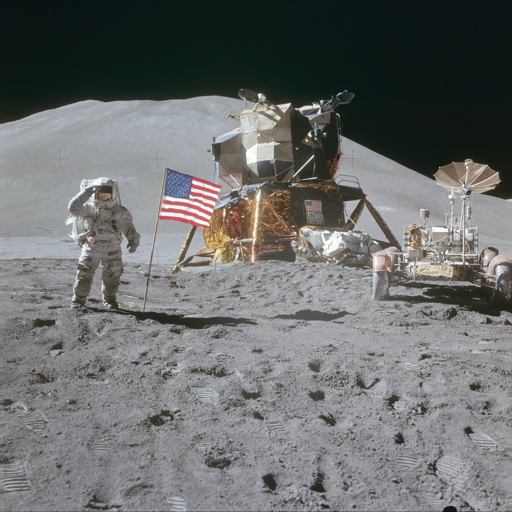
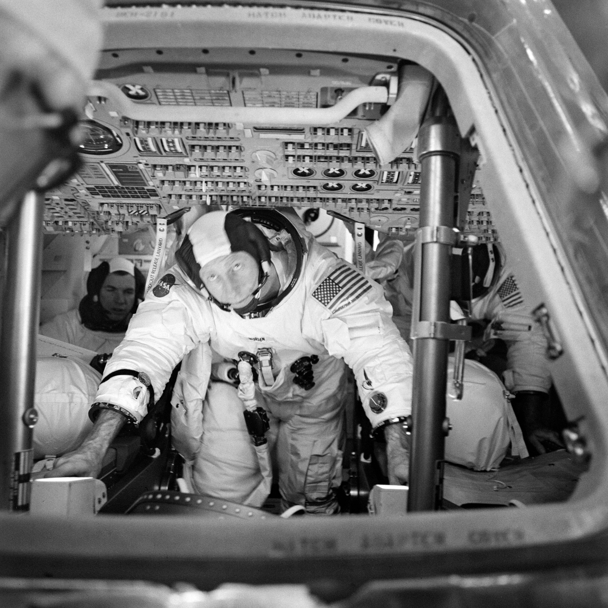

## Cuarta misión tripulada, en julio de 1971, primera en llevar un vehículo lunar (rover).

*David Scott junto al rover lunar, el módulo Falcon y la bandera de EE. UU. en Hadley-Apenino (NASA, agosto de 1971).*

Apolo 15 alunizó el 30 de julio de 1971 en la región de Hadley-Apenino, al pie de una cadena montañosa lunar. Fue la primera de las llamadas "misiones J", con estancias más largas (casi tres días) y mayor peso científico: David Scott y James Irwin usaron por primera vez el **rover lunar (LRV)**, que les permitió recorrer varios kilómetros y alejarse mucho más del módulo de lo que era posible a pie. Alfred Worden, en órbita, realizó además el primer paseo espacial en el espacio profundo durante el regreso a la Tierra.

Antes del despegue, Scott, Worden e Irwin firmaron a título personal varios cientos de sobres filatélicos sin permiso de la NASA, que un marchante alemán vendería después en el mercado coleccionista. Cuando se destapó el acuerdo, la agencia amonestó a los tres, y ninguno volvió a volar al espacio: uno de los pocos episodios que empañó la reputación del programa Apolo.

*David Scott, Alfred Worden y James Irwin durante los entrenamientos previos a la misión (NASA, 1971).*
