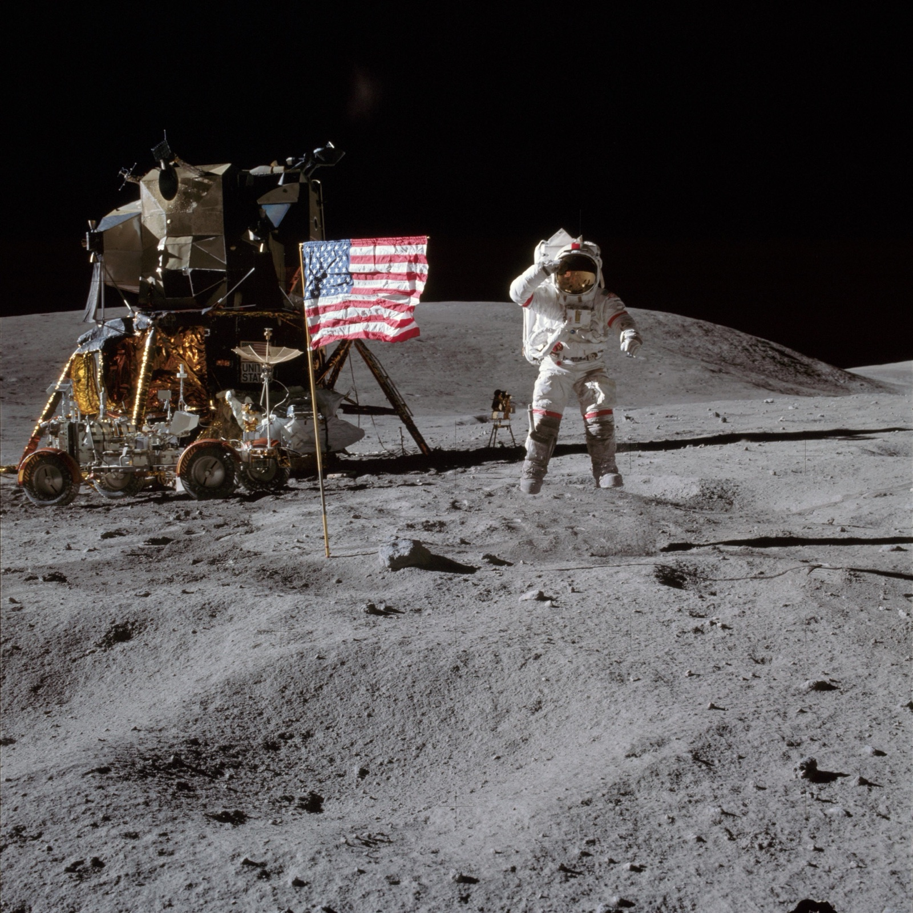

## Quinta misión tripulada, en abril de 1972, primer alunizaje en tierras altas lunares.

*John Young salta junto a la bandera de EE. UU. en las tierras altas de Descartes (NASA, abril de 1972).*

Apolo 16 alunizó el 21 de abril de 1972 en las tierras altas de Descartes, una zona elegida por su geología distinta a la de los mares lunares visitados hasta entonces. John Young y Charles Duke pasaron casi tres días en la superficie mientras Thomas Mattingly —que debía haber volado en el Apolo 13 y fue sustituido por sospecha de rubeola— orbitaba en solitario. Fue la penúltima misión tripulada a la Luna.
