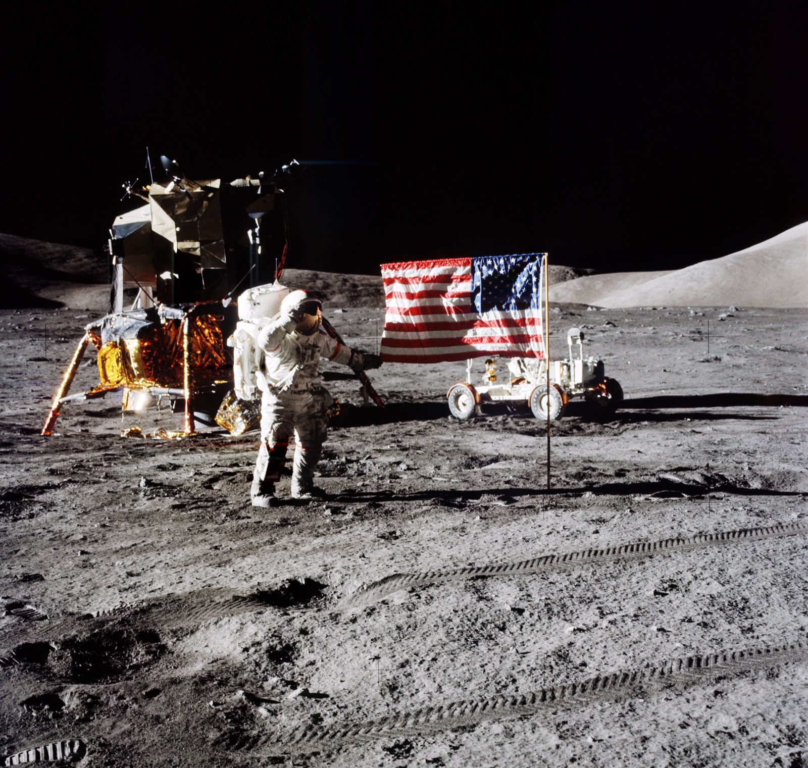

## Sexta y última misión tripulada, en diciembre de 1972.

*Eugene Cernan junto al módulo lunar Challenger en el valle Taurus-Littrow (NASA, diciembre de 1972).*

Apolo 17 alunizó el 11 de diciembre de 1972 en el valle Taurus-Littrow y sigue siendo, medio siglo después, la última vez que un ser humano ha pisado la Luna. Eugene Cernan y Harrison Schmitt —geólogo de formación y único científico profesional en volar al Apolo— pasaron más de 74 horas en la superficie, récord del programa, mientras Ronald Evans orbitaba en el módulo de mando *America*. Cernan fue el último hombre en subir la escalerilla del módulo lunar, cerrando el programa Apolo.
