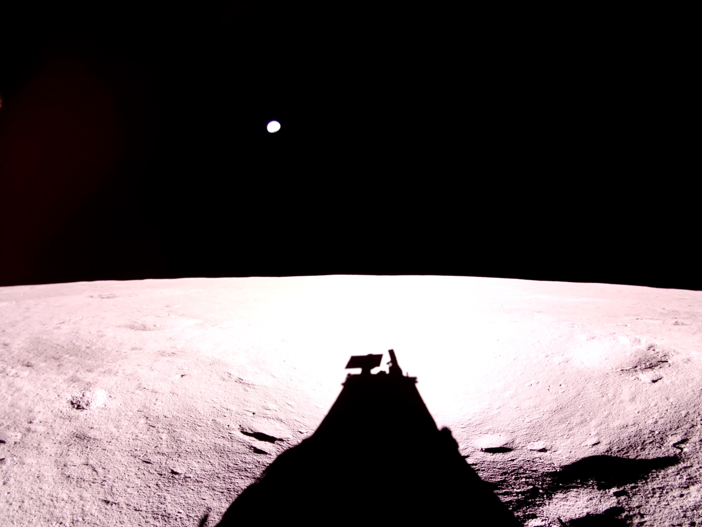
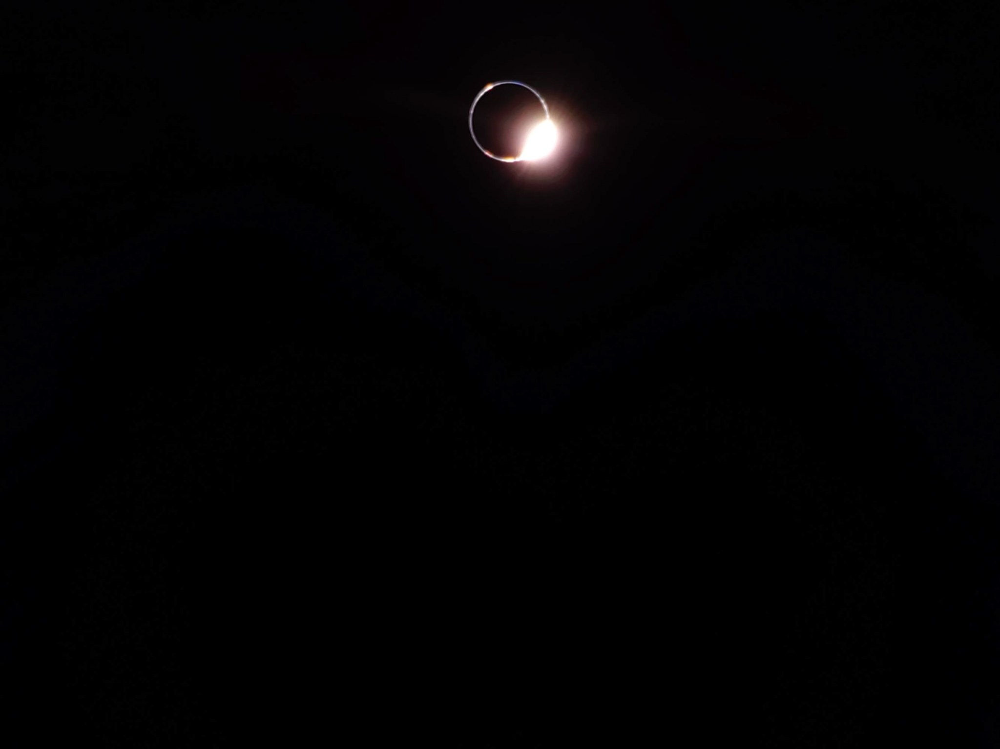

## Primer alunizaje privado completamente exitoso, el 2 de marzo de 2025.

*El módulo Blue Ghost sobre la superficie lunar, en Mare Crisium (NASA/Firefly Aerospace, marzo de 2025).*

*Blue Ghost Mission 1*, de la empresa estadounidense **Firefly Aerospace**, alunizó el 2 de marzo de 2025 en el Mare Crisium: se posó derecho, sin incidentes, y operó a pleno rendimiento durante todo un día lunar (unas dos semanas), el primer alunizaje privado de la historia **completamente exitoso**. Durante la misión captó, entre otras cosas, imágenes de un eclipse solar visto desde la superficie lunar y de una puesta de Tierra. Como Peregrine e IM-1 antes, formaba parte del programa CLPS de la NASA, que por fin veía cumplido su objetivo sin reservas.

El nombre no es un capricho publicitario: *Blue Ghost* es una especie real de luciérnaga, *Phausis reticulata*, propia de los bosques de los Apalaches, que a diferencia de otras luciérnagas no parpadea, sino que emite una luz fija vista de lejos como azulada y, de cerca, verde. Firefly Aerospace, la empresa texana detrás de la misión, tomó prestado el nombre de ese insecto para su primer módulo lunar.

*Eclipse solar total visto desde la superficie lunar por Blue Ghost, con la Tierra tapando al Sol, el 14 de marzo de 2025 (NASA/Firefly Aerospace).*
