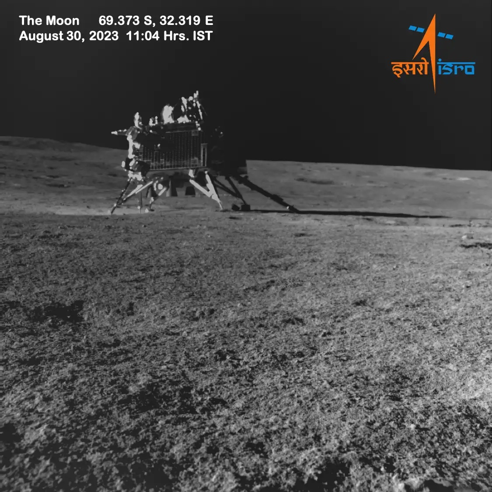

## Primer alunizaje con éxito de India, el 23 de agosto de 2023, cerca del polo sur lunar.

*El módulo Vikram sobre la superficie lunar, fotografiado por el róver Pragyan a 15 metros de distancia (ISRO, 30 de agosto de 2023).*

Chandrayaan-3 alunizó el 23 de agosto de 2023 a unos 69° de latitud sur, la zona más próxima al polo lunar donde ha aterrizado hasta ahora cualquier misión, y convirtió a India en el cuarto país en lograr un alunizaje suave, tras la URSS, EE. UU. y China. El módulo **Vikram** y el róver **Pragyan** repitieron la misión de la fallida Chandrayaan-2 (2019) con un diseño reforzado tras aquel accidente. El polo sur interesa especialmente porque sus cráteres permanentemente en sombra podrían contener hielo de agua.
