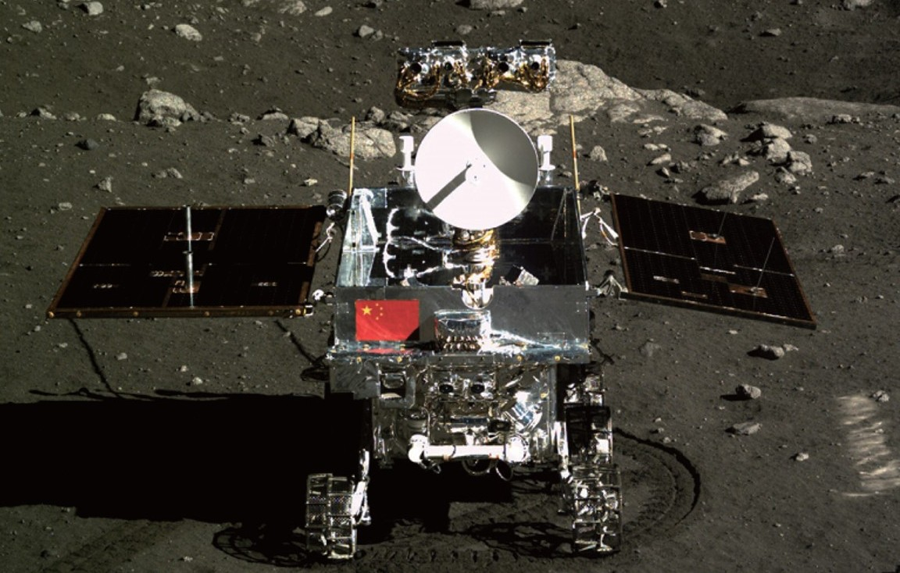
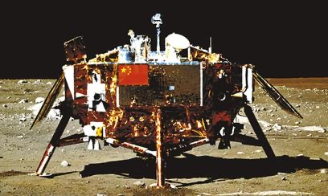

## Primer alunizaje chino, en diciembre de 2013.

*El róver Yutu sobre la superficie lunar (Institute of High Energy Physics, Academia China de las Ciencias, CC BY 4.0).*

Chang'e 3 alunizó el 14 de diciembre de 2013 en Sinus Iridum, dentro del Mare Imbrium, y fue el primer alunizaje lunar chino y el primer alunizaje suave de cualquier país desde la soviética Luna 24 en 1976, 37 años antes. Desplegó el róver **Yutu** ("Conejo de Jade"), que a pesar de sufrir una avería en sus mecanismos de movimiento a las pocas semanas, siguió transmitiendo datos desde su posición fija durante más de dos años.

El módulo de descenso, inmóvil desde el primer día, sigue encendiendo y apagando cada mes su telescopio ultravioleta, un instrumento pensado para durar solo un año: más de una década después seguía observando estrellas variables desde la superficie lunar, el primer telescopio robótico de la historia en operar allí, y en su día llegó a fotografiar la galaxia del Molinete (M101), a unos 21 millones de años luz.

*El módulo de descenso de Chang'e 3 en Sinus Iridum, en una imagen difundida por la agencia estatal china Xinhua tras el alunizaje (diciembre de 2013).*
