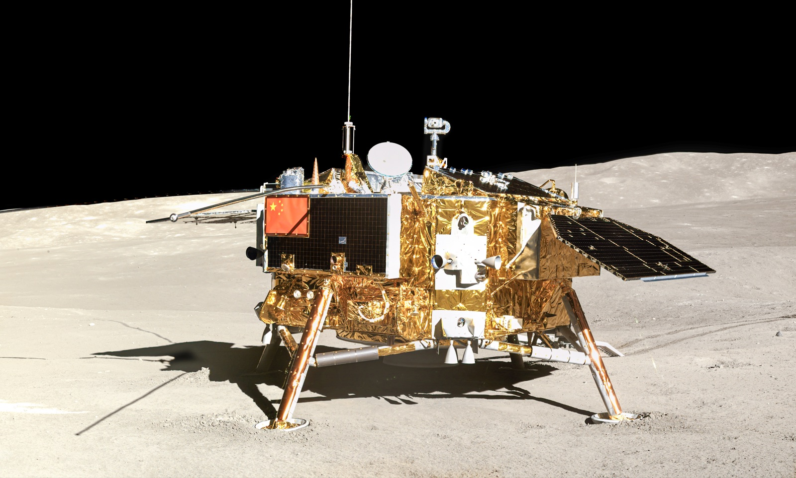
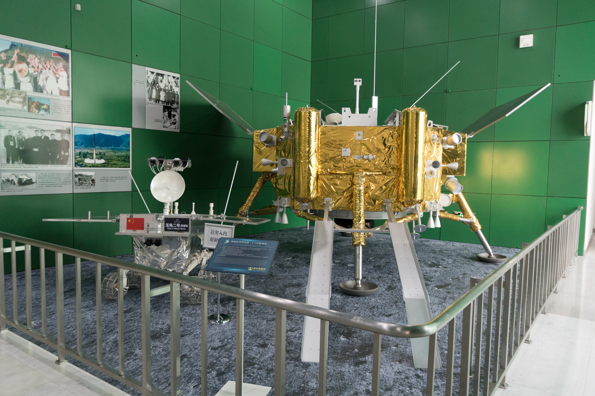

## Primer alunizaje de la historia en la cara oculta de la Luna, en enero de 2019.

*El módulo de descenso de Chang'e 4 fotografiado por el róver Yutu-2 en el cráter Von Kármán, cara oculta de la Luna (CNSA, enero de 2019).*

Chang'e 4 alunizó el 3 de enero de 2019 en el cráter Von Kármán, dentro de la cuenca Polo Sur-Aitken, y logró el primer alunizaje suave de la historia en la **cara oculta de la Luna**, algo que ninguna misión, tripulada o no, había conseguido antes por la dificultad de comunicarse con una zona sin visión directa desde la Tierra. Para resolverlo, China puso antes en órbita el satélite relé **Queqiao**, situado más allá de la Luna, que retransmite las señales entre el módulo, el róver Yutu-2 y la Tierra.

Su espectrómetro de radio de baja frecuencia aprovecha algo que ningún telescopio en Tierra puede ofrecer: el silencio radioeléctrico casi absoluto de la cara oculta, protegida de las emisiones humanas por miles de kilómetros de roca lunar. Con esos datos, un equipo de astrónomos llevó a cabo años más tarde la primera búsqueda SETI de señales periódicas realizada jamás desde la cara oculta de la Luna.

*Maqueta a tamaño real de Chang'e 4 y el róver Yutu-2 expuesta en el Museo de Ciencia y Tecnología de China (foto: Shujianyang, CC BY-SA 4.0, junio de 2023).*
