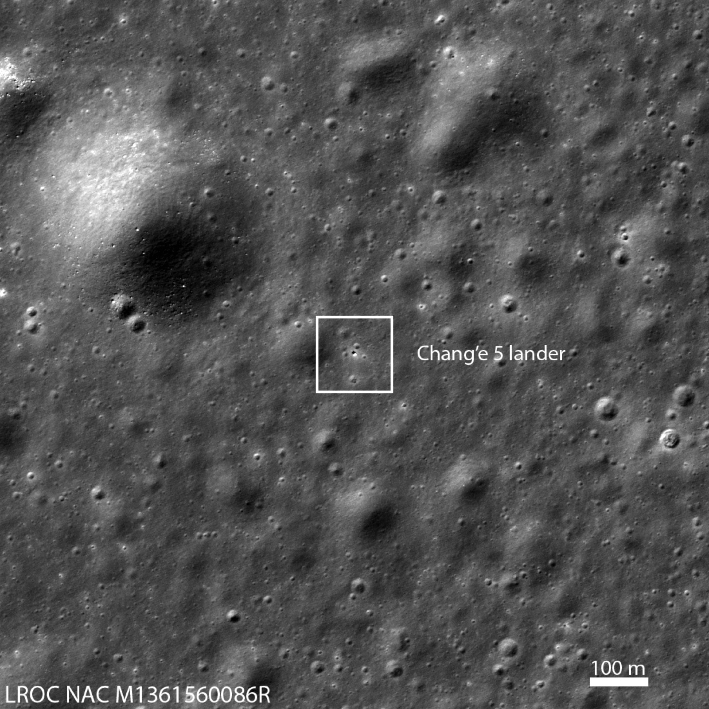
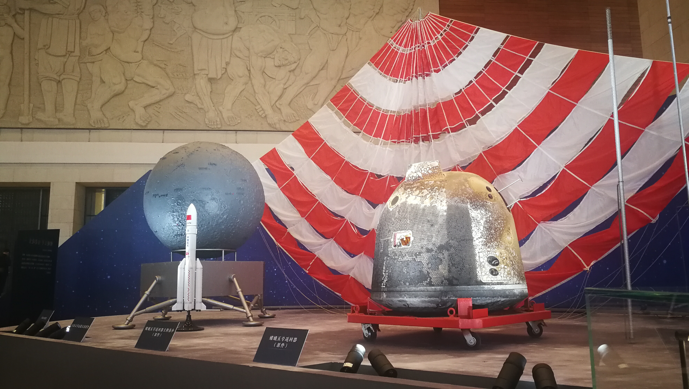

## Primera misión china de retorno de muestras, en diciembre de 2020.

*El emplazamiento de Chang'e 5 en Oceanus Procellarum, fotografiado desde órbita por la sonda estadounidense LRO; el recuadro señala el módulo (NASA/GSFC/Arizona State University).*

Chang'e 5 alunizó el 1 de diciembre de 2020 cerca de Mons Rümker, en el Oceanus Procellarum, perforó y recogió casi 2 kg de material de superficie y subsuelo: la primera misión china en traer muestras lunares a la Tierra. Fueron las primeras muestras lunares devueltas por cualquier país desde la soviética Luna 24 en 1976, 44 años antes, y permitieron datar por primera vez actividad volcánica lunar relativamente reciente (unos 2000 millones de años).

El regreso de las muestras exigió una maniobra que, hasta entonces, solo se había hecho con tripulación humana a los mandos: la etapa de ascenso de Chang'e 5 se acopló de forma totalmente automática con el módulo orbital, transfirió el contenedor sellado con las muestras y se separó, el primer encuentro y acoplamiento robótico en órbita lunar de la historia, después de siete intentos previos, todos ellos del programa Apolo.

*La cápsula de retorno y el paracaídas principal de Chang'e 5, expuestos en el Museo Nacional de China (foto: 纳瓦拉的亨利, CC BY-SA 4.0, marzo de 2021).*
