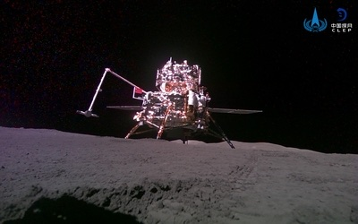

## Primeras muestras traídas de la cara oculta de la Luna, en junio de 2024.

*Módulo de descenso y ascenso de Chang'e 6 en la superficie lunar, en una imagen difundida por la Administración Espacial Nacional China (CNSA), junio de 2024.*

Chang'e 6 alunizó el 2 de junio de 2024 en la cuenca Polo Sur-Aitken, en la cara oculta de la Luna, apoyándose de nuevo en el satélite relé Queqiao-2. Recogió y trajo a la Tierra ese mismo mes casi 2 kg de muestras, las **primeras de la historia procedentes de la cara oculta**, de una región que se cree geológicamente distinta al resto de la Luna y clave para entender por qué las dos caras son tan diferentes.
