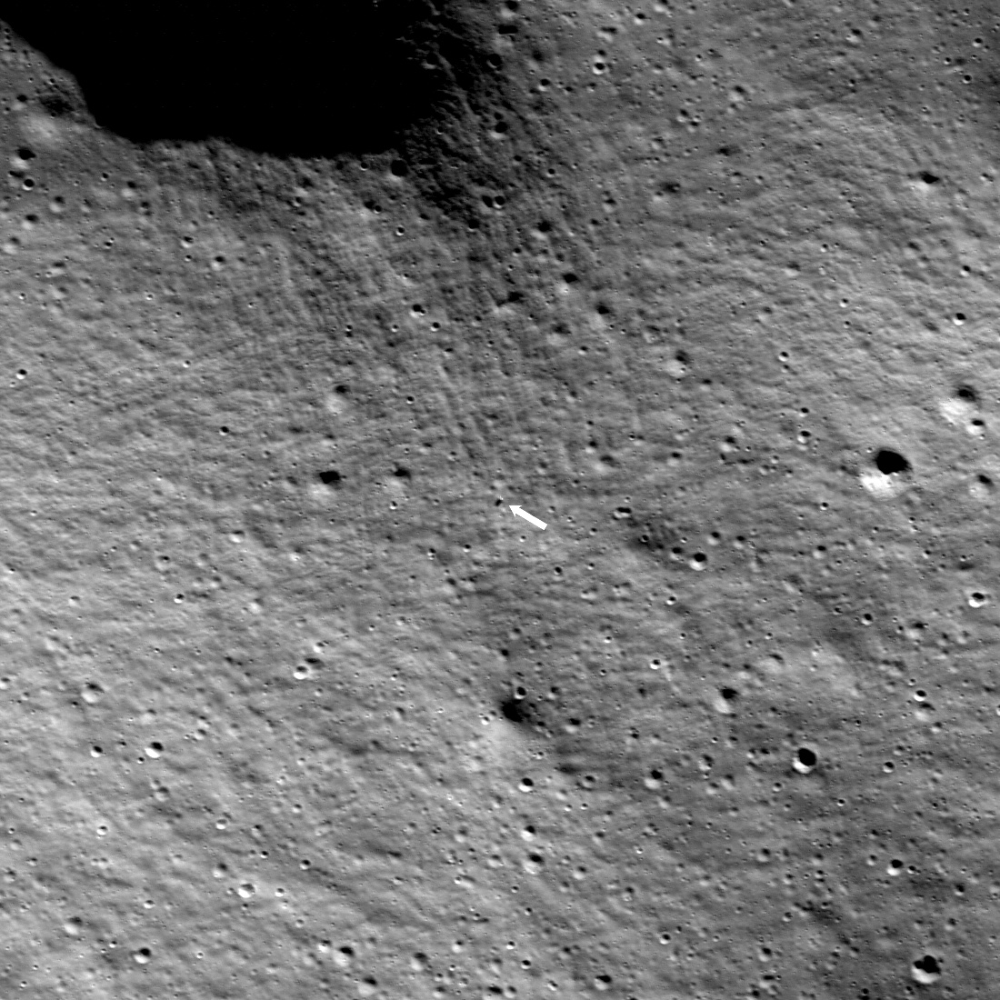
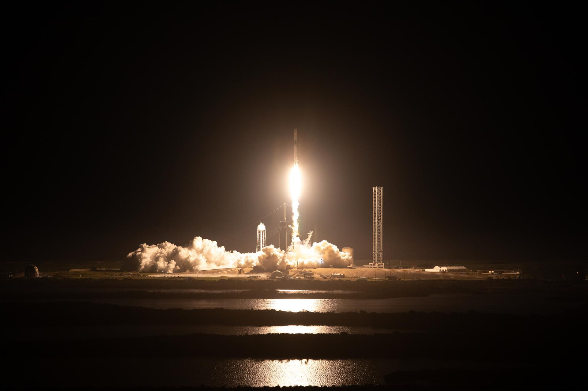

## Primer alunizaje privado con éxito de la historia, el 22 de febrero de 2024.

*El punto de alunizaje de Odysseus, cerca del cráter Malapert A, localizado por la sonda estadounidense LRO (NASA/LROC).*

*Odysseus*, el módulo Nova-C de la empresa estadounidense **Intuitive Machines**, alunizó el 22 de febrero de 2024 cerca del cráter Malapert A, en la región del polo sur lunar: el primer alunizaje privado con éxito de la historia y el primero de EE. UU. desde el Apolo 17 en 1972. Uno de sus sensores láser de altitud falló antes del descenso y una pata del tren de aterrizaje se rompió al tocar suelo, dejándolo apoyado de lado sobre una roca; aun así, siguió transmitiendo datos e imágenes durante unos días antes de agotar la energía. Formaba parte, como el fallido Peregrine unas semanas antes, del programa CLPS de la NASA.

Entre su carga secundaria viajaba también una obra de arte: 125 esculturas metálicas en miniatura del artista Jeff Koons, tituladas *Moon Phases*, cada una grabada con el nombre de una figura histórica distinta, de Platón a Maya Angelou, y presentadas como la primera obra «autorizada» depositada en la Luna. La coletilla no es casual: en 1971 la tripulación del Apolo 15 ya había dejado allí, en secreto y sin permiso de la NASA, una pequeña figura del belga Paul Van Hoeydonck, el *Astronauta Caído*.

*Despegue del cohete Falcon 9 con el módulo Odysseus desde el Complejo de Lanzamiento 39A, el 15 de febrero de 2024 (NASA).*
