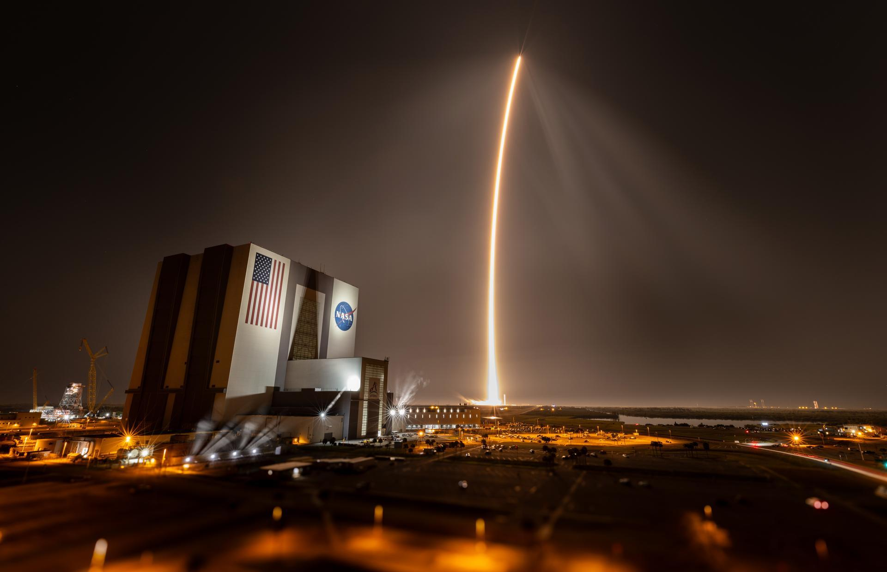

## Segundo alunizaje de Intuitive Machines, el 6 de marzo de 2025 cerca del polo sur, donde acabó volcado dentro de un cráter.

*La meseta de Mons Mouton vista en oblicuo por la sonda estadounidense LRO; la flecha pequeña del centro señala a Athena (NASA/GSFC/Arizona State University).*

*Athena*, el segundo módulo Nova-C de la empresa estadounidense **Intuitive Machines**, alunizó el 6 de marzo de 2025 en Mons Mouton, una meseta a unos 160 km del polo sur lunar, lo más al sur que había llegado ninguna nave hasta entonces. Durante el descenso le falló el altímetro: golpeó la meseta, volcó y rodó hasta quedar de lado dentro de un pequeño cráter en sombra. Con los paneles solares mal orientados y cubiertos de polvo apenas generaba energía, y la misión se dio por terminada unas 13 horas después. Como el IM-1 un año antes, que también acabó apoyado de lado, formaba parte del programa CLPS de la NASA; entre otros instrumentos llevaba el taladro PRIME-1, pensado para buscar hielo bajo la superficie.

Athena llevaba además el Lunar Surface Communication System de Nokia, un sistema pensado para desplegar la primera red celular 4G/LTE de la historia sobre la superficie de otro cuerpo celeste, con estaciones base a bordo del propio módulo y de dos vehículos que debían moverse por el terreno. La estación de Athena llegó a encenderse y a enviar datos operativos hacia la Tierra antes de que la misión se diera por terminada.

*Despegue del cohete Falcon 9 con el módulo Athena desde el Complejo de Lanzamiento 39A, el 26 de febrero de 2025 (NASA).*
