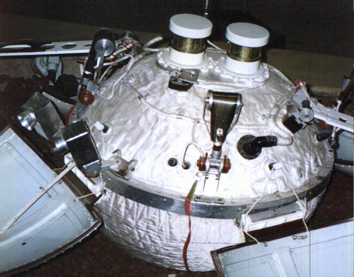

## Tercer alunizaje suave con éxito de la historia, el 24 de diciembre de 1966.

*Réplica de la esfera de aterrizaje de Luna 13.*

Luna 13 alunizó el 24 de diciembre de 1966 en el Oceanus Procellarum. Fue el tercer alunizaje suave logrado por cualquier país, tras Luna 9 (soviética) y Surveyor 1 (estadounidense), ambos unos meses antes ese mismo año. A los cuatro minutos de tocar la superficie desplegó sus antenas y empezó a transmitir; durante los dos días siguientes envió varias panorámicas del terreno tomadas con distinto ángulo de luz solar, además de medir con un penetrómetro la densidad y las propiedades mecánicas del regolito y evaluar la radiación en la superficie.

Ese penetrómetro era en realidad un dinamógrafo que disparaba contra el suelo una punta cónica de titanio con la fuerza de un pequeño motor a reacción, de apenas 6 kg de empuje, para medir la resistencia mecánica del terreno. Lo acompañaba un densitómetro de rayos gamma que, con una fuente radiactiva y tres contadores, calculaba la densidad del regolito hasta 15 cm de profundidad: entre ambos ofrecieron los primeros datos directos sobre cómo era realmente pisar la Luna.
