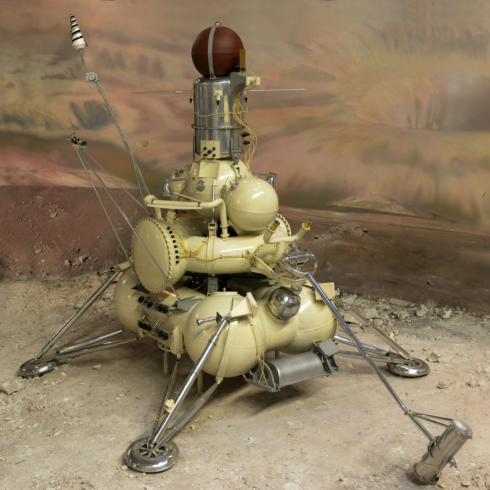

## Primera misión robótica en traer muestras lunares a la Tierra, en septiembre de 1970.

*Réplica de la sonda de retorno de muestras Luna 16.*

Luna 16 alunizó el 20 de septiembre de 1970 en el Mare Fecunditatis y se convirtió en la primera sonda no tripulada de la historia en traer muestras lunares a la Tierra: perforó el suelo, extrajo 101 gramos de regolito y los devolvió en una pequeña cápsula. Fue la respuesta soviética, sin tripulación, al programa Apolo, que ya había traído muestras humanas unos meses antes con el Apolo 11 y el 12.
