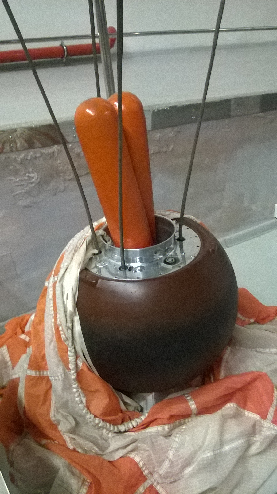

## Primera misión robótica en traer muestras lunares a la Tierra, en septiembre de 1970.

*Réplica de la sonda de retorno de muestras Luna 16.*

Luna 16 alunizó el 20 de septiembre de 1970 en el Mare Fecunditatis, perforó el suelo, extrajo 101 gramos de regolito y los devolvió en una pequeña cápsula: la primera sonda no tripulada de la historia en traer muestras lunares a la Tierra. Fue la respuesta soviética, sin tripulación, al programa Apolo, que ya había traído muestras humanas unos meses antes con el Apolo 11 y el 12.

Unos meses antes había estado a punto de adelantarse a los propios estadounidenses: la sonda Luna 15, lanzada tres días antes que el Apolo 11 con la misma misión de traer muestras, intentó posarse en la Luna mientras Armstrong y Aldrin seguían todavía en la superficie, y se estrelló en el Mare Crisium pocas horas antes de que despegara el módulo lunar *Eagle*. Luna 16, un año después, logró lo que aquella no pudo.

*El aparato de retorno de la estación automática Luna 16, expuesto en un museo ruso (foto: Ludvig14, CC BY-SA 4.0).*
