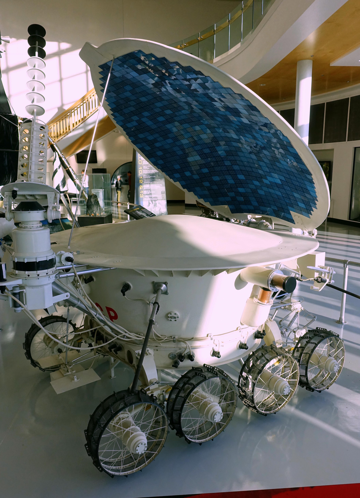

## Desplegó el Lunojod 1, primer vehículo con ruedas en otro cuerpo celeste, en noviembre de 1970.

*El emplazamiento de descenso de Luna 17 fotografiado desde órbita por la sonda estadounidense LRO (NASA/LROC).*

Luna 17 alunizó el 17 de noviembre de 1970 en el Mare Imbrium y desplegó el **Lunojod 1**, el primer vehículo con ruedas operado a distancia en otro cuerpo celeste, casi un año antes de que el Apolo 15 llevara el primer rover tripulado. El Lunojod 1 recorrió más de 10 km en los diez meses siguientes, tomando miles de fotografías y análisis del suelo por control remoto desde la Tierra.

El Lunojod 1 llevaba a bordo un reflector láser francés que, tras dejar de transmitir en 1971, se dio por perdido durante casi 40 años, sin que nadie supiera con certeza dónde había quedado el vehículo. En 2010, un equipo de la Universidad de California en San Diego usó imágenes de la sonda LRO para localizarlo con precisión y, apuntando un láser desde el observatorio de Apache Point, logró rebotar señal en él a la primera: el reflector seguía funcionando incluso mejor que el de su sucesor, el Lunojod 2.

*Réplica del róver Lunojod 1 expuesta en el Evergreen Aviation & Space Museum, McMinnville, Oregón.*
