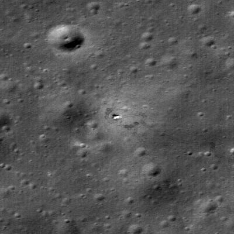

## Desplegó el Lunojod 1, primer vehículo con ruedas en otro cuerpo celeste, en noviembre de 1970.

*El emplazamiento de descenso de Luna 17 fotografiado desde órbita por la sonda estadounidense LRO (NASA/LROC).*

Luna 17 alunizó el 17 de noviembre de 1970 en el Mare Imbrium y desplegó el **Lunojod 1**, el primer vehículo con ruedas operado a distancia en otro cuerpo celeste, casi un año antes de que el Apolo 15 llevara el primer rover tripulado. El Lunojod 1 recorrió más de 10 km en los diez meses siguientes, tomando miles de fotografías y análisis del suelo por control remoto desde la Tierra.
