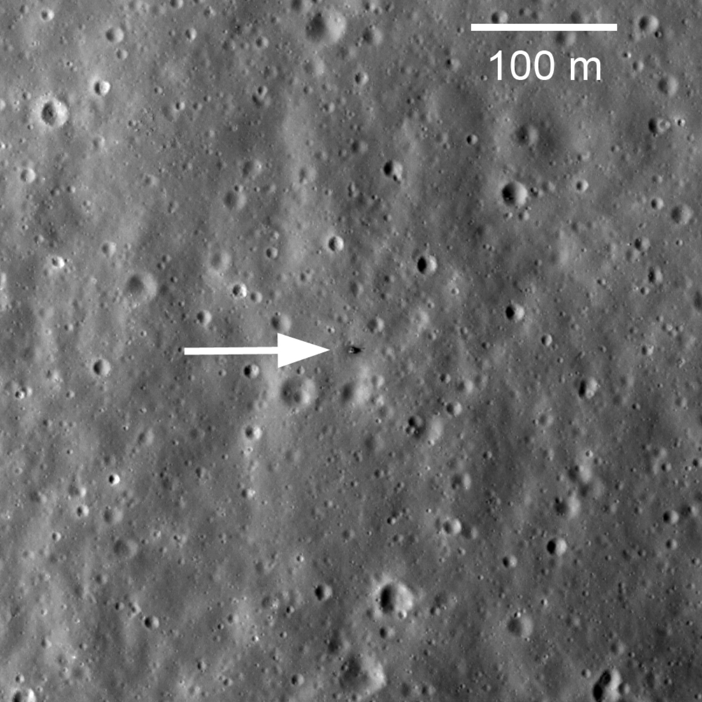

## Segunda misión soviética de retorno de muestras, en febrero de 1972.

*La etapa de descenso de Luna 20 fotografiada desde órbita por la sonda estadounidense LRO, décadas después del alunizaje (NASA/LROC).*

Luna 20 alunizó el 21 de febrero de 1972 en una zona de tierras altas cercana al Mare Fecunditatis, junto a donde había alunizado Luna 16 año y medio antes. Trajo a la Tierra unos 30 gramos de muestras de una zona geológicamente distinta a la de mar, lo que permitió comparar la composición de tierras altas y mares lunares sin depender de misiones tripuladas.
