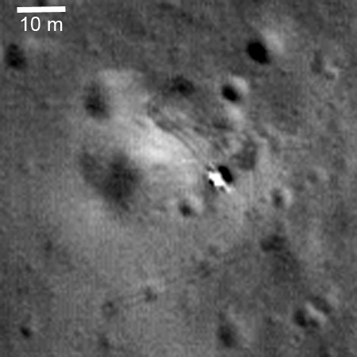
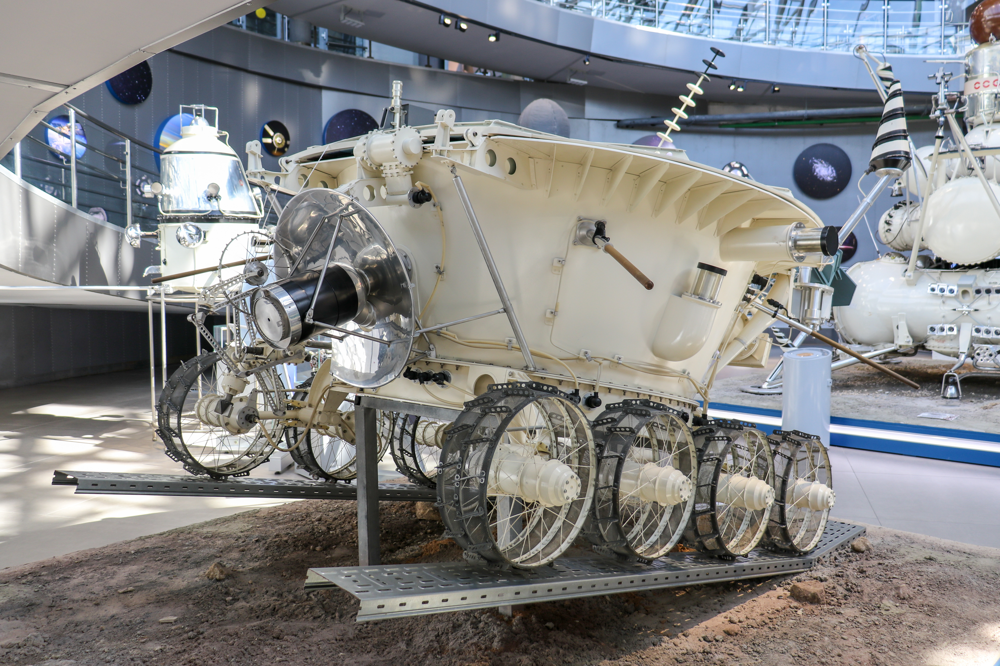

## Desplegó el Lunojod 2, segundo róver soviético, en enero de 1973.

*El módulo de descenso de Luna 21 fotografiado desde órbita por la sonda estadounidense LRO (NASA/LROC).*

Luna 21 alunizó el 15 de enero de 1973 en el cráter Le Monnier, en el borde del Mare Serenitatis, y desplegó el **Lunojod 2**, el segundo róver soviético, más avanzado que el primero. Recorrió unos 39 km en cuatro meses de operación, un récord de distancia recorrida por un vehículo en otro cuerpo celeste que se mantuvo hasta 2014, cuando lo superó el rover Opportunity de la NASA, ya en Marte. Perdió el contacto tras caer accidentalmente polvo lunar sobre sus radiadores, lo que provocó un sobrecalentamiento.

Ese récord de distancia dio que hablar de nuevo décadas después: en 2013, un análisis de sus huellas con imágenes de la sonda LRO reveló que el vehículo había dado más vueltas y retrocedido más veces de lo que sugerían sus cuentakilómetros, y la cifra subió de los 37 km oficiales a unos 39-42 km. La revisión llegó justo a tiempo para disputar si el róver marciano Opportunity, de la NASA, ya le había arrebatado el récord o no, algo que finalmente ocurrió en julio de 2014.

*Réplica del róver Lunojod 2 expuesta en el Museo Estatal de Historia de la Cosmonáutica de Kaluga, Rusia.*
