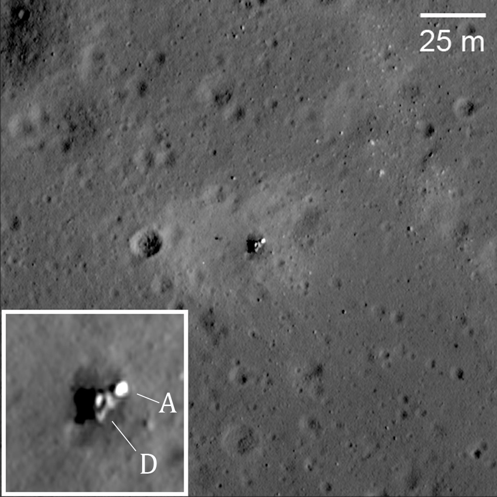

## Alunizó en noviembre de 1974 en el Mare Crisium, pero volcó y no pudo traer muestras.

*Luna 23 tumbada de lado en el Mare Crisium, fotografiada desde órbita por la sonda estadounidense LRO; recuadro con la nave ampliada: A, etapa de ascenso; D, etapa de descenso (NASA/GSFC/Arizona State University).*

Luna 23 alunizó el 6 de noviembre de 1974 en el extremo sur del Mare Crisium, con la misión de perforar el suelo y traer muestras a la Tierra, como antes habían hecho Luna 16 y Luna 20. Tocó suelo a más velocidad de la prevista y volcó: el taladro quedó dañado y no pudo recoger muestras. Aun así, los controladores mantuvieron el contacto durante tres días, hasta el 9 de noviembre. Dos años después, Luna 24 alunizó a unos cientos de metros y cumplió la misión que ella no pudo. En 2012, las imágenes de la sonda LRO confirmaron que seguía tumbada de lado.

Llevaba un taladro rediseñado, capaz de perforar hasta 2,5 metros de profundidad frente a los 30-35 cm que habían alcanzado Luna 16 y Luna 20; era el mismo modelo de barrena, algo mejorado, que dos años más tarde sí funcionaría en Luna 24. El vuelco al aterrizar dejó esa mejora técnica sin estrenar.
