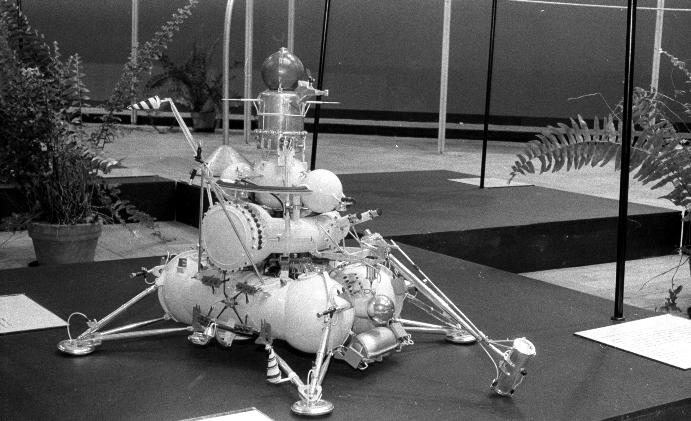

## Última misión del programa Luna, en agosto de 1976, tercera en traer muestras a la Tierra.

*El emplazamiento de Luna 24 en el Mare Crisium, fotografiado desde órbita por la sonda estadounidense LRO; recuadro con el módulo ampliado (NASA/GSFC/Arizona State University).*

Luna 24 alunizó el 18 de agosto de 1976 en el Mare Crisium y fue la última misión del programa Luna soviético, así como la tercera y última en traer muestras a la Tierra (170 gramos, perforando más profundo que sus predecesoras). Durante décadas fue también la última vez que cualquier país trajo muestras lunares a la Tierra, hasta que China repitió la hazaña con la Chang'e 5 en 2020.

Parte de esos 170 gramos acabaron, por un curioso giro de la Guerra Fría, en manos estadounidenses: como ya se había hecho con material de Luna 16 y Luna 20, la URSS entregó fragmentos a la NASA a cambio de rocas lunares del Apolo, y ese pequeño intercambio diplomático es hoy la razón de que haya polvo lunar soviético guardado junto al de las misiones tripuladas en los archivos de EE. UU.

*Modelo de la sonda Luna 24 expuesto en Praga, hacia 1980.*
