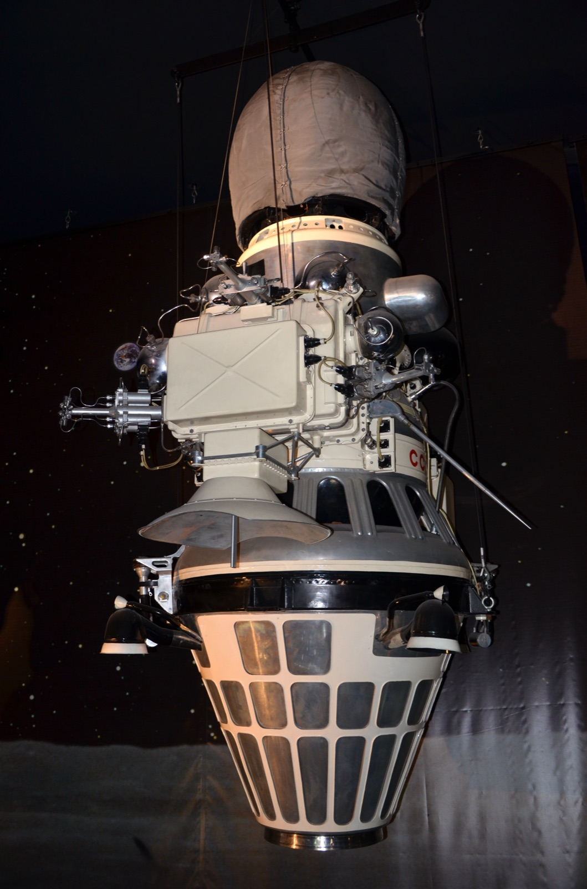

## Primer alunizaje suave de la historia, el 3 de febrero de 1966.

*Réplica de la sonda Luna 9 expuesta en el Museo del Aire y el Espacio de Le Bourget, París.*

Luna 9 fue la primera sonda —soviética o de cualquier país— en lograr un **alunizaje suave**, el 3 de febrero de 1966, en el Océano de las Tormentas. No tripulada, transmitió las primeras fotografías panorámicas tomadas desde la superficie de otro cuerpo celeste, que sirvieron para confirmar que el suelo lunar era lo bastante firme como para soportar el peso de un módulo tripulado, una duda real hasta entonces. Adelantó a EE. UU. en esta carrera concreta, cuatro meses antes del primer Surveyor.
