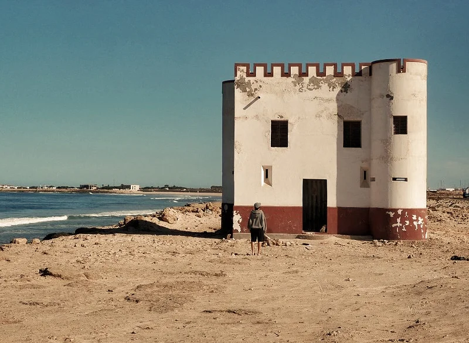
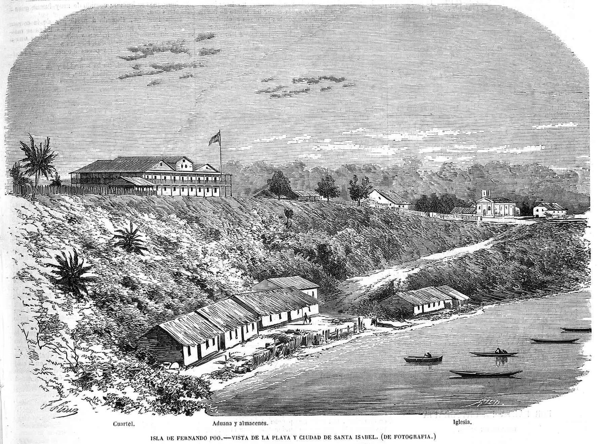

## Introducción al Sáhara

Este artículo nace de haber escuchado muchas veces la misma idea: que el Sáhara era una provincia española de pleno derecho, con representación en Cortes, con los mismos derechos que Cuenca o Toledo, una más del mapa. Dicho siempre con ese tono de quien se da golpes en el pecho por lo bien que se hicieron las cosas. Yo también lo creía así, hasta que me puse a escribir sobre este periodo de la historia.

Veamos, España declaró el Sáhara e Ifni provincias por el [Decreto de 10 de enero de 1958](https://www.boe.es/datos/pdfs/BOE//1958/012/A00087-00087.pdf). En el texto, se dice de forma literal que "los Territorios del África Occidental Española se hallan integrados por dos provincias, denominadas Ifni y Sáhara Español".

Antes de esa fecha, ambos territorios llevaban desde 1946 unidos bajo un único "Gobierno General de África Occidental Española", es decir, compartían una administración conjunta, pero no eran "una misma provincia": el decreto de 1958 precisamente lo que hace es separarlos administrativamente y darles a cada uno rango pleno de provincia española, como Cuenca o Toledo.

La fuerte presión de la ONU ([Resolución 1514, la gran declaración sobre descolonización](https://es.wikipedia.org/wiki/Resoluci%C3%B3n_1514_de_la_Asamblea_General_de_las_Naciones_Unidas)) es de **diciembre de 1960**, dos años después. Y el Sáhara no entra en la lista de territorios no autónomos de la ONU hasta **1963**. Es decir, la provincialización no fue una reacción a una amenaza de la ONU que ya existiera — fue un **movimiento preventivo** para intentar esquivar de antemano el [Capítulo XI](https://www.un.org/es/about-us/un-charter/chapter-11) de la Carta de la ONU (el que obliga a rendir cuentas sobre territorios no autónomos). Si consigues que tu colonia sea "provincia" en vez de "colonia", en teoría no tienes que informar a la ONU sobre ella ni comprometerte a descolonizarla.

## El caso de nuestro vecino ibérico: Portugal

Portugal hizo la misma jugada mediante la revisión constitucional del régimen de Salazar, que sustituyó sistemáticamente el término "colonias" por "provincias ultramarinas", y "Imperio Colonial Portugués" por "Ultramar". Esto afectó a Angola, Mozambique, Guinea Portuguesa, Cabo Verde, Santo Tomé y Príncipe, Goa,  Macao y Timor Portugués.

De hecho, Portugal hizo esto mucho antes, en 1951, cuando ni siquiera era todavía miembro de la ONU. España y Portugal entraron juntos en Naciones Unidas en el mismo *paquete* de admisiones, en diciembre de 1955. Es decir, Salazar blindó jurídicamente sus colonias convirtiéndolas en "provincias" **cuatro años antes** de tener siquiera que rendir cuentas ante la ONU. Salazar veía venir el clima descolonizador de posguerra (independencia de India en 1947, la Carta de la ONU de 1945 con su Capítulo XI ya redactado, el ambiente que después cristalizaría en Bandung 1955) y decidió curarse en salud antes de que la obligación le alcanzase formalmente.

## Hablemos de Lequerica

José Félix de Lequerica y Erquiza nació en Bilbao en 1890. Fue nombrado **alcalde de Bilbao entre 1938 y 1939** durante la Guerra Civil. En 1939 pasó a ser **embajador de España en París**, cargo que mantuvo bajo el régimen de Vichy, y entre **1944 y 1945 fue ministro de Asuntos Exteriores** de Franco. Y en **diciembre de 1955**, cuando España es por fin admitida en la ONU, Lequerica es nombrado **primer embajador permanente de España ante las Naciones Unidas**.

Desde ese puesto fue el encargado de defender ante la Asamblea General la tesis oficial del franquismo —la misma que justifica el decreto de 1958—: que España **no tenía colonias**, sino **provincias**, y que por tanto esos territorios no estaban sujetos al proceso de descolonización del Capítulo XI de la Carta de la ONU.

Lo interesante —y poco contado— es que en **1960**, bajo presión internacional creciente (justo el año de la Resolución 1514 de la ONU sobre descolonización), el propio Lequerica anunció que España transmitiría al Secretario General información sobre esos territorios conforme al Capítulo XI, lo cual suponía, de facto, **reconocer que Ifni, el Sáhara y Guinea (Fernando Poo y Río Muni) eran territorios no autónomos** y no simples provincias como sostenía el Gobierno.

Aquella declaración le costó una tormenta diplomática: hubo un conflicto interno entre Exteriores (que cedía ante la ONU) y Presidencia (que se aferraba a la ficción provincial), y protestas oficiales de Portugal (que estaba jugando la misma carta con sus "provincias ultramarinas" africanas y no quería que España abriera la grieta). El Gobierno llegó a plantearse destituir a la delegación española en la ONU por lo que había dicho Lequerica.

## ¿Y Guinea? La historia de Fernando Poo y Río Muni

El [21 de agosto de 1956](https://www.boe.es/diario_gazeta/comun/pdf.php?p=1956/09/19/pdfs/BOE-1956-263.pdf) se aprobó el Decreto por el que los "Territorios Españoles del Golfo de Guinea" (hasta entonces colonia) pasan a ser **una sola provincia**: la "Provincia Española del Golfo de Guinea". La primera vez que España convirtió una colonia africana en "provincia" fue aquí, **dos años antes** que con Ifni y el Sáhara.

El [30 de julio de 1959, la ley 46/1959](https://www.boe.es/datos/pdfs/BOE//1959/182/A10370-10371.pdf) divide esa única provincia en las dos que conocemos: **Fernando Poo** (capital Santa Isabel) y **Río Muni** (capital Bata). A diferencia de Ifni y sobre todo el Sáhara, con Guinea España sí siguió el guion "correcto" de la ONU: hubo un Estatuto de Autonomía en 1963, una Conferencia constitucional en Madrid, un referéndum que aprobó una Constitución el 11 de agosto de 1968, y la [independencia](https://es.wikipedia.org/wiki/Independencia_de_Guinea_Ecuatorial) se proclamó el **12 de octubre de 1968**, naciendo la República de Guinea Ecuatorial.

A pesar de haber seguido el proceso "bien hecho", esto no significó un final feliz. Apenas semanas después de la independencia, [**Francisco Macías Nguema**](https://es.wikipedia.org/wiki/Francisco_Mac%C3%ADas_Nguema) se hizo con el poder absoluto e instauró una de las dictaduras más sangrientas de África, con matanzas dirigidas en particular contra la [minoría bubi](https://es.wikipedia.org/wiki/Bubi) de Fernando Poo (que ya en la conferencia constitucional había pedido no ser unida a la [mayoría fang](https://es.wikipedia.org/wiki/Fang_(etnia)) del continente, y no se le hizo caso). Macías fue derrocado en 1979 por su propio sobrino, [Teodoro Obiang Nguema Mbasogo](https://es.wikipedia.org/wiki/Teodoro_Obiang_Nguema) — que sigue siendo el dictador del país hoy mismo, más de 45 años después.

## Mi opinión sobre el Sáhara

Terminando, queda realmente claro que tanto Ifni como el Sáhara eran **colonias** españolas en África, nombradas provincias en un claro intento de escapar de la ONU con un cambio de nomenclatura, y perdidas, una en 1969 y la otra en 1975.

Así que no, el Sáhara nunca fue una provincia como Cuenca: fue una colonia con papeles de provincia, y cuando llegó la hora de la verdad —la nacionalidad de la gente que nació allí— ni el propio Estado español se atrevió a tratarla como tal. Muchos saharauis nacidos antes de 1975, pese a haber sido legalmente "españoles de provincia" durante años, nunca recibieron DNI ni pasaporte español en igualdad de condiciones, y cuando España se retiró en 1976, el Gobierno consideró que habían perdido esa nacionalidad.

Y hay una última prueba, quizás la más contundente de todas. En 2020, el Tribunal Supremo tuvo que decidir si haber nacido en el Sáhara antes de la descolonización daba derecho a la nacionalidad española de origen. La [sentencia 207/2020, de 29 de mayo](https://www.civil-mercantil.com/sites/civil-mercantil.com/files/NCJ064797.pdf), del Pleno de la Sala de lo Civil, dijo que no — el propio tribunal reconoce que quienes nacían en el Sáhara cuando era posesión española nunca llegaron a ser nacionales de pleno derecho, sino una especie de súbditos que simplemente se beneficiaban de la nacionalidad, sin tenerla de verdad.
