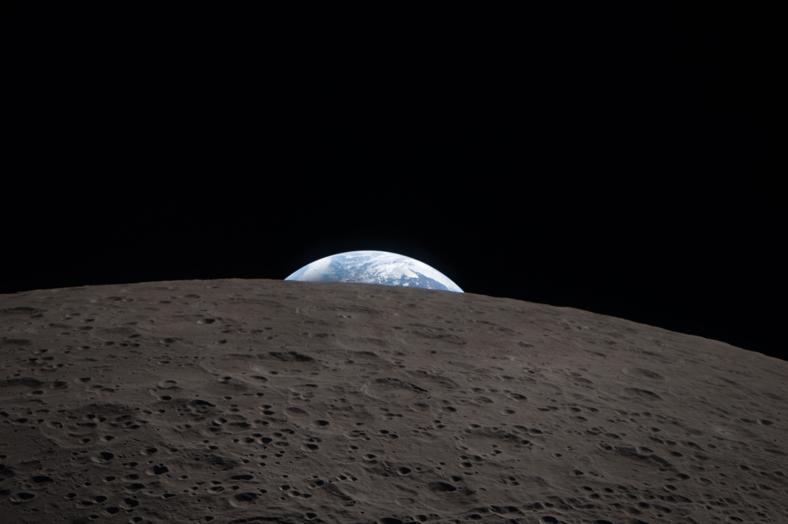

## Primer vuelo tripulado a la Luna desde 1972: la nave Orion rodeó la Luna con cuatro astronautas en abril de 2026.

*La Tierra se oculta tras el horizonte de la cara oculta de la Luna, fotografiada por la tripulación de Artemis II desde la nave Orion durante el sobrevuelo lunar (NASA, 6 de abril de 2026).*

Artemis II despegó el 1 de abril de 2026 desde el Centro Espacial Kennedy a bordo del cohete SLS, con Reid Wiseman (comandante), Victor Glover (piloto), Christina Koch y el canadiense Jeremy Hansen dentro de la nave Orion, bautizada por ellos como *Integrity*. No alunizó: siguió una **trayectoria de retorno libre** que la llevó a rodear la cara oculta de la Luna el 6 de abril y la devolvió a la Tierra sin necesidad de entrar en órbita lunar. Durante el sobrevuelo la tripulación superó el récord de distancia a la Tierra alcanzado por un ser humano, en manos del Apolo 13 desde 1970. Orion amerizó en el Pacífico, frente a San Diego, el 10 de abril. Fue la **primera misión tripulada a la Luna desde [Apolo 17](/notas/apolo-17-1972)**, la primera con una mujer, una persona negra y un no estadounidense a bordo, y la prueba general antes de Artemis III, la que debe volver a poner astronautas en la superficie.

La propia cápsula Orion llevaba tiempo bajo sospecha: tras el vuelo sin tripulación de Artemis I, en 2022, la NASA encontró más de un centenar de zonas donde el escudo térmico se había agrietado y perdido material de forma distinta a la prevista, por gases atrapados que no lograban escapar durante la reentrada en «skip» (con un rebote en la atmósfera). La investigación retrasó Artemis II cerca de un año, hasta que los ingenieros optaron por una reentrada más directa, sin ese rebote, que en la práctica redujo la pérdida de material a menos de una décima parte de la registrada en 2022.

_El cohete SLS despegó a las 00:35 (hora española) desde el Centro Espacial Kennedy, en Florida, y marca el inicio del **primer vuelo tripulado del programa Artemis**._

_De izquierda a derecha: **Jeremy Hansen, Reid Wiseman, Victor Glover y Christina Koch._**
