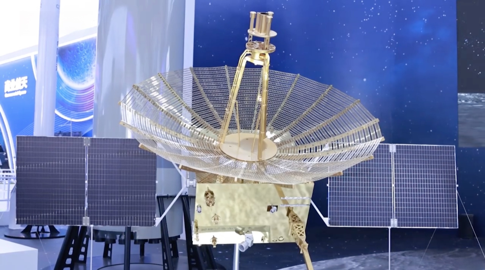

## Segundo satélite relé chino en la Luna, lanzado en marzo de 2024 para dar servicio a Chang'e 6 y a las próximas misiones al polo sur.

*Maqueta del satélite relé Queqiao-2 expuesta por la Academia China de Tecnología Espacial (CAST) en el Salón Aeronáutico de Zhuhai de 2024 (China News Service, CC BY 3.0).*

Queqiao-2 despegó el 20 de marzo de 2024 a bordo de un cohete _Long March 8_ desde el centro de lanzamiento de Wenchang. Más grande que su predecesor, [Queqiao](/notas/queqiao-2018) (unas 1,2 toneladas), lleva también una antena de 4,2 m, pero en lugar de quedarse en el punto L2 se colocó en una **órbita elíptica alrededor de la propia Luna**, con un periodo de unas 24 horas, que le permite pasar largos ratos sobre la cara oculta y el polo sur. Dos meses después retransmitió las comunicaciones de [Chang'e 6](/notas/change-6-2024) durante la primera recogida de muestras en la cara oculta, y está previsto que dé servicio a Chang'e 7 y Chang'e 8, las misiones con las que China prepara una base de investigación en el polo sur lunar.

El mismo cohete puso en órbita lunar otros dos pasajeros mucho más pequeños, los cubesats experimentales Tiandu-1 (61 kg) y Tiandu-2 (15 kg), construidos por el Deep Space Exploration Laboratory chino: vuelan en formación como banco de pruebas de navegación y telemetría láser para la futura constelación de satélites Queqiao, con la que China quiere dar cobertura permanente a las misiones robóticas y tripuladas que planea en la próxima década.
