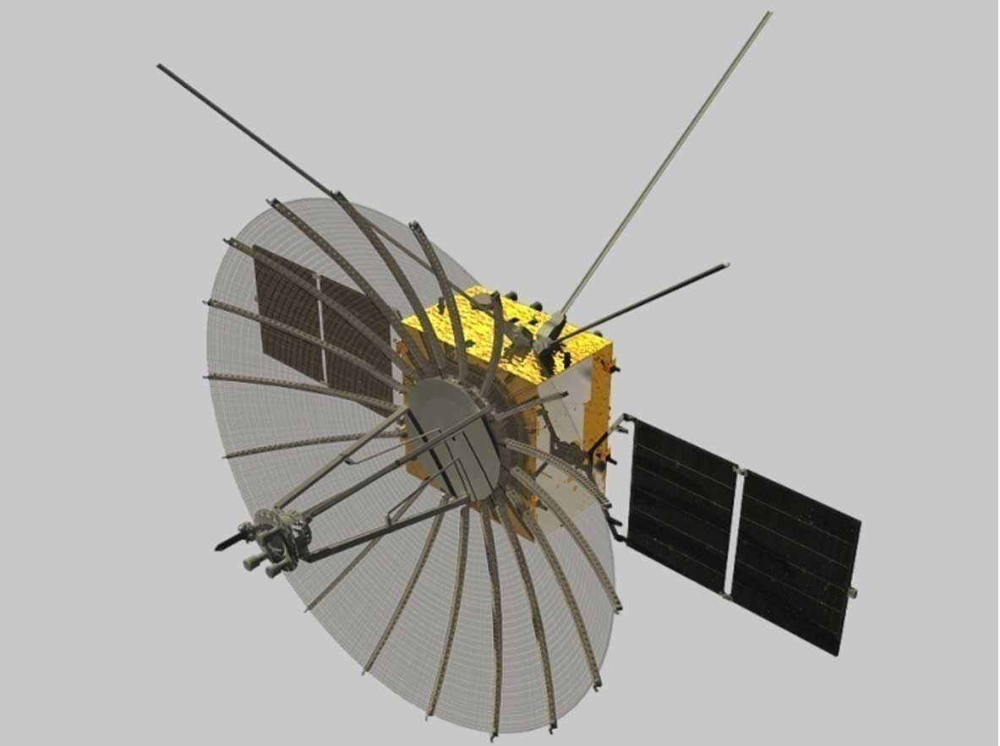

## Satélite relé que hizo posible el primer alunizaje en la cara oculta de la Luna, lanzado en mayo de 2018.

*Modelo del satélite relé Queqiao con su antena desplegable de 4,2 m (Zhang Lihua / DFH Satellite, CC BY 4.0).*

Queqiao despegó el 21 de mayo de 2018 a bordo de un cohete _Long March 4C_ desde el centro de lanzamiento de Xichang, casi ocho meses antes que [Chang'e 4](/notas/change-4-2019). Su nombre, «puente de urracas», viene de la leyenda china en la que las urracas forman un puente para reunir a dos amantes separados. China lo situó en una **órbita de halo alrededor del punto de Lagrange L2** del sistema Tierra-Luna, a unos 65.000 km más allá de la Luna, desde donde ve a la vez la cara oculta y la Tierra. Como la propia Luna bloquea cualquier contacto directo con la cara oculta, sin este relé ni el módulo de Chang'e 4 ni el róver Yutu-2 habrían podido comunicarse con la Tierra. Fue el **primer satélite de comunicaciones de la historia en órbita más allá de la Luna** y siguió operativo mucho más allá de los tres años de vida para los que se diseñó.

Con él viajaron dos microsatélites experimentales, Longjiang-1 y Longjiang-2, construidos por estudiantes del Harbin Institute of Technology; el primero se perdió antes de entrar en órbita lunar, pero el segundo funcionó durante casi dos años y, en febrero de 2019, tomó una fotografía poco habitual con la cara oculta de la Luna y la Tierra —una pequeña canica azul— en el mismo encuadre, captada por radioaficionados de todo el mundo y procesada por el astrónomo neerlandés Cees Bassa desde el radiotelescopio de Dwingeloo.

