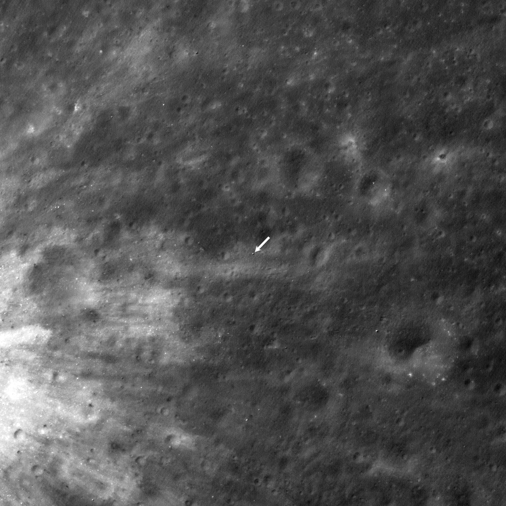

## Alunizaje de precisión japonés, el 19-20 de enero de 2024, en el cráter Shioli.

*El punto de alunizaje de SLIM, localizado por la sonda estadounidense LRO (NASA/LROC, 24 de enero de 2024).*

SLIM ("Smart Lander for Investigating Moon"), apodado *Moon Sniper*, alunizó el 19-20 de enero de 2024 junto al cráter Shioli, convirtiendo a Japón en el quinto país en lograr un alunizaje suave. Su objetivo no era solo llegar, sino demostrar un **alunizaje de precisión**: se posó a apenas 55 metros de su punto objetivo, muy por debajo del margen de varios kilómetros habitual hasta entonces. Un fallo en un motor durante el descenso lo dejó volcado de lado, pero sobrevivió y siguió transmitiendo datos científicos de forma intermitente, incluso tras varias noches lunares, mucho más allá de lo previsto.
