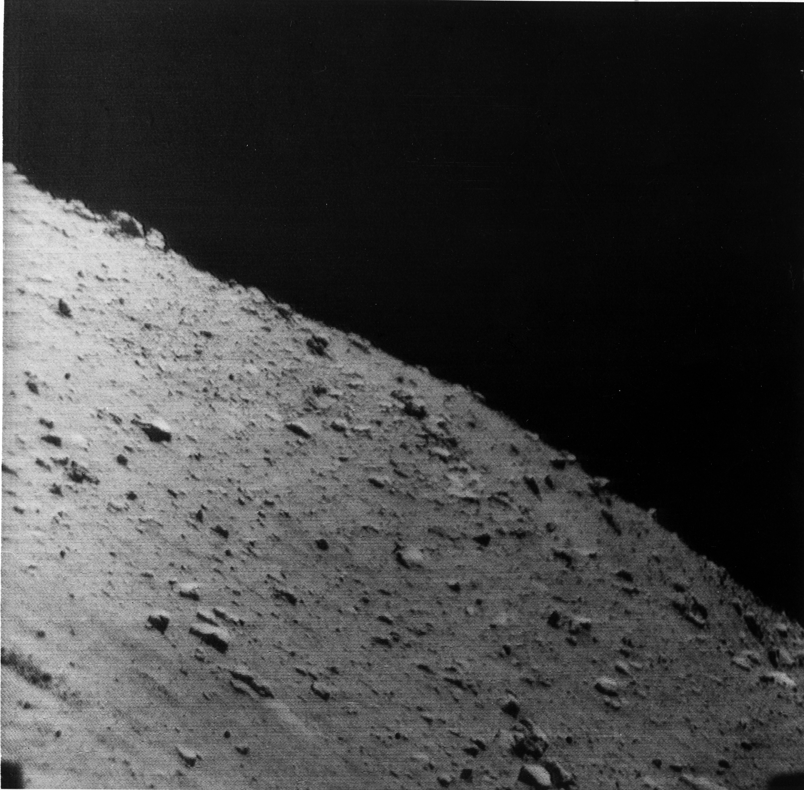
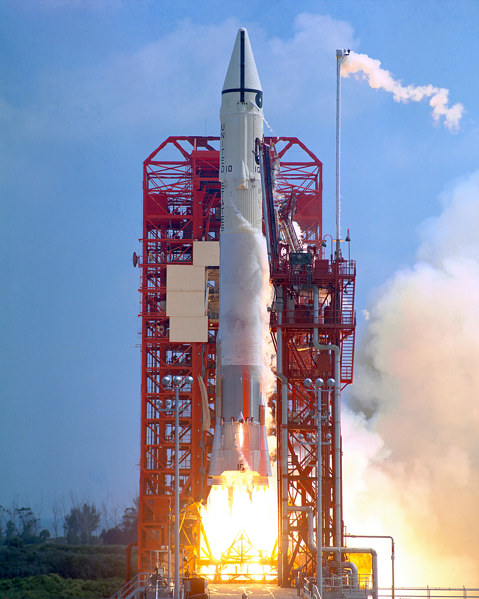

## Primer alunizaje suave estadounidense, el 2 de junio de 1966.

*El horizonte lunar fotografiado por la propia Surveyor 1 desde la superficie (NASA, junio de 1966).*

Surveyor 1 alunizó el 2 de junio de 1966 en el Océano de las Tormentas, cerca del cráter Flamsteed. Fue el primer alunizaje suave logrado por EE. UU., apenas cuatro meses después de que la URSS lo consiguiera por primera vez con Luna 9, y el primero de los siete Surveyor: sondas no tripuladas pensadas para probar que un terreno era lo bastante firme y seguro para posar allí un módulo tripulado del programa Apolo. Transmitió más de 11.000 fotografías de la superficie antes de que acabara su misión.

Nadie en el JPL daba por hecho que fuera a funcionar a la primera: el mismo laboratorio gestionaba el programa Ranger, que había encadenado seis fracasos seguidos entre 1961 y 1964 antes de que Ranger 7 lograra por fin fotografiar la Luna de cerca en su caída final. Con ese historial reciente pesando sobre el equipo, Surveyor 1 alunizó sin incidentes a la primera, algo que sorprendió a más de un ingeniero que ya tenía preparados protocolos para un fallo que nunca llegó.

*Despegue del cohete Atlas-Centaur 10 con la sonda Surveyor 1, el 30 de mayo de 1966 (NASA).*
