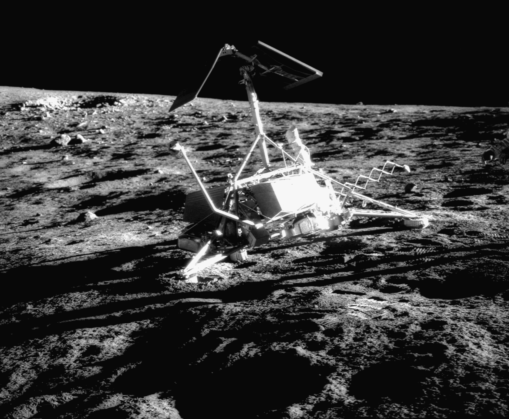
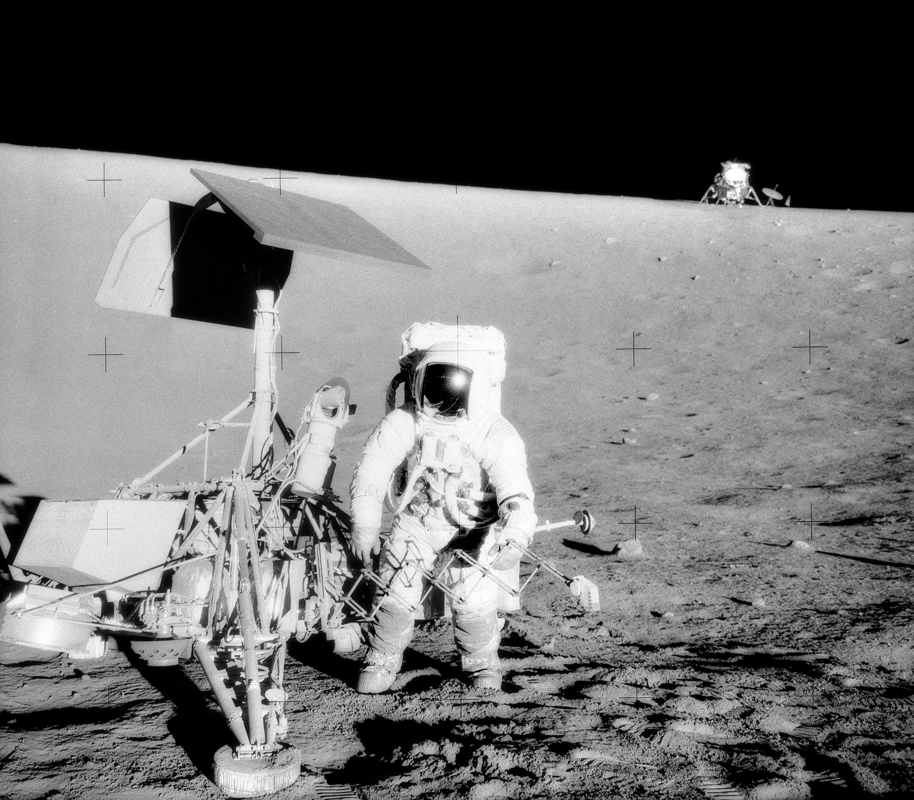

## Alunizaje del 20 de abril de 1967, visitado más tarde por los astronautas del Apolo 12.

*Surveyor 3 en la superficie lunar, fotografiada por Alan Bean durante el paseo lunar del Apolo 12 (NASA, 20 de noviembre de 1969).*

Surveyor 3 alunizó el 20 de abril de 1967 en el sureste del Océano de las Tormentas. Llevaba una pala mecánica con la que excavó y analizó el suelo lunar, además de tomar fotografías. Su alunizaje fue accidentado: rebotó varias veces sobre la superficie antes de posarse del todo, debido a un fallo que dejó encendidos sus motores de descenso más tiempo de lo previsto. Es la sonda más famosa de todo el programa porque, dos años y medio después, la tripulación del **Apolo 12** alunizó a poca distancia y visitó a pie los restos de Surveyor 3, trayendo piezas suyas de vuelta a la Tierra para estudiar el efecto de la exposición lunar en los materiales.

Durante años circuló una anécdota inquietante sobre esa cámara recuperada: al analizarla en laboratorio, unos científicos creyeron haber encontrado en su interior bacterias *Streptococcus mitis* que habrían sobrevivido casi tres años en el vacío y el frío extremo lunar, un hallazgo que alimentó el debate sobre la resistencia microbiana en el espacio. Ya en el siglo XXI, una revisión del caso concluyó que lo más probable es que la contaminación se produjera en la propia Tierra, durante la manipulación de las muestras.

*El astronauta Pete Conrad junto a Surveyor 3, con el módulo lunar Intrepid del Apolo 12 al fondo (NASA, noviembre de 1969).*
