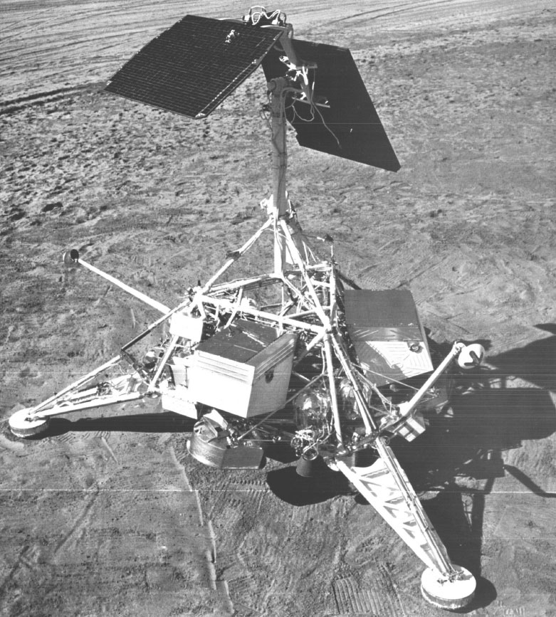

## Alunizó el 11 de septiembre de 1967 en el Mar de la Tranquilidad, el mismo mar donde alunizaría el Apolo 11.

*Maqueta a escala real de una sonda Surveyor, usada en las pruebas de NASA en Tierra.*

Surveyor 5 alunizó el 11 de septiembre de 1967 en el Mare Tranquillitatis, tras un descenso complicado por una fuga en su sistema de propulsión que obligó a improvisar la maniobra final. Fue la primera sonda en analizar químicamente el suelo lunar in situ, con un instrumento que bombardeaba la superficie con partículas alfa; los resultados confirmaron que el terreno era similar al basalto terrestre, un dato clave para preparar el punto de alunizaje del Apolo 11, que llegaría al mismo mar menos de dos años después.
