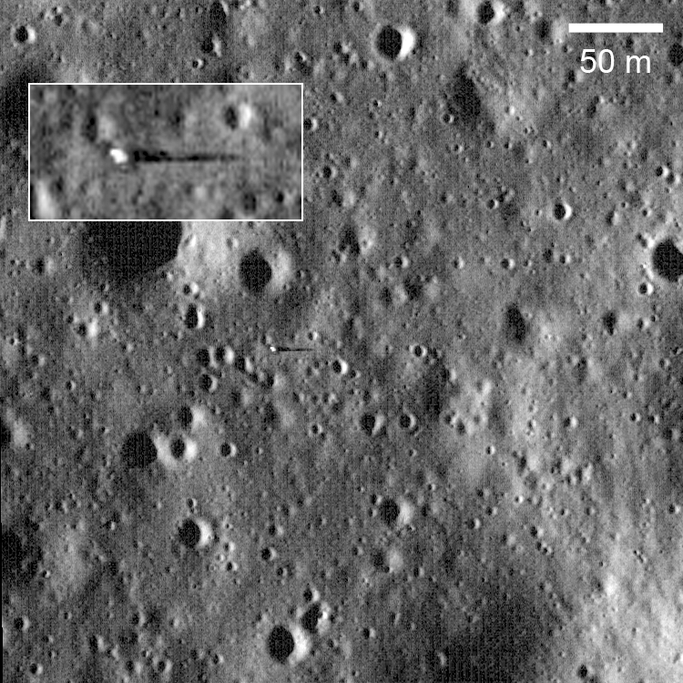
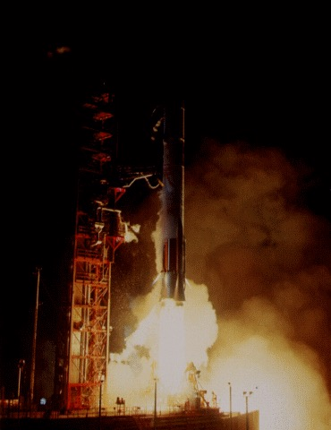

## Alunizó el 10 de noviembre de 1967 en Sinus Medii y protagonizó el primer "salto" en la Luna.

*El emplazamiento de Surveyor 6 en Sinus Medii, fotografiado desde órbita por la sonda estadounidense LRO; recuadro con la nave ampliada (NASA/GSFC/Arizona State University).*

Surveyor 6 alunizó el 10 de noviembre de 1967 en Sinus Medii, cerca del centro del disco lunar visto desde la Tierra. Semanas después de posarse, el control en Tierra encendió brevemente sus motores para que despegara unos metros y volviera a alunizar a poca distancia: fue el primer "salto" (*hop*) de una nave en la Luna, pensado para fotografiar el mismo terreno desde otro ángulo y comprobar cómo respondía el suelo al despegue, un dato útil de cara al ascenso del módulo lunar del Apolo.

Pocos meses antes, en julio de 1967, la sonda gemela Surveyor 4 había perdido el contacto por radio apenas dos minutos y medio antes de tocar la superficie, durante el encendido de los motores de frenado, y nunca se supo si llegó a estrellarse o si sobrevivió al descenso sin poder comunicarlo. Surveyor 6 voló esa misma secuencia meses después, sin margen para confiarse.

*Despegue nocturno del cohete Atlas-Centaur con Surveyor 6, el 7 de noviembre de 1967 (NASA).*
