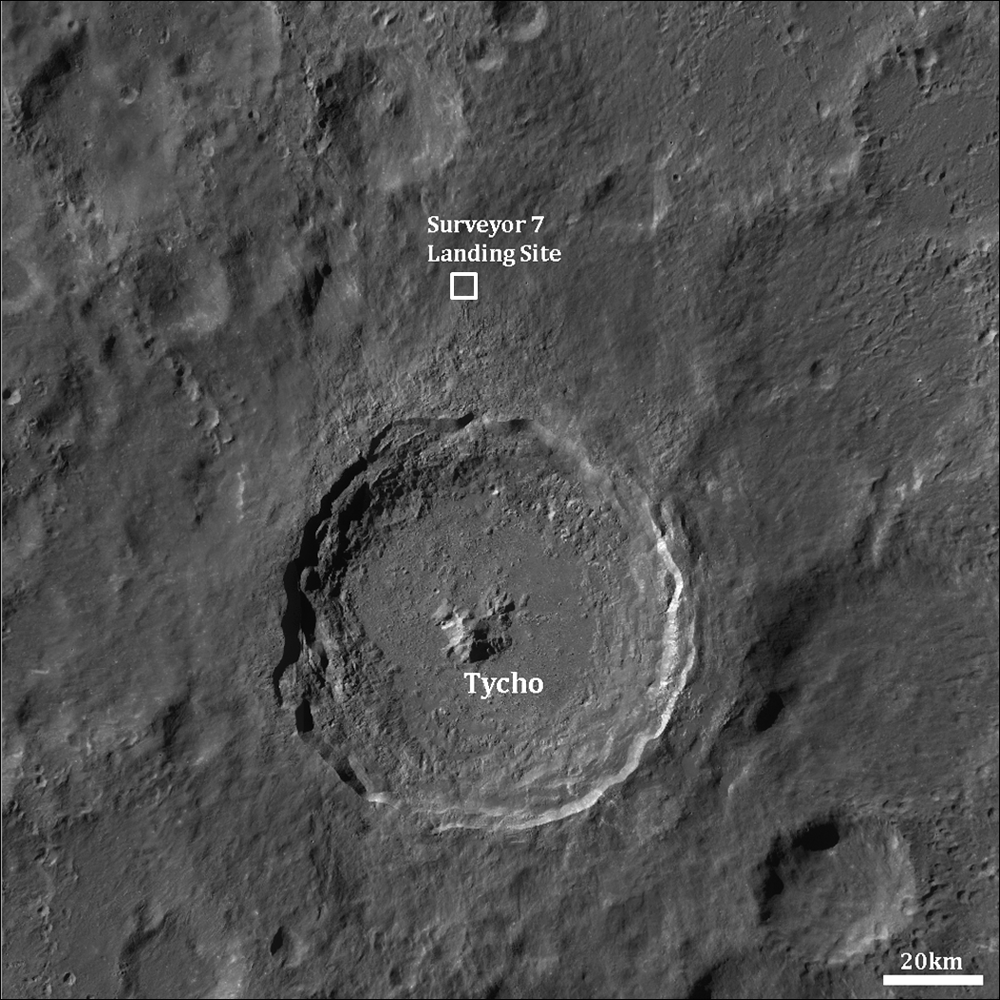
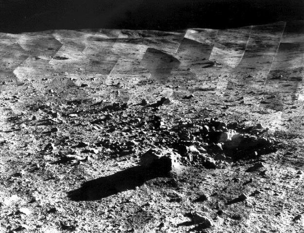

## Último Surveyor, el 10 de enero de 1968, el único con fines puramente científicos.

*El punto de alunizaje de Surveyor 7, al norte del cráter Tycho, localizado por la sonda estadounidense LRO (NASA/LROC).*

Surveyor 7 alunizó el 10 de enero de 1968 en el borde exterior del cráter Tycho, en las tierras altas del hemisferio sur lunar. A diferencia de los seis anteriores, no buscaba un mar llano y seguro pensando en el Apolo, sino que fue el único Surveyor con un objetivo puramente científico: estudiar un terreno accidentado y geológicamente distinto, la eyecta de un cráter joven y prominente. Con la pala mecánica y el analizador de partículas alfa heredados de misiones anteriores, envió cerca de 21.000 fotografías antes de que terminara la misión, cerrando el programa Surveyor justo antes de los vuelos tripulados del Apolo.

Una hora después de la puesta de Sol, sus cámaras captaron algo que nadie esperaba: un tenue resplandor sobre el horizonte lunar, sin ninguna atmósfera que lo explicara. Pasarían más de cuatro décadas hasta que la misión LADEE de la NASA, en 2013, confirmara que aquel brillo lo producía polvo lunar cargado eléctricamente y levitando varios centímetros sobre el suelo; Surveyor 7 había sido la primera sonda en fotografiarlo, sin que nadie supiera entonces del todo qué estaba viendo.

*Fotomosaico del panorama lunar cerca del cráter Tycho, tomado por la propia Surveyor 7 (NASA/JPL).*
