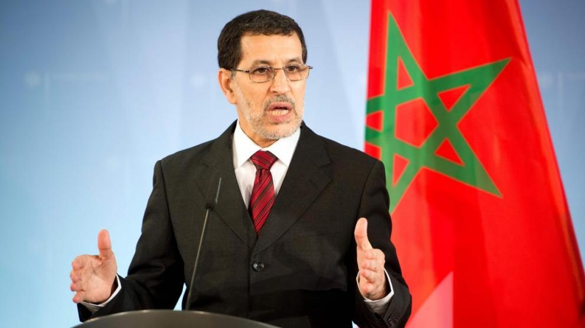
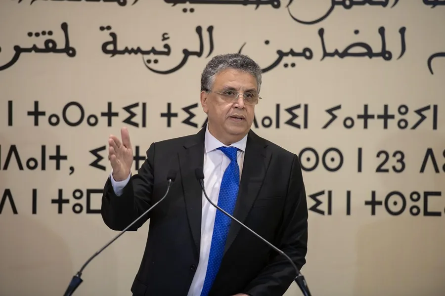
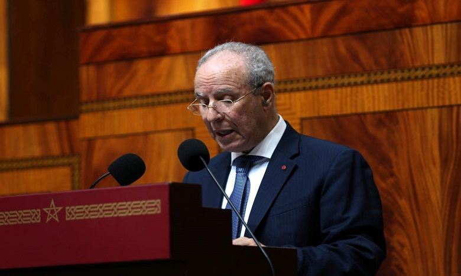
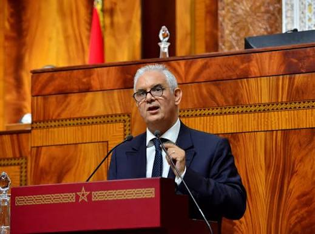
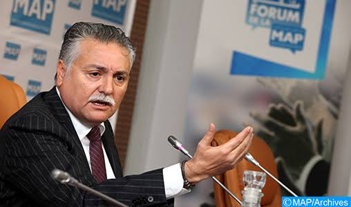
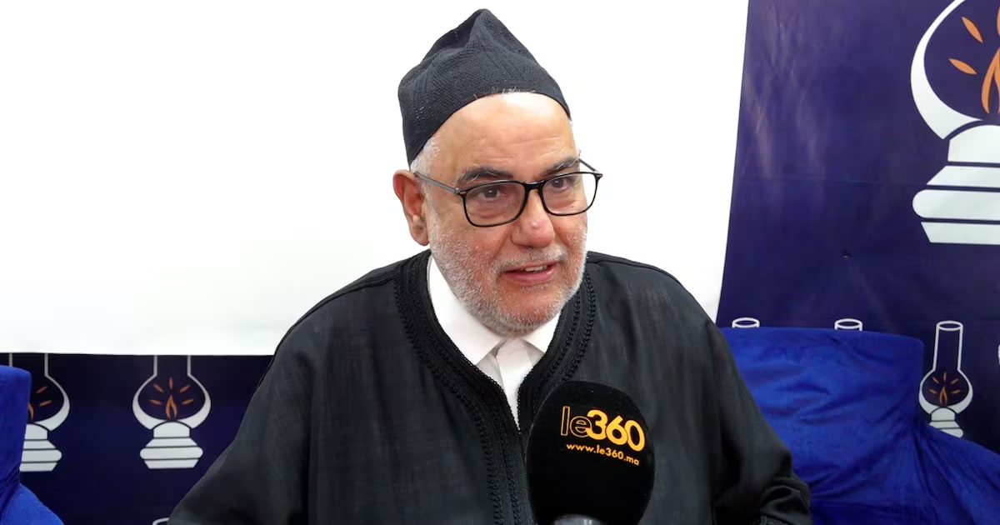
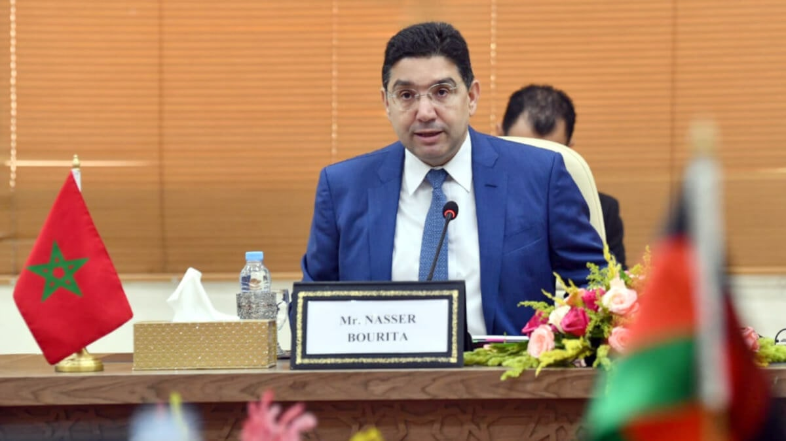

> Durante los días 30 y 31 de julio, [entre 75.000 y 85.000](https://theobjective.com/wp-content/uploads/2026/09/informe_ceuta_sept__compressed.pdf) personas entraron a la ciudad de Ceuta ante la pasividad de las autoridades marroquíes. Durante todo el mes de agosto, el trabajo del gobierno español ha sido incansable a la hora de defender a Marruecos como socio fiable y libre de toda culpa.

> Lejos de ser un vecino amisto, múltiples autoridades políticas y religiosas han reclamado Ceuta, Melilla, y otros territorios españoles, como parte de su tierra. Vamos con una recopilación de todos ellos.

## Saadeddine Al Othmani

**Expresidente del Gobierno (2017-2021)** y dirigente del PJD. El 7 de agosto, en pleno pulso por los menores y las reclamaciones, volvió a referirse a Ceuta y Melilla como ciudades marroquíes «ocupadas» y añadió que considerarlas propias «es la posición del Estado marroquí» ([Infobae](https://www.infobae.com/espana/2026/08/10/el-ex-primer-ministro-de-marruecos-sostiene-que-ceuta-y-melilla-son-ciudades-ocupadas-por-espana-y-que-considerarlas-como-propias-es-la-posicion-del-estado-marroqui/)).

> Ceuta y Melilla son ciudades marroquíes «ocupadas» por España.

## Abdellatif Ouahbi

**Ministro de Justicia**. El 12 de agosto, en una entrevista con [Asharq News](https://asharq.com/videos/192785/%D9%88%D8%B2%D9%8A%D8%B1-%D8%A7%D9%84%D8%B9%D8%AF%D9%84-%D8%A7%D9%84%D9%85%D8%BA%D8%B1%D8%A8%D9%8A-%D8%A3%D9%88%D8%B1%D9%88%D8%A8%D8%A7-%D8%AA%D8%AA%D8%B9%D8%A7%D9%85%D9%84-%D8%A8%D8%A7%D9%86%D8%AA%D9%82%D8%A7%D8%A6%D9%8A%D8%A9-%D9%85%D8%B9-%D8%A7%D9%84%D9%87%D8%AC%D8%B1%D8%A9/) / Bloomberg, dijo: 

>"Seguimos reivindicando nuestros territorios. Es un asunto que está sobre la mesa. Cada vez que nos reunimos con los españoles planteamos la cuestión." 

El 21-22 de agosto, en la televisión pública 2M, fue más lejos: 

>"Ceuta y Melilla seguirán siendo objeto de diálogo entre nosotros y España, y mantendremos nuestro derecho histórico y nuestro derecho geográfico"

Reclamando una "solución definitiva" que suponga el '*retorno de Ceuta y Melilla al seno de la patria*', y propuso crear una comisión bilateral de diálogo. También vinculó el asunto a que España entregue a los menores marroquíes no acompañados que cruzaron a Ceuta en la crisis migratoria de finales de julio. Estas declaraciones del 21 de agosto provocaron que España convocara a la embajadora marroquí, Karima Benyaich.

## Ahmed Toufiq

**Ministro de Habices y Asuntos Islámicos**. Intervino el 25-26 de agosto en la ceremonia religiosa del Mawlid (nacimiento del profeta) en el Palacio Real de Rabat, presidida por el propio Mohamed VI y el príncipe heredero Moulay Hasán ([Press Digital](https://www.pressdigital.es/articulo/politica/2026-08-25/5992969-ministro-marroqui-habla-liberacion-ceuta-melilla-ante-mohamed-vi-durante-celebracion-religiosa)). 

Ante el rey, se refirió a Ceuta y Melilla como "ciudades ocupadas" y evocó la "liberación" de esos territorios, invocando a eruditos religiosos históricos ligados a Ceuta (Ayyad, Al Zafi, Al Jazuli) como "símbolo de movilización" para su recuperación. Es la intervención con mayor carga simbólico-religiosa, hecha literalmente delante del monarca.

## Nizar Baraka

**Ministro de Obras Públicas y Agua** y secretario general del partido Istiqlal, hizo la declaración más reciente, el propio 3 de septiembre, en un mitin electoral (Marruecos está entrando en campaña para sus elecciones legislativas de este mes): 

>"No retrocederemos ni un palmo de nuestro territorio nacional", en referencia directa a la crisis de Ceuta ([Infobae](https://www.infobae.com/espana/2026/09/04/la-llamada-a-la-embajada-no-frena-a-marruecos-y-otro-ministro-reclama-ceuta-y-melilla-no-retrocederemos-ni-un-palmo-de-nuestro-territorio/)).

## Mohamed Nabil Benabdellah

**Secretario general del Partido del Progreso y el Socialismo (PPS)**, de la oposición. A comienzos de septiembre, en plena precampaña electoral, aseguró que llegará el día en que nadie podrá negar la ocupación de Ceuta y Melilla ([El Español](https://www.elespanol.com/mundo/africa/20260907/lider-partido-progreso-socialismo-marruecos-nadie-negara-ceuta-melilla-ciudades-ocupadas/1003744374768_0.html)).

> «Llegará un día en que nadie podrá negar que Ceuta y Melilla son dos ciudades marroquíes ocupadas.»

## Abdelilah Benkirane

**Líder del PJD y ex primer ministro.** Durante la campaña de las legislativas del 23 de septiembre defendió que los marroquíes «nunca han olvidado» Ceuta y Melilla, y presentó su recuperación como parte de una «conciencia colectiva» que exige un esfuerzo político y diplomático constante ([El Independiente](https://www.elindependiente.com/internacional/2026/09/13/ceuta-melilla-protagonizan-campana-electoral-marruecos/)).

> Los marroquíes «nunca han olvidado» Ceuta y Melilla.

## Nasser Bourita

**Ministro de Asuntos Exteriores.** No reclama Ceuta, pero es el primer miembro del Gobierno que culpa a España del bloqueo de las devoluciones. El 25 de septiembre, tras reunirse con Albares al margen de la Asamblea General de la ONU, dijo que los obstáculos para que vuelvan los migrantes y los menores vienen de «polémicas, obstáculos y dificultades españolas» ([El Español](https://www.elespanol.com/espana/politica/20260925/burita-ministro-exteriores-marruecos-migrantes-menores-no-vuelto-debe-preguntar-espana/1003744396611_0.html)).

> «Si los migrantes en situación irregular no han vuelto, si los menores no han vuelto, la pregunta no se debe hacer a Marruecos, sino a España.»
