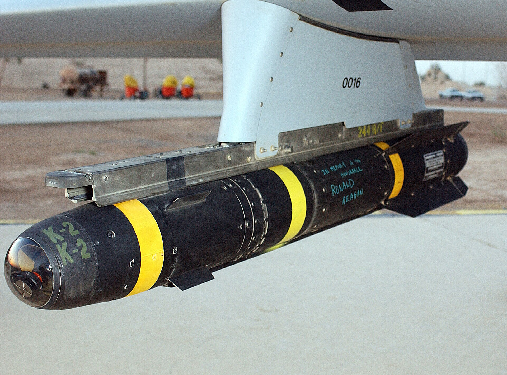
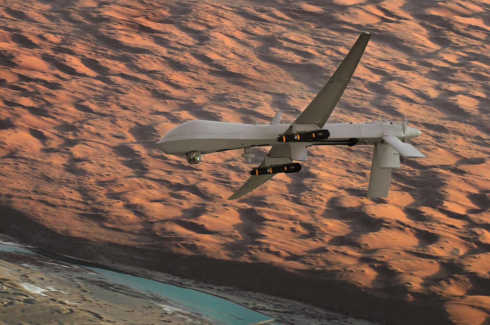
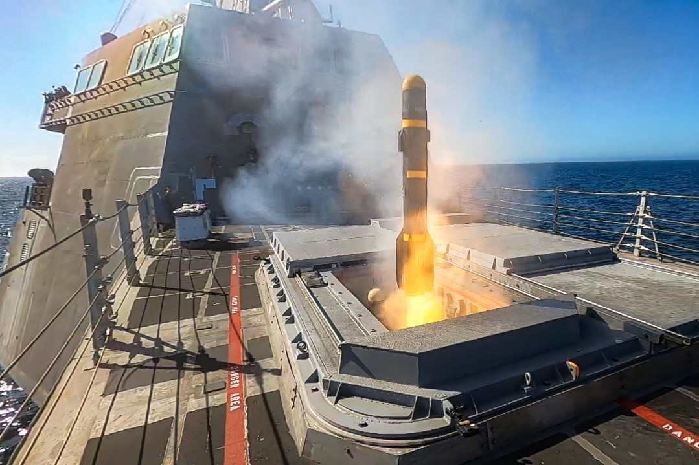
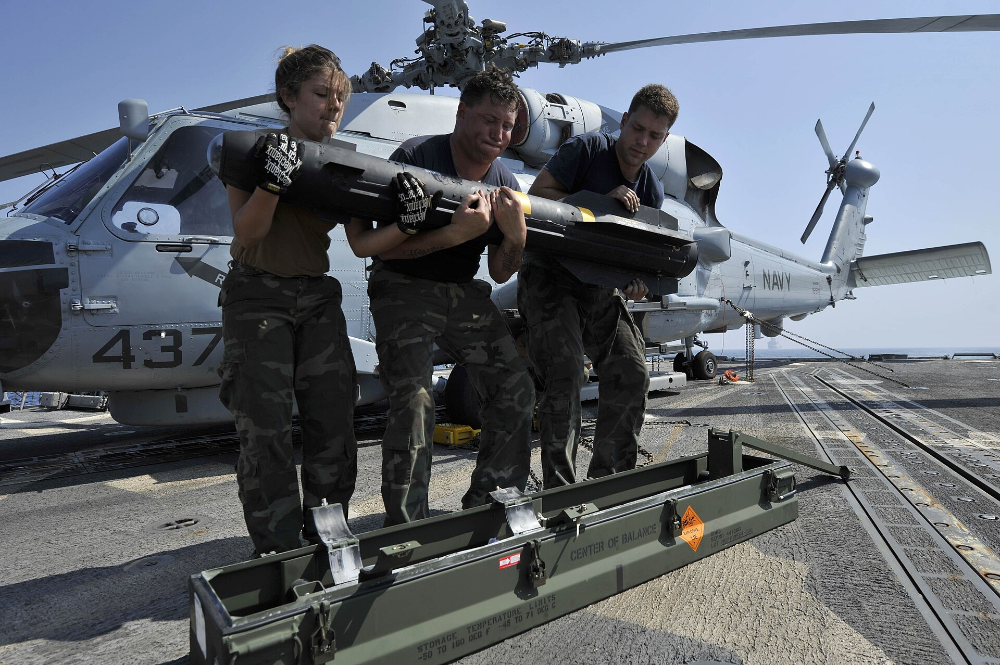

*Un Hellfire colgado del ala de un Predator, con una dedicatoria a Ronald Reagan escrita a mano (foto: TSgt Scott Reed, Fuerza Aérea de EE. UU.).*

*Un MQ-1 Predator con dos Hellfire, en una misión sobre el sur de Afganistán, en noviembre de 2008 (foto: Lt Col Leslie Pratt, Fuerza Aérea de EE. UU.).*

*Un Hellfire Longbow sale del lanzador del USS Montgomery, en la primera prueba de este misil contra un blanco en tierra, en mayo de 2022 (foto: Lt. j.g. Samuel Hardgrove, Marina de EE. UU.).*

*Marineros sacan de su caja un Hellfire para cargarlo en un helicóptero SH-60B, en octubre de 2012 (foto: MC2 Deven B. King, Marina de EE. UU.).*

| | |
|---|---|
| **País** | 🇺🇸 Estados Unidos |
| **Fabricante** | Lockheed Martin (lo diseñó Rockwell) |
| **Tipo** | Misil aire-superficie |
| **Guiado** | Láser semiactivo; la versión AGM-114L, por radar |
| **Peso / longitud** | 45 a 50 kg / 1,63 m |
| **Warhead** | 8 a 9 kg |
| **Alcance** | 8 a 11 km, según la versión |
| **En servicio** | Desde 1985 |
| **Lo llevan** | [MQ-9 Reaper](/uas/mq-9-reaper) |

El Hellfire se diseñó en los años setenta para que los helicópteros del Ejército de EE. UU. pudieran destruir tanques soviéticos; su nombre viene de *Helicopter Launched Fire and Forget* ([Designation-Systems](https://www.designation-systems.net/dusrm/m-114.html)). Entró en servicio en 1985 con el Apache. Se guía por láser: alguien, sea el propio helicóptero, otro avión o un soldado en tierra, apunta un láser al blanco y el misil va hacia ese punto. La madrugada del 17 de enero de 1991, ocho Apache [dispararon 27 Hellfire contra dos radares iraquíes](https://www.dvidshub.net/news/498151): fueron los primeros disparos de la guerra del Golfo.

Pero lo que lo hizo famoso fue el dron. El 16 de febrero de 2001, sobre un campo de tiro de Nevada, un Predator [disparó un Hellfire por primera vez](https://www.smithsonianmag.com/air-space-magazine/hellfire-meets-predator-180953940/), y desde entonces es el arma habitual de los drones armados de EE. UU. Con uno se mató a [Qasem Soleimani](https://www.abc.net.au/news/2020-01-08/qassem-soleimani-drone-attack-this-is-how-reaper-airstrike/11852740) en Bagdad en 2020. En 2022, en Kabul, un Reaper mató al jefe de Al Qaeda, Ayman al Zawahiri, en el balcón de su casa sin apenas dañar el edificio. Se cree que usó el [R9X](/uas/armamento/agm-114r9x), una versión [sin explosivo que saca seis cuchillas](https://abcnews.com/Politics/hellfire-missiles-al-qaeda-leader-al-zawahiri-minimal/story?id=87885003) antes del impacto. España [aprobó comprarlos en 2023](https://www.elespanol.com/omicrono/defensa-y-espacio/20231122/primer-dron-armado-espana-dispara-misiles-hellfire-machacar-tanques-km/811418897_0.html) para sus Reaper.

## Fuentes

* **Designation-Systems.net** - Boeing/Lockheed Martin (Rockwell/Martin Marietta) AGM-114 Hellfire ([fuente](https://www.designation-systems.net/dusrm/m-114.html))
* **Smithsonian, Air & Space**, marzo 2015 - Hellfire Meets Predator ([fuente](https://www.smithsonianmag.com/air-space-magazine/hellfire-meets-predator-180953940/))
* **ABC News (Australia)**, enero 2020 - US-Iran airstrikes: I spent two years learning about Reaper drone strikes, this is how an attack plays out ([fuente](https://www.abc.net.au/news/2020-01-08/qassem-soleimani-drone-attack-this-is-how-reaper-airstrike/11852740))
* **ABC News**, agosto 2022 - How the Hellfire missiles took out al-Qaeda leader al-Zawahiri with minimal collateral damage ([fuente](https://abcnews.com/Politics/hellfire-missiles-al-qaeda-leader-al-zawahiri-minimal/story?id=87885003))
* **El Español**, noviembre 2023 - Así es el primer dron armado de España: dispara misiles Hellfire para machacar tanques a 8 km ([fuente](https://www.elespanol.com/omicrono/defensa-y-espacio/20231122/primer-dron-armado-espana-dispara-misiles-hellfire-machacar-tanques-km/811418897_0.html))
* **DVIDS**, mayo 2025 - Task Force Normandy Heroes Awarded Long Awaited Distinguished Flying Crosses ([fuente](https://www.dvidshub.net/news/498151))
