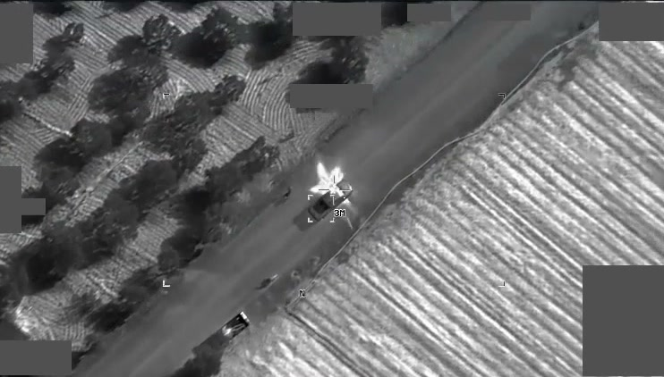

*El R9X alcanza la camioneta de un jefe de Hurras al Din, en el noroeste de Siria, el 23 de febrero de 2025: no hay explosión, solo un destello en forma de cruz (vídeo: Mando Central de EE. UU.).*

| | |
|---|---|
| **País** | 🇺🇸 Estados Unidos |
| **Fabricante** | Sin confirmar; el Hellfire lo hace Lockheed Martin |
| **Tipo** | Misil aire-superficie sin explosivo |
| **Guiado** | Láser semiactivo |
| **Peso / longitud** | No se han publicado |
| **Warhead** | Ninguna: más de 45 kg de metal y seis cuchillas |
| **Alcance** | No se ha publicado |
| **En servicio** | Se usó por primera vez en 2017; se supo en 2019 |
| **Lo llevan** | [MQ-9 Reaper](/uas/mq-9-reaper) |

El AGM-114R9X es un [Hellfire](/uas/armamento/agm-114-hellfire) sin explosivo. En lugar de la carga lleva [más de 45 kg de metal y seis cuchillas largas](https://en.wikipedia.org/wiki/AGM-114_Hellfire) que se abren justo antes de llegar: atraviesa el techo del coche o de la casa y mata a la persona a la que apunta sin que estalle nada alrededor. Se empezó a desarrollar con Obama, cuando se buscaba [una forma de matar a Bin Laden sin entrar por tierra](https://www.twz.com/27917/secret-hellfire-missile-with-sword-like-blades-made-mysterious-syria-strike-on-terror-leader), y cogió fuerza en 2013, cuando su Gobierno endureció las normas para no matar civiles en los ataques fuera de las zonas de guerra. La CIA y el Pentágono lo usaron en secreto hasta que el Wall Street Journal lo contó en mayo de 2019. Le llaman «ninja bomb» y «flying Ginsu», por una marca de cuchillos que se anunciaba en la tele estadounidense.

El primer ataque conocido fue en febrero de 2017, en Idlib (Siria): mató a Abu Khayr al Masri, el número dos de Al Qaeda, que iba en coche. En enero de 2019, en Yemen, mató a Jamal al Badawi, acusado de organizar el atentado contra el destructor USS Cole en 2000. El más famoso es el de Kabul: el 31 de julio de 2022, a las 6:18 de la mañana, un dron de la CIA [disparó dos Hellfire contra el balcón](https://www.cbsnews.com/news/hellfire-missiles-ayman-al-zawahiri-dead-kabul-balcony/) donde estaba Ayman al Zawahiri, el jefe de Al Qaeda. Murió solo él y la casa quedó en pie. Estados Unidos nunca ha dicho qué misil usó, pero todo apunta al R9X. Se sigue usando en Siria contra Hurras al Din, la rama de Al Qaeda allí: en marzo de 2025, CENTCOM publicó [el primer vídeo de uno](https://www.twz.com/air/bladed-hellfire-missile-seen-in-action-for-the-first-time), el del ataque del 23 de febrero contra el jefe militar del grupo, Muhammed Yusuf Ziya Talay. La camioneta queda casi entera, con un agujero en el techo justo encima del conductor.

## Fuentes

* **Wikipedia** - AGM-114 Hellfire ([fuente](https://en.wikipedia.org/wiki/AGM-114_Hellfire))
* **The War Zone**, mayo 2019 - Secret Hellfire Missile With Sword-Like Blades Made Mysterious Strike On Terror Leader In Syria ([fuente](https://www.twz.com/27917/secret-hellfire-missile-with-sword-like-blades-made-mysterious-syria-strike-on-terror-leader))
* **CBS News**, agosto 2022 - Al-Zawahiri was on his Kabul balcony. How Hellfire missiles took him out ([fuente](https://www.cbsnews.com/news/hellfire-missiles-ayman-al-zawahiri-dead-kabul-balcony/))
* **The War Zone**, marzo 2025 - Bladed 'Ginsu' Hellfire Missile Seen In Action For First Time ([fuente](https://www.twz.com/air/bladed-hellfire-missile-seen-in-action-for-the-first-time))
* **DVIDS**, marzo 2025 - CENTCOM Forces Kill the Senior Military Leader of Al-Qaeda Affiliate Hurras al-Din (HaD) in Syria ([fuente](https://www.dvidshub.net/video/954005))
