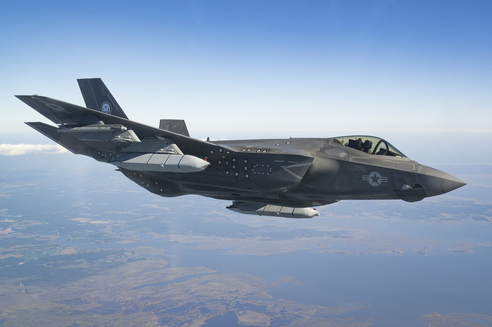
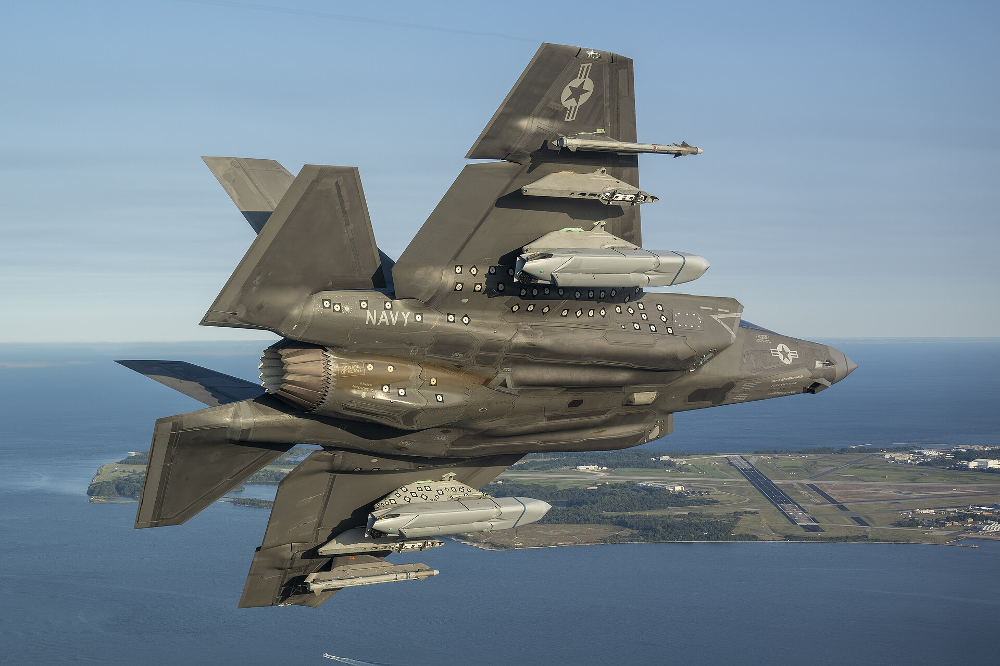
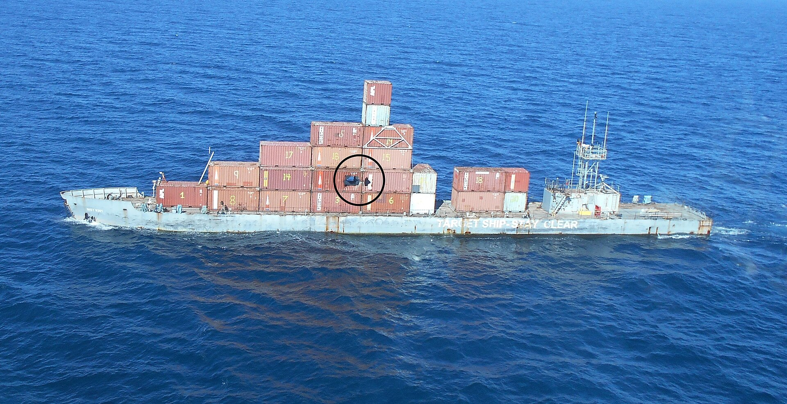

*Un LRASM recién soltado por un B-1B, en su primer vuelo de pruebas, en agosto de 2013 (foto: DARPA).*

*Un F-35C con un LRASM bajo cada ala y un misil aire-aire AIM-9X Sidewinder en el soporte de fuera, en las pruebas para certificar el avión con el LRASM, en septiembre de 2024 (foto: Dane Wiedmann, Marina de EE. UU.).*

*Un F-35C con un misil AGM-158 y un AIM-9X Sidewinder bajo cada ala, en el primer vuelo de esas pruebas, el 9 de septiembre de 2024. Según la ficha del vuelo, los AGM-158 de esta foto podrían ser JASSM-ER, el hermano del LRASM para atacar en tierra (foto: Dane Wiedmann, Marina de EE. UU.).*

*El MST 9301, el barco blanco de la Marina que hizo de blanco en la primera prueba del LRASM, el 27 de agosto de 2013 (foto: DARPA).*

| | |
|---|---|
| **País** | 🇺🇸 Estados Unidos |
| **Fabricante** | Lockheed Martin |
| **Tipo** | Misil antibuque |
| **Guiado** | GPS e INS, y una cámara infrarroja con la que elige solo el barco al que ataca |
| **Peso / longitud** | Unos 1.250 kg / 4,3 m |
| **Warhead** | 450 kg |
| **Alcance** | Más de 370 km (fabricante) |
| **En servicio** | Desde 2018 |
| **Lo llevan** | [Wildfire](/uas/wildfire) (propuesta de General Atomics, dos) |

El LRASM (*Long Range Anti-Ship Missile*) nació en 2009 de un programa de DARPA, la agencia de proyectos del Pentágono, para tener un misil capaz de hundir barcos de guerra desde muy lejos ([Wikipedia](https://en.wikipedia.org/wiki/AGM-158C_LRASM)). Lockheed Martin lo hizo a partir del JASSM-ER, un misil de crucero diseñado para que el radar lo vea mal. Voló por primera vez en 2013, soltado desde un B-1B, y entró en servicio en esos bombarderos en 2018 y en los Super Hornet de la Marina en 2019. Está pensado sobre todo para la [marina china](https://www.iiss.org/online-analysis/missile-dialogue-initiative/2025/04/countering-chinas-navy-the-us-air-fleets-growing-anti-ship-role/).

Nadie ha confirmado que se haya usado en combate, pero un documento del Pentágono de mayo de 2025 pedía dinero para [reponer los LRASM gastados «en la respuesta a la situación en Israel»](https://www.twz.com/air/has-the-u-s-been-firing-agm-158c-long-range-anti-ship-missiles-in-the-middle-east). Tras la guerra contra Irán, el Pentágono quiere [comprar hasta 11.200 JASSM y LRASM](https://thedefensepost.com/2026/07/14/pentagon-jassm-lrasm/) en los próximos cinco a siete años. General Atomics dice que el [Wildfire](/uas/wildfire) podrá llevar dos.

## Fuentes

* **Wikipedia** - AGM-158C LRASM ([fuente](https://en.wikipedia.org/wiki/AGM-158C_LRASM))
* **IISS**, abril 2025 - Countering China’s navy: the US air fleet’s growing anti-ship role ([fuente](https://www.iiss.org/online-analysis/missile-dialogue-initiative/2025/04/countering-chinas-navy-the-us-air-fleets-growing-anti-ship-role/))
* **The War Zone**, julio 2025 - Has The U.S. Been Firing AGM-158C Long-Range Anti-Ship Missiles In The Middle East? ([fuente](https://www.twz.com/air/has-the-u-s-been-firing-agm-158c-long-range-anti-ship-missiles-in-the-middle-east))
* **The Defense Post**, julio 2026 - Pentagon Plans Major JASSM, LRASM Production Expansion After Iran Strikes ([fuente](https://thedefensepost.com/2026/07/14/pentagon-jassm-lrasm/))
