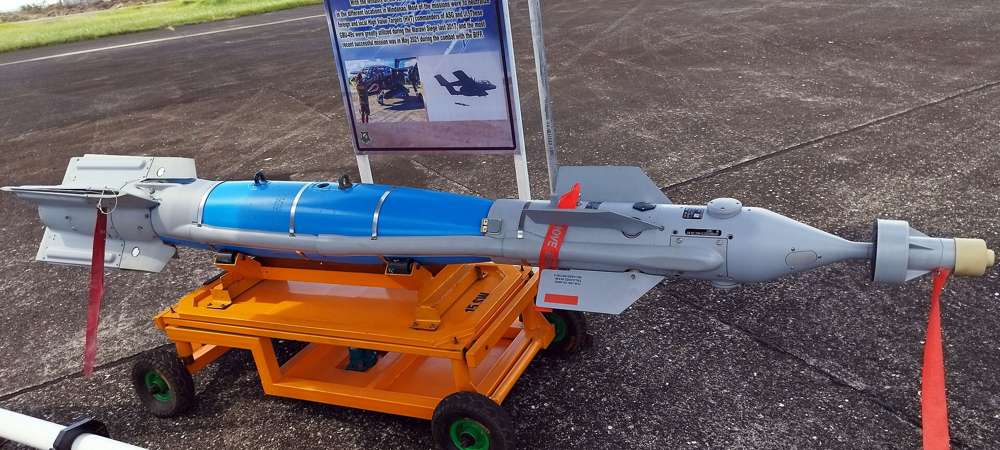
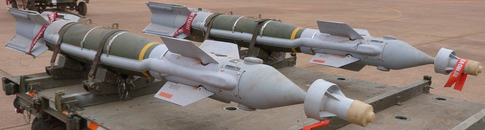
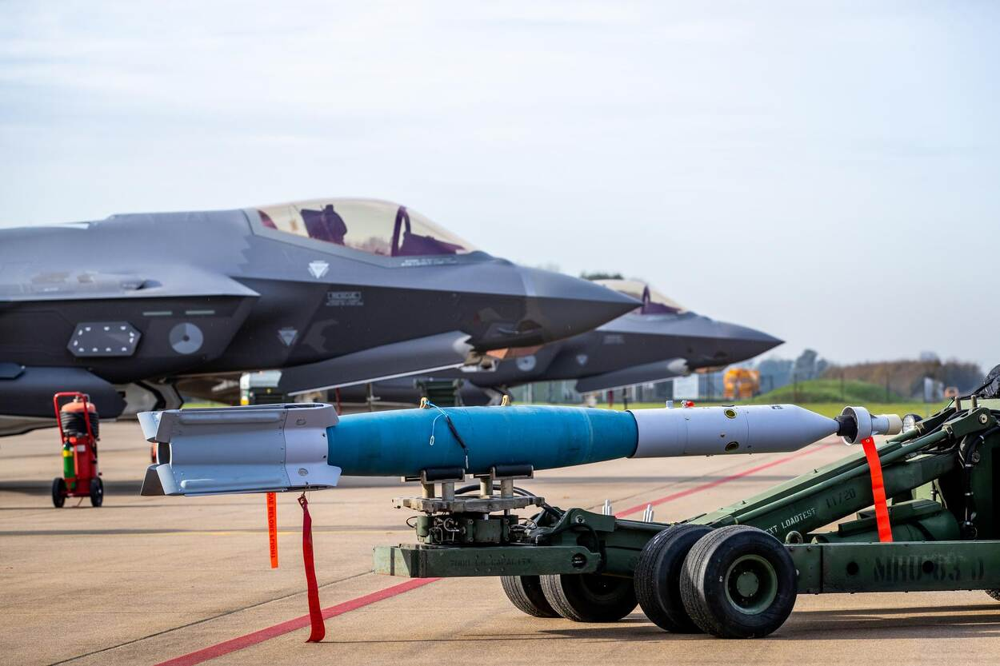

*Una GBU-49 de la Fuerza Aérea de Filipinas, en la feria PFDX de 2023: el cuerpo azul es la bomba y, delante, el buscador láser con el módulo GPS (foto: rhk111, CC BY-SA 4.0).*

*Dos GBU-49 sobre un remolque de carga, en febrero de 2013 (foto: Bobdenard57, CC BY-SA 3.0).*

*Una GBU-49 junto a un F-35A neerlandés en la base de Volkel, en noviembre de 2020 (foto: Defensie Nederland, CC BY-SA 4.0).*

| | |
|---|---|
| **País** | 🇺🇸 Estados Unidos |
| **Fabricante** | Raytheon y Lockheed Martin |
| **Tipo** | Bomba guiada por láser y GPS |
| **Guiado** | Láser semiactivo y GPS |
| **Peso / longitud** | 227 kg (una bomba Mk 82) / 3,3 m |
| **Alcance** | Unos 10 km |
| **En servicio** | El Paveway II, desde 1976; probada en un Reaper en 2008 |
| **Lo llevan** | [MQ-9 Reaper](/uas/mq-9-reaper) |

La GBU-49 es la [GBU-12](/uas/armamento/gbu-12-paveway-ii) con un receptor GPS añadido: la misma bomba Mk 82 de 227 kg, con su buscador láser y sus aletas, pero que además puede ir a unas coordenadas cuando nadie ilumina el blanco ([Air & Space Forces](https://www.airandspaceforces.com/weapons-platforms/gbu-10-12-49-paveway-ii/)). Por eso se la llama «de doble modo»: con láser, para blancos que se mueven, y con GPS, para los que no, con nubes, humo o de noche, y desde entre 760 y 12.200 m de altura.

Al Reaper llegó antes que la [GBU-38](/uas/armamento/gbu-38-jdam). En mayo de 2008, en China Lake (California), un equipo de pruebas de la Fuerza Aérea [soltó seis desde un MQ-9](https://www.af.mil/News/Article-Display/Article/123520/mq-9-reaper-drops-first-gps-guided-weapon): los tres guiados por GPS dieron en el blanco y el guiado por láser cayó muy cerca. Fue la primera arma guiada por GPS que soltó un Reaper.

## Fuentes

* **Air & Space Forces Magazine** - GBU-10/12/49 Paveway II ([fuente](https://www.airandspaceforces.com/weapons-platforms/gbu-10-12-49-paveway-ii/))
* **Fuerza Aérea de EE. UU.**, mayo 2008 - MQ-9 Reaper drops first GPS-guided weapon ([fuente](https://www.af.mil/News/Article-Display/Article/123520/mq-9-reaper-drops-first-gps-guided-weapon))
