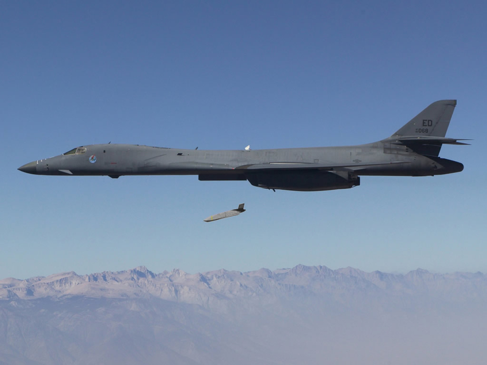
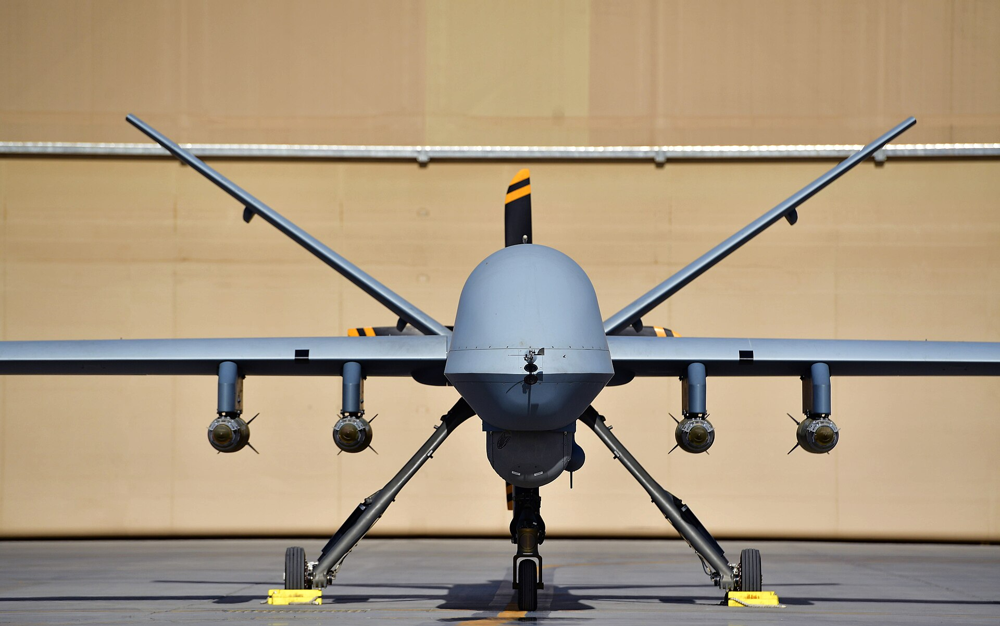

> Las municiones que llevan los drones del Hangar: misiles y bombas guiadas, cada una con su foto, sus datos y dónde se ha usado. Se irá ampliando según entren drones nuevos. Los términos técnicos están en el [glosario](/uas/glosario-y-terminologia).

## Misiles

### AGM-114 Hellfire

*Un Hellfire colgado del ala de un Predator, con una dedicatoria a Ronald Reagan escrita a mano (foto: TSgt Scott Reed, Fuerza Aérea de EE. UU.).*

| | |
|---|---|
| **País** | 🇺🇸 Estados Unidos |
| **Fabricante** | Lockheed Martin (lo diseñó Rockwell) |
| **Tipo** | Misil aire-superficie |
| **Guiado** | Láser semiactivo; la versión AGM-114L, por radar |
| **Peso / longitud** | 45 a 50 kg / 1,63 m |
| **Warhead** | 8 a 9 kg |
| **Alcance** | 8 a 11 km, según la versión |
| **En servicio** | Desde 1985 |
| **Lo llevan** | [MQ-9 Reaper](/uas/mq-9-reaper) |

El Hellfire se diseñó en los años setenta para que los helicópteros del Ejército de EE. UU. pudieran destruir tanques soviéticos; su nombre viene de *Helicopter Launched Fire and Forget* ([Designation-Systems](https://www.designation-systems.net/dusrm/m-114.html)). Entró en servicio en 1985 con el Apache. Se guía por láser: alguien, sea el propio helicóptero, otro avión o un soldado en tierra, apunta un láser al blanco y el misil va hacia ese punto. La madrugada del 17 de enero de 1991, ocho Apache [dispararon 27 Hellfire contra dos radares iraquíes](https://www.dvidshub.net/news/498151): fueron los primeros disparos de la guerra del Golfo.

Pero lo que lo hizo famoso fue el dron. El 16 de febrero de 2001, sobre un campo de tiro de Nevada, un Predator [disparó un Hellfire por primera vez](https://www.smithsonianmag.com/air-space-magazine/hellfire-meets-predator-180953940/), y desde entonces es el arma habitual de los drones armados de EE. UU. Con uno se mató a [Qasem Soleimani](https://www.abc.net.au/news/2020-01-08/qassem-soleimani-drone-attack-this-is-how-reaper-airstrike/11852740) en Bagdad en 2020. En 2022, en Kabul, un Reaper mató al jefe de Al Qaeda, Ayman al Zawahiri, en el balcón de su casa sin apenas dañar el edificio. Se cree que usó el <mark>R9X</mark>, una versión [sin explosivo que saca seis cuchillas](https://abcnews.com/Politics/hellfire-missiles-al-qaeda-leader-al-zawahiri-minimal/story?id=87885003) antes del impacto. España [aprobó comprarlos en 2023](https://www.elespanol.com/omicrono/defensa-y-espacio/20231122/primer-dron-armado-espana-dispara-misiles-hellfire-machacar-tanques-km/811418897_0.html) para sus Reaper.

### JSM

*Maqueta del JSM en la feria Japan Aerospace de 2016, en Tokio (foto: Strak Jegan, CC BY-SA 4.0).*

| | |
|---|---|
| **País** | 🇳🇴 Noruega |
| **Fabricante** | Kongsberg, con Raytheon |
| **Tipo** | Misil de crucero antibuque y de ataque a tierra |
| **Guiado** | GPS e INS, y al final una cámara infrarroja que reconoce el blanco |
| **Peso / longitud** | 416 kg / 4 m |
| **Warhead** | 120 kg |
| **Alcance** | Unos 350 km; hasta 555 km si vuela alto buena parte del camino |
| **En servicio** | Desde 2025 |
| **Lo llevan** | [Wildfire](/uas/wildfire) (propuesta de General Atomics, cuatro) |

El JSM (*Joint Strike Missile*) lo hizo la empresa noruega Kongsberg a partir del NSM, su misil antibuque. Lo pensaron para que [cupiera dentro de la bodega de armas del F-35](https://theaviationist.com/2025/04/28/jsm-for-norways-f-35s-ready/), de modo que el avión no pierda su ventaja de ser difícil de ver en el radar. Vuela bajo, pegado al mar o al terreno, y en el último tramo una cámara infrarroja compara lo que ve con la forma del blanco que lleva guardada. Noruega recibió [los primeros en abril de 2025](https://www.kongsberg.com/news/stories/2025/4/norway-completes-f-35-fleet-and-receives-first-joint-strike-missile/) para sus F-35, y detrás van Japón, Australia y Estados Unidos, cuya Fuerza Aérea [ya ha encargado dos lotes](https://thedefensepost.com/2025/12/23/usaf-joint-strike-missiles/).

No se ha usado en combate. En los drones, General Atomics lo quiere para sus aviones sin piloto: el [Wildfire](/uas/wildfire) sale en los [renders con cuatro JSM](https://www.twz.com/wp-content/uploads/2026/09/wildfire-jsm-cruise-missiles.jpg) bajo las alas.

### AGM-158C LRASM

*Un LRASM recién soltado por un B-1B, en su primer vuelo de pruebas, en agosto de 2013 (foto: DARPA).*

| | |
|---|---|
| **País** | 🇺🇸 Estados Unidos |
| **Fabricante** | Lockheed Martin |
| **Tipo** | Misil antibuque |
| **Guiado** | GPS e INS, y una cámara infrarroja con la que elige solo el barco al que ataca |
| **Peso / longitud** | Unos 1.250 kg / 4,3 m |
| **Warhead** | 450 kg |
| **Alcance** | Más de 370 km (fabricante) |
| **En servicio** | Desde 2018 |
| **Lo llevan** | [Wildfire](/uas/wildfire) (propuesta de General Atomics, dos) |

El LRASM (*Long Range Anti-Ship Missile*) nació en 2009 de un programa de DARPA, la agencia de proyectos del Pentágono, para tener un misil capaz de hundir barcos de guerra desde muy lejos ([Wikipedia](https://en.wikipedia.org/wiki/AGM-158C_LRASM)). Lockheed Martin lo hizo a partir del JASSM-ER, un misil de crucero diseñado para que el radar lo vea mal. Voló por primera vez en 2013, soltado desde un B-1B, y entró en servicio en esos bombarderos en 2018 y en los Super Hornet de la Marina en 2019. Está pensado sobre todo para la [marina china](https://www.iiss.org/online-analysis/missile-dialogue-initiative/2025/04/countering-chinas-navy-the-us-air-fleets-growing-anti-ship-role/).

Nadie ha confirmado que se haya usado en combate, pero un documento del Pentágono de mayo de 2025 pedía dinero para [reponer los LRASM gastados «en la respuesta a la situación en Israel»](https://www.twz.com/air/has-the-u-s-been-firing-agm-158c-long-range-anti-ship-missiles-in-the-middle-east). Tras la guerra contra Irán, el Pentágono quiere [comprar hasta 11.200 JASSM y LRASM](https://thedefensepost.com/2026/07/14/pentagon-jassm-lrasm/) en los próximos cinco a siete años. General Atomics dice que el [Wildfire](/uas/wildfire) podrá llevar dos.

## Bombas guiadas

### GBU-12 Paveway II

*Reaper británico en Kandahar, con dos GBU-12 en los soportes de dentro y cuatro Hellfire en los de fuera (foto: Cpl Steve Bain/MOD, OGL v1.0, diciembre de 2009).*

| | |
|---|---|
| **País** | 🇺🇸 Estados Unidos |
| **Fabricante** | Raytheon y Lockheed Martin |
| **Tipo** | Bomba guiada por láser |
| **Guiado** | Láser semiactivo |
| **Peso / longitud** | 227 kg (una bomba Mk 82 de 500 libras) / 3,3 m |
| **Alcance** | Unos 10 km |
| **En servicio** | Desde 1976 |
| **Lo llevan** | [MQ-9 Reaper](/uas/mq-9-reaper) |

La GBU-12 no es una bomba nueva: es la Mk 82 de toda la vida, de 500 libras, a la que se le pone delante un buscador láser y detrás unas aletas que se abren al soltarla ([Air & Space Forces](https://www.airandspaceforces.com/weapons/gbu-10-12-49-paveway-ii/)). Igual que el Hellfire, va hacia el punto que alguien ilumina con un láser, pero no tiene motor: cae planeando. Se hizo famosa en la guerra del Golfo de 1991, cuando los F-111F y los F-15E la usaron de noche contra los tanques iraquíes. Los pilotos lo llamaban [«tank plinking»](https://www.airandspaceforces.com/article/1093plinking/), como quien tira latas con una escopeta de balines, y alguna vez dos F-15E destruyeron dieciséis blindados en una sola salida.

Hasta 2017, el Reaper solo tenía [dos armas](https://www.twz.com/10046/usaf-reaper-drones-can-finally-drop-gps-guided-joint-direct-attack-munitions): el Hellfire y esta bomba. Las dos tienen el mismo punto débil: el láser no atraviesa bien las nubes ni el humo, y si no se puede iluminar el blanco, no hay ataque. Por eso la Fuerza Aérea quiso darle al Reaper también la [GBU-38 JDAM](#gbu-38-jdam).

### GBU-38 JDAM

*Un Reaper de la Fuerza Aérea en Kandahar, armado con cuatro GBU-38, en febrero de 2018 (foto: TSgt Paul Labbe, Fuerza Aérea de EE. UU.).*

| | |
|---|---|
| **País** | 🇺🇸 Estados Unidos |
| **Fabricante** | Boeing |
| **Tipo** | Bomba guiada por GPS |
| **Guiado** | GPS e INS |
| **Peso** | 227 kg (una bomba Mk 82 de 500 libras) |
| **Alcance** | Hasta 24 km |
| **Precio** | Unos 18.000 dólares el kit |
| **En servicio** | El JDAM, desde 1999 |
| **Lo llevan** | [MQ-9 Reaper](/uas/mq-9-reaper) |

JDAM (*Joint Direct Attack Munition*) es un kit de Boeing: una cola con GPS, INS y aletas móviles que convierte una bomba normal en una guiada. La GBU-38 es ese kit puesto sobre la misma Mk 82 de la GBU-12. La diferencia es que no necesita que nadie ilumine el blanco: se le dan unas coordenadas y va hacia ellas, haya nubes, humo o sea de noche. Se estrenó en la [guerra de Kosovo de 1999](https://www.twz.com/10046/usaf-reaper-drones-can-finally-drop-gps-guided-joint-direct-attack-munitions) y en 2017, con la guerra contra el Estado Islámico, Boeing llegó a fabricar más de 150 kits al día.

Al Reaper llegó tarde. Los pilotos la [pedían desde hacía años](https://www.twz.com/10046/usaf-reaper-drones-can-finally-drop-gps-guided-joint-direct-attack-munitions); las pruebas acabaron en 2016 y al año siguiente ya la [lanzaban en combate](https://newatlas.com/jdam-gbu-38-guided-bombs-mq-9-reaper-uav/49646/) contra el Estado Islámico. Además de servir con mal tiempo, es mucho más barata: el kit cuesta unos 18.000 dólares, cuando un Hellfire [pasaba de los 100.000](https://newatlas.com/jdam-gbu-38-guided-bombs-mq-9-reaper-uav/49646/).

## Fuentes

- **Designation-Systems.net** ([fuente](https://www.designation-systems.net/dusrm/m-114.html))
  La historia del Hellfire, de dónde viene su nombre y las medidas de cada versión.

- **DVIDS** ([fuente](https://www.dvidshub.net/news/498151))
  Los Apache de la Task Force Normandy y los primeros disparos de la guerra del Golfo.

- **Smithsonian, Air & Space** ([fuente](https://www.smithsonianmag.com/air-space-magazine/hellfire-meets-predator-180953940/))
  El primer Hellfire disparado desde un Predator, en febrero de 2001.

- **ABC News (Australia)** ([fuente](https://www.abc.net.au/news/2020-01-08/qassem-soleimani-drone-attack-this-is-how-reaper-airstrike/11852740))
  El Hellfire con el que se mató a Soleimani.

- **ABC News** ([fuente](https://abcnews.com/Politics/hellfire-missiles-al-qaeda-leader-al-zawahiri-minimal/story?id=87885003))
  El ataque contra Al Zawahiri y el R9X, el Hellfire de las cuchillas.

- **El Español** ([fuente](https://www.elespanol.com/omicrono/defensa-y-espacio/20231122/primer-dron-armado-espana-dispara-misiles-hellfire-machacar-tanques-km/811418897_0.html))
  La compra de Hellfire para los Reaper españoles.

- **Kongsberg** ([fuente](https://www.kongsberg.com/news/stories/2025/4/norway-completes-f-35-fleet-and-receives-first-joint-strike-missile/))
  La entrega de los primeros JSM a Noruega, en abril de 2025.

- **The Aviationist** ([fuente](https://theaviationist.com/2025/04/28/jsm-for-norways-f-35s-ready/))
  El JSM dentro del F-35 y su alcance.

- **The Defense Post** ([fuente](https://thedefensepost.com/2025/12/23/usaf-joint-strike-missiles/))
  El segundo lote de JSM de la Fuerza Aérea de EE. UU.

- **Wikipedia** ([fuente](https://en.wikipedia.org/wiki/AGM-158C_LRASM))
  Origen del LRASM, pruebas, entrada en servicio y medidas.

- **IISS** ([fuente](https://www.iiss.org/online-analysis/missile-dialogue-initiative/2025/04/countering-chinas-navy-the-us-air-fleets-growing-anti-ship-role/))
  Los misiles antibuque de la aviación de EE. UU. pensando en la marina china.

- **The War Zone** ([fuente](https://www.twz.com/air/has-the-u-s-been-firing-agm-158c-long-range-anti-ship-missiles-in-the-middle-east))
  El documento del Pentágono que apunta a que el LRASM ya se ha usado en Oriente Próximo.

- **The Defense Post** ([fuente](https://thedefensepost.com/2026/07/14/pentagon-jassm-lrasm/))
  El plan del Pentágono para comprar miles de JASSM y LRASM tras la guerra contra Irán.

- **Air & Space Forces Magazine** ([fuente](https://www.airandspaceforces.com/weapons/gbu-10-12-49-paveway-ii/))
  Ficha de la GBU-12: fabricantes, medidas, alcance y aviones que la llevan.

- **Air & Space Forces Magazine** ([fuente](https://www.airandspaceforces.com/article/1093plinking/))
  El «tank plinking» de la guerra del Golfo, con los F-111F y los F-15E.

- **The War Zone** ([fuente](https://www.twz.com/10046/usaf-reaper-drones-can-finally-drop-gps-guided-joint-direct-attack-munitions))
  La llegada de la GBU-38 al Reaper, su precio y su estreno en Kosovo.

- **New Atlas** ([fuente](https://newatlas.com/jdam-gbu-38-guided-bombs-mq-9-reaper-uav/49646/))
  El alcance y el precio de la GBU-38 frente al Hellfire.
