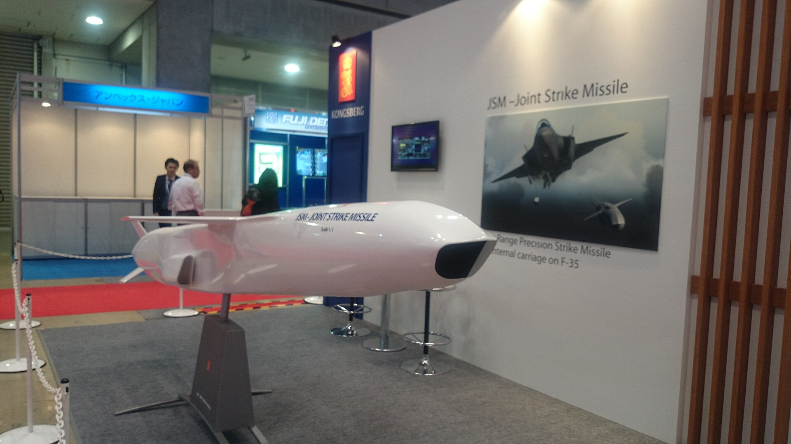

*Maqueta del JSM en la feria Japan Aerospace de 2016, en Tokio (foto: Strak Jegan, CC BY-SA 4.0).*

| | |
|---|---|
| **País** | 🇳🇴 Noruega |
| **Fabricante** | Kongsberg, con Raytheon |
| **Tipo** | Misil de crucero antibuque y de ataque a tierra |
| **Guiado** | GPS e INS, y al final una cámara infrarroja que reconoce el blanco |
| **Peso / longitud** | 416 kg / 4 m |
| **Warhead** | 120 kg |
| **Alcance** | Unos 350 km; hasta 555 km si vuela alto buena parte del camino |
| **En servicio** | Desde 2025 |
| **Lo llevan** | [Wildfire](/uas/wildfire) (propuesta de General Atomics, cuatro) |

El JSM (*Joint Strike Missile*) lo hizo la empresa noruega Kongsberg a partir del NSM, su misil antibuque. Lo pensaron para que [cupiera dentro de la bodega de armas del F-35](https://theaviationist.com/2025/04/28/jsm-for-norways-f-35s-ready/), de modo que el avión no pierda su ventaja de ser difícil de ver en el radar. Vuela bajo, pegado al mar o al terreno, y en el último tramo una cámara infrarroja compara lo que ve con la forma del blanco que lleva guardada. Noruega recibió [los primeros en abril de 2025](https://www.kongsberg.com/news/stories/2025/4/norway-completes-f-35-fleet-and-receives-first-joint-strike-missile/) para sus F-35, y detrás van Japón, Australia y Estados Unidos, cuya Fuerza Aérea [ya ha encargado dos lotes](https://thedefensepost.com/2025/12/23/usaf-joint-strike-missiles/).

No se ha usado en combate. En los drones, General Atomics lo quiere para sus aviones sin piloto: el [Wildfire](/uas/wildfire) sale en los [renders con cuatro JSM](https://www.twz.com/wp-content/uploads/2026/09/wildfire-jsm-cruise-missiles.jpg) bajo las alas.

## Fuentes

* **Kongsberg**, abril 2025 - Norway completes F-35 fleet and receives first Joint Strike Missile ([fuente](https://www.kongsberg.com/news/stories/2025/4/norway-completes-f-35-fleet-and-receives-first-joint-strike-missile/))
* **The Aviationist**, abril 2025 - First Joint Strike Missiles for Norway’s F-35s are Ready ([fuente](https://theaviationist.com/2025/04/28/jsm-for-norways-f-35s-ready/))
* **The Defense Post**, diciembre 2025 - USAF Orders Second Production Lot of Joint Strike Missiles for F-35 Fleet ([fuente](https://thedefensepost.com/2025/12/23/usaf-joint-strike-missiles/))
