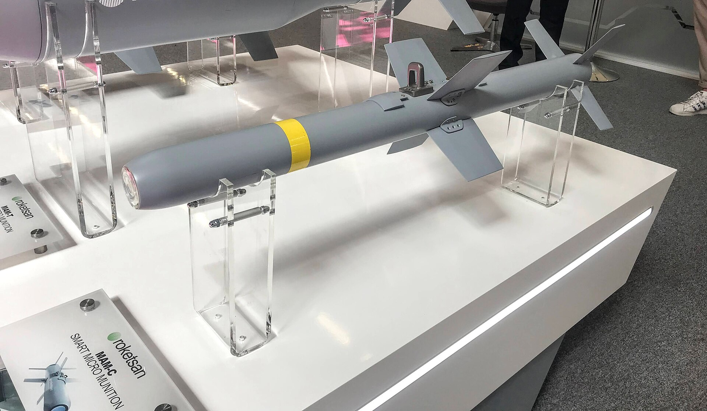
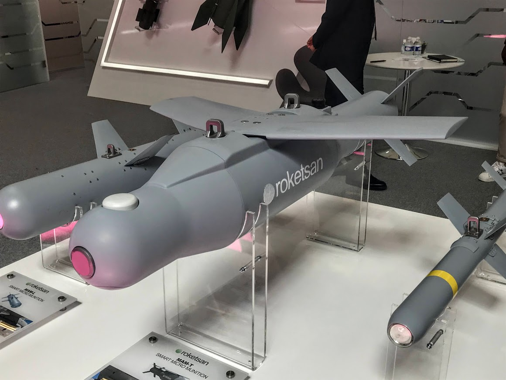

*Una MAM-C en la feria Eurosatory de 2022, en París (foto: NeeXxXoR, CC BY-SA 4.0).*

*La MAM-T junto a la MAM-L y la MAM-C, en la feria Eurosatory de 2022 (foto: NeeXxXoR, CC BY-SA 4.0).*

| | |
|---|---|
| **País** | 🇹🇷 Turquía |
| **Fabricante** | Roketsan |
| **Tipo** | Bomba muy pequeña guiada por láser |
| **Guiado** | Láser semiactivo |
| **Peso / longitud** | 6,5 kg / 0,97 m |
| **Warhead** | Explosiva con metralla, con una carga perforante e incendiaria |
| **Alcance** | 8 km (fabricante) |
| **En servicio** | Desde 2016 |
| **Lo llevan** | [Bayraktar TB2](/uas/bayraktar-tb2) y drones turcos más pequeños, como el Karayel |

La MAM-C es la hermana pequeña de la [MAM-L](/uas/armamento/mam-l). Sale del Cirit, el cohete guiado de 70 mm que Roketsan hizo para los helicópteros de ataque, al que también se le quitó el motor ([Wikipedia](https://en.wikipedia.org/wiki/MAM_(Smart_Micro_Munition))). Pesa 6,5 kg, menos de un tercio que la MAM-L, y está pensada para blancos pequeños: personas, camionetas o blindados ligeros ([Roketsan](https://www.roketsan.com.tr/en/products/mam-c-smart-micro-munition)).

Lo que gana es el peso. Con ella pueden atacar drones que no pueden con una MAM-L, como el Karayel de Vestel, y un TB2 puede llevarla en un soporte y una MAM-L en otro, según el blanco. Lo que pierde es alcance, 8 km frente a los 15 de su hermana, y fuerza: contra un tanque no sirve.

## Fuentes

* **Roketsan** - MAM-C Smart Micro Munition ([fuente](https://www.roketsan.com.tr/en/products/mam-c-smart-micro-munition))
* **Wikipedia** - Mini Akıllı Mühimmat ([fuente](https://en.wikipedia.org/wiki/MAM_(Smart_Micro_Munition)))
