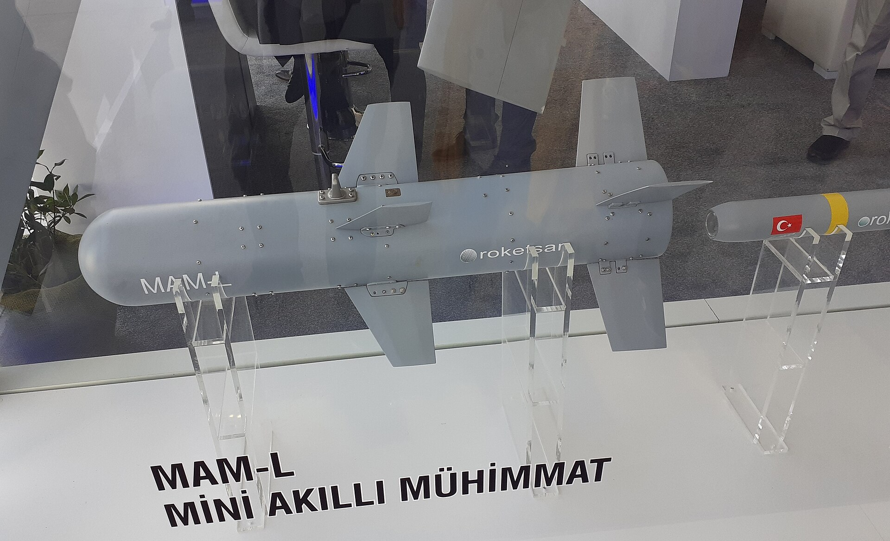

*Una MAM-L en la feria Teknofest de 2019, en Estambul (foto: Kingbjelica, CC BY-SA 4.0).*

| | |
|---|---|
| **País** | 🇹🇷 Turquía |
| **Fabricante** | Roketsan |
| **Tipo** | Bomba pequeña guiada por láser |
| **Guiado** | Láser semiactivo; hay una versión con INS y GPS |
| **Peso / longitud** | 22 kg / 1 m |
| **Warhead** | Explosiva con metralla, termobárica o en tándem contra tanques |
| **Alcance** | Hasta 15 km (fabricante) |
| **En servicio** | Desde 2016 |
| **Lo llevan** | [Bayraktar TB2](/uas/bayraktar-tb2) y otros drones turcos, como el Akıncı y el Anka |

La MAM-L es una bomba pequeña que Roketsan hizo para los drones turcos, que cargan poco peso. MAM son las siglas de *Mini Akıllı Mühimmat*, «munición inteligente pequeña». Roketsan cogió su misil antitanque L-UMTAS, le quitó el motor y lo dejó en una bomba de 22 kg que [cae planeando](https://en.wikipedia.org/wiki/MAM_(Smart_Micro_Munition)) hasta el punto que ilumina el láser de la torreta del dron. Un TB2 la soltó por primera vez en pruebas en [diciembre de 2015](https://en.wikipedia.org/wiki/Baykar_Bayraktar_TB2), y desde 2016 la usan el Ejército, la Gendarmería y la Policía turcos ([Defence Turkey](https://www.defenceturkey.com/en/content/roketsan-s-smart-micro-munition-product-family-continues-to-prove-itself-in-the-field-3462)).

Ha ido con el TB2 a todas sus guerras: Siria, Libia, Nagorno Karabaj, Etiopía y Ucrania. El 26 de octubre de 2021, una MAM-L soltada por un TB2 ucraniano [destruyó un obús de los separatistas](https://www.dailysabah.com/business/defense/in-ukraines-1st-combat-use-bayraktar-tb2-destroys-russian-armament) en el Donbás: fue el primer ataque de Ucrania con el dron. En Tigray, en Etiopía, se encontraron [restos de MAM-L](https://en.wikipedia.org/wiki/Baykar_Bayraktar_TB2) después de los bombardeos de la guerra civil. Y en junio de 2025, otra [hundió una lancha de desembarco rusa](https://united24media.com/latest-news/ukraines-bayraktar-tb2-returns-to-combat-why-now-and-where-has-it-been-the-full-story-of-a-wartime-legend-9433) cerca de Jersón, con la que los TB2 ucranianos volvieron a atacar después de casi tres años.

## Fuentes

* **Roketsan** - MAM-L Smart Micro Munition ([fuente](https://www.roketsan.com.tr/en/products/mam-l-smart-micro-munition))
* **Wikipedia** - Mini Akıllı Mühimmat ([fuente](https://en.wikipedia.org/wiki/MAM_(Smart_Micro_Munition)))
* **Wikipedia** - Baykar Bayraktar TB2 ([fuente](https://en.wikipedia.org/wiki/Baykar_Bayraktar_TB2))
* **Defence Turkey**, mayo 2019 - Roketsan’s Smart Micro Munition Product Family Continues to Prove Itself in the Field ([fuente](https://www.defenceturkey.com/en/content/roketsan-s-smart-micro-munition-product-family-continues-to-prove-itself-in-the-field-3462))
* **Daily Sabah**, octubre 2021 - In Ukraine’s 1st combat use, Bayraktar TB2 destroys Russian armament ([fuente](https://www.dailysabah.com/business/defense/in-ukraines-1st-combat-use-bayraktar-tb2-destroys-russian-armament))
* **United24 Media**, junio 2025 - Ukraine’s Bayraktar TB2 Returns to Combat — Why Now, and Where Has It Been? The Full Story of a Wartime Legend ([fuente](https://united24media.com/latest-news/ukraines-bayraktar-tb2-returns-to-combat-why-now-and-where-has-it-been-the-full-story-of-a-wartime-legend-9433))
